# 中山大学数据科学与计算机学院本科生实验报告
## （2018年秋季学期）
| 课程名称 | 手机平台应用开发 | 任课老师 | 郑贵锋 |
| :------------: | :-------------: | :------------: | :-------------: |
| 年级 | 2016 | 专业（方向） | 嵌软 |
| 学号 | 16340215 | 姓名 | 王建 |
| 电话 | 13246824607 | Email | jankingwon@foxmail.com |
| 开始日期 | 2018-9-27 | 完成日期 |2018-10-2|

---

## 一、实验题目

1. 熟悉Android Studio开发工具操作。
2. 熟悉Android Studio基本UI开发，并进行UI基本设计。

---

## 二、实现内容

实现一个Android应用，界面呈现如图中的效果。  
  

- 该界面为应用启动后看到的第一个界面。
- 各控件的要求
  1. 标题字体大小**20sp**，与顶部距离**20dp**，居中；
  2. 图片与上下控件的间距均为**20dp**，居中；
  3. 输入框整体距左右屏幕各间距**20dp**，内容（包括提示内容）如图所示，内容字体大小**18sp**；
  4. 按钮与输入框间距**10dp**，文字大小**18sp**。按钮背景框左右边框与文字间距**10dp**，上下边框与文字间距**5dp**，圆角半径**180dp**，背景色为**#3F51B5**；
  5. 四个单选按钮整体居中，与输入框间距10dp，字体大小**18sp**，各个单选按钮之间间距**10dp**，默认选中的按钮为第一个。

---

## 三、课堂实验结果

### (1)实验截图

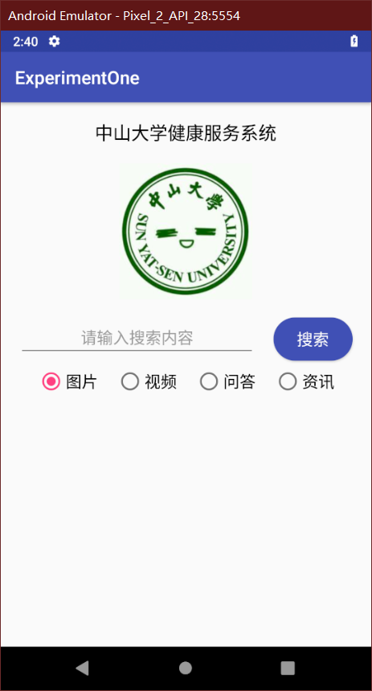

### (2)实验步骤以及关键代码

-  创建一个文本框 `TextView`

  首先要清楚布局文件在哪里

  用`Android`模式查看项目结构，在`layout`里面存放着app的所有布局，默认第一个页面就是`activity_main.xml`
  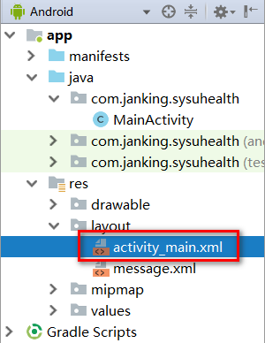
  那么就可以直接在这里面添加一些列界面元素了

  ```xml
  <TextView
          android:id="@+id/text" //表示它的id为text，放在id xml里，而且这是新加的id所以用+号
          android:layout_width="wrap_content"	//这个是必须的，定义了组件的宽度
          android:layout_height="wrap_content"//这个也是必须的，定义了组件的高度
          android:text="@string/display_name"//这个定义了显示的文本为string的xml里的display_name字符串，这样有利于修改，其实也可以直接写
          android:textSize="20sp" 	//定义了文字的大小，一般用sp作单位
          android:layout_marginTop="20dp" //定义了组件距离上边界的空白，一般用dp作单位
          app:layout_constraintLeft_toLeftOf="parent"//约束布局：表明其左边界与父组件的左边对齐
          app:layout_constraintRight_toRightOf="parent"//约束布局：表明其右边界与父组件的右边对齐
          app:layout_constraintTop_toTopOf="parent" />//约束布局：表明其顶部与父组件的顶部对齐
  ```

  这里有一点需要注意的

  - 官方是建议使用`layout_marginEnd`和`layout_marginStart`代替`layout_marginLeft`和`layout_marginRight`,说法是这样文字不论从左到右还是从右到左都不会出现问题，之前我还一直疑惑为什么又有`Left`又有`Start`，不知道该用什么，反正就按官方的做，不过有时候用不了？我还是用回了`Left`和`Right`
    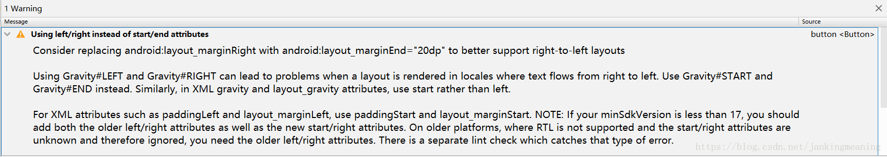

  ## 创建一个图片块`ImageView`

  一般来说图片文件放在`mipmap`文件夹里，不过其实不止一个文件夹

  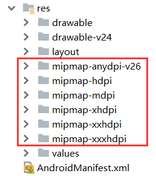

  这里的不同后缀代表不同的分辨率图片
  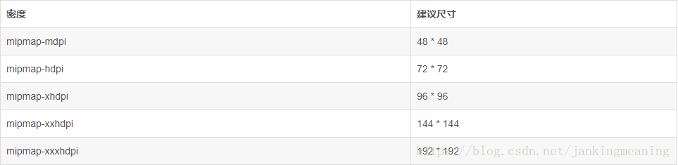

  不过一般的小程序放错了问题应该不大，反正都能找到（/emm）

  然后在`xml`这样引用这个图片
  这里的`sysu`是图片文件名，**不带格式后缀！**

  ```xml
  	<ImageView
  	......
  		android:src="@mipmap/sysu" />
  ```

  ## 创建一个输入框`EditText`

  ```xml
      <EditText
      ......
          android:layout_width="0dp"
          android:layout_height="wrap_content"
          android:gravity="center" //表示文字格式
          android:hint="@string/edit_text" //表示未输入时提示的文字
          app:layout_constraintTop_toBottomOf="@+id/image" /> //表示它始终位于组件`image`的下方
  ```

  这里有一个小问题，我用的`layout_width`是`0dp`，它表示与**外组件适应**，这是因为如果我用的是`wrap_content`，将会是这样的效果，因为文字只有七个字，这样以后文字多了它也会一直拉伸，很不美观
  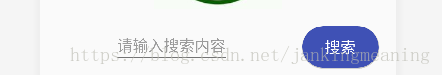
  修改之后就是这样的了，它处于并将长期处于这个长度！
  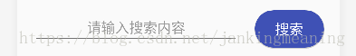

  ## 创建一系列单选按钮`RadioButton`

  单选按钮组件是不能独立存在的，它需要一个组即`RadioGroup`（因为一个按钮实在没什么意思），然后再在这个组里面创建需要数目的`RadioButton`

  ```xml
      <RadioGroup
      	......
          android:orientation="horizontal">
          <RadioButton
          ......
          style="@style/AppTheme"
           /><!--设置默认选中-->
          <RadioButton/>
          <RadioButton />
          <RadioButton />
      </RadioGroup>
  ```

  主要不同的就是需要确定其排列方向`horizontal`或者`vertical`
  而`RadioButton`还可以指定`style`，这里随便写了个系统默认的，如果没有特别好看的`style`就不用写了吧【haha

  效果如下
  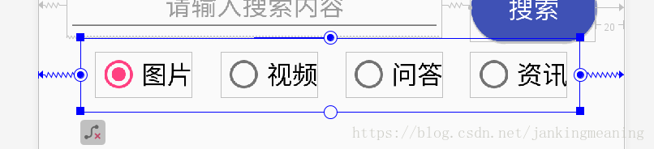
  其实可以试用一下group的padding属性（因为我不太熟），我加了句`android:padding="10dp"`之后，成了下面这个样子，确实内部边框都加粗了，不过我觉得还是用`外边距Margin`和`内边距Padding`其中一个就好了（针对我这种小应用），不然跟别的组件距离不好计算，用一个就能解决的话多好
  
  每个小按钮可以设置其周围的`margin`，当然可以设置不一致，难道还会担心`group`包不下吗
  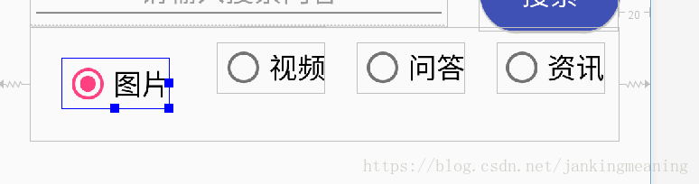

  ## 创建一个简单按钮`Button`

  ```xaml
      <Button
      ......
          android:background="@drawable/button_shape"
          android:textColor="@color/colorWhite"/>
  ```

  主要有两个需要注意的属性

  - `background`：这个是按钮文本的颜色，用的是colors.xml中定义的颜色
    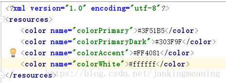
  - `background`：说是叫按钮背景，其实差不多也是按钮样式了，因为默认按钮是这样的
    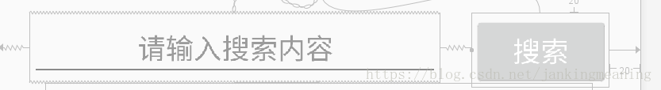

  想要有颜色的椭圆形按钮的话需要自己定义样式，在`drawable`文件夹新建一个文件`button_shape`，用下列代码就可以创建一个蓝色椭圆按钮了，其本质上是使长方形的边角弧度增大

  ```xml
  <?xml version="1.0" encoding="utf-8"?>
  <shape xmlns:android="http://schemas.android.com/apk/res/android"
      android:shape="rectangle">
      <solid android:color="#3F51B5" /> //指定颜色
      <corners android:radius="180dp" />  //指定弧度
  </shape>
  ```

### (3)实验遇到的困难以及解决思路

实验步骤中有

---

## 四、课后实验结果

写了篇博客算吗……

https://janking.wang/post/android1.html

---

## 五、实验思考及感想

Android界面真的很美观，比UWP美观很多了！

---

