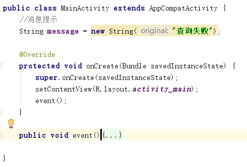
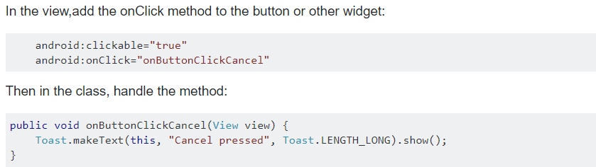

# 中山大学数据科学与计算机学院本科生实验报告
## （2018年秋季学期）
| 课程名称 | 手机平台应用开发 | 任课老师 | 郑贵锋 |
| :------------: | :-------------: | :------------: | :-------------: |
| 年级 | 2016 | 专业（方向） | 嵌软 |
| 学号 | 16340215 | 姓名 | 王建 |
| 电话 | 13246824607 | Email | jankingwon@foxmail.com |
| 开始日期 | 2018-9-27 | 完成日期 |2018-10-2|

---

## 一、实验题目

1. 了解Android编程基础。
2. 熟悉Button、RadioButton、EditText等基本控件，能够处理这些控件的基本事件。
3. 学会弹出对话框，并定制对话框中的内容，能对确定和取消按钮的事件做处理。

---

## 二、实现内容

- 该界面为应用启动后看到的第一个界面。  
- 各控件处理的要求
  1. 点击搜索按钮：
     - 如果搜索内容为空，弹出Toast信息“**搜索内容不能为空**”。
     - 如果搜索内容为“Health”，根据选中的RadioButton项弹出如下对话框。  
         
       点击“确定”，弹出Toast信息——**对话框“确定”按钮被点击**。  
       点击“取消”，弹出Toast 信息——**对话框“取消”按钮被点击**。  
       否则弹出如下对话框，对话框点击效果同上。  
         
  2. RadioButton选择项切换：选择项切换之后，弹出Toast信息“**XX被选中**”，例如从图片切换到视频，弹出Toast信息“**视频被选中**”  

---

## 三、课堂实验结果
### (1)实验截图

### (2)实验步骤以及关键代码

> 实验目的：
>
> 1. 了解`Android`编程基础。
> 2. 熟悉`Button`、`RadioButton`、`EditText`等基本控件，能够处理这些控件的基本事件。
> 3. 学会弹出对话框，并定制对话框中的内容，能对确定和取消按钮的事件做处理。

- 1.首先要知道在哪里添加事件代码


- 2.还需要分析一下这个``java``文件的结构



在`OnCreate`方法里面创建了一个`savedInstanceState`，还把它的`View`设置为上次的布局`activity_main`，这都不重要，总是，把填写的事件应该放在`onCreate`里面，不然就无法被调用，如果觉得放的太乱了，也可以新建一个自己的事件方法，然后在`onCreate`里面调用这个方法，**记得要最后调用**

- 3.然后需要解决下面的一些问题

## 如何获取`EditText`中的值

```java
final EditText editText = (EditText)findViewById(R.id.edit_text);
String text = editText.getText().toString();
```

这里是通过`EditText`的`id`找到它，但是需要声明为`final`，不然会报错说内部类的变量应该定义为`final`

## 如何获取选中的`RadioButton`的值

```java
final RadioGroup radioGroup = (RadioGroup)findViewById(R.id.rg);
String text = ((RadioButton)findViewById(radioGroup.getCheckedRadioButtonId())).getText();
```

这里同样也是通过`id`找到该值，不需要调用`toString`方法

## 如何添加按钮事件

```java
final Button btn = (Button) findViewById(R.id.button);
if(btn != null){
    btn.setOnClickListener(new View.OnClickListener(){
        @Override
        public void onClick(View view){
            //添加一些事件
        }
    });
}
```

这里是通过直接在`java`代码里添加监听器以及`onClick`方法

还有一种方式是在xml里添加按钮的`onClick`属性，然后指向自己写的`onClick`方法（当然名称可以变），如下图



## 如何弹出`Toast`信息

```java
//单选按钮更改事件
        radioGroup.setOnCheckedChangeListener(new RadioGroup.OnCheckedChangeListener() {
            @Override public void onCheckedChanged(RadioGroup group, int checkedId) {
                Toast.makeText(getApplicationContext(),((RadioButton)findViewById(radioGroup.getCheckedRadioButtonId())).getText() + "被选中",Toast.LENGTH_SHORT).show();

            } });
```

这里实现的是改变`RadioGroup`中选中的按钮触发的事件，像添加按钮事件一样

然后里面实现了点击不同的`RadioButton`弹出不同的`Toast`提示“XXX被选中”

## 如何弹出对话框`AlertDialog`

```java
final AlertDialog.Builder alertDialog = new AlertDialog.Builder(MainActivity.this);
alertDialog.setTitle("提示").setMessage(message).setPositiveButton("确认",
        new DialogInterface.OnClickListener() {
            @Override
            public void onClick(DialogInterface dialog, int which) {
                Toast.makeText(getApplicationContext(),"对话框“确定”按钮被点击",Toast.LENGTH_SHORT).show();
            }
        }).setNegativeButton("取消",
        new DialogInterface.OnClickListener() {
            @Override
            public void onClick(DialogInterface dialog, int which) {
                Toast.makeText(getApplicationContext(),"对话框“取消”按钮被点击",Toast.LENGTH_SHORT).show();
            }
        }).create().show();
```

主要需要实先`setTitle`，`setMessage`，`setPositiveButton`，`setNegativeButton`

在这个里面还实现了点击两个不同按钮弹出不同Toast提示的事件

### (3)实验遇到的困难以及解决思路

## 重点：如何根据不同情况弹出不同的对话框`AlertDialog`

也许这个最终实现起来代码很简单，但是我的想法确实有点曲折

> 要求：
>
> - 如果搜索内容为空，弹出`Toast`信息“**搜索内容不能为空**”。
> - 如果搜索内容为“Health”，根据选中的`RadioButton`项弹出信息“**xxx搜索成功**”，xxx是`RadioButton`选中的内容
> - 其他情况，弹出“**搜索失败**”

### 思路一：

我先创建好`AlertDialog`，然后再调用``setMessage(message)`来适应不同情况下的提示消息

**结果：失败！**

因为``AlertDialog``一但创建好就是`final`的不会改变，后来是改变不了的，所以效果就是一直弹出的知识最开始设定的消息

另外，也不要想创建的时候用`String`传值给`setMessage`，然后改变这个`String`就好了，**我试过了，不可以！**

### 思路二:

得到这个博客[Android AlertDialog 动态更新里面的ListView数据](https://www.cnblogs.com/galibujianbusana/p/8259150.html)的启发，想用`ListView`来存储消息，但是容量只有一个，`AlertDialog`中的样式由自定义的`xml`确定，里面当然就是`ListView`了，每次需要调用`AlertDialog`的时候就把容器里面唯一的消息弹出来，把需要的消息放进去，就可以改变消息了

**结果：或许能成功，但太过麻烦**

为什么说或许能成功呢，反正我是失败了，而且即使把上面老哥的代码跑一遍也还是失败了，失败的标志就是**程序闪退：停止运行**，但是理论上我觉得是可行的，只是暂时还是不会正确使用`ListView`和`AlertDIalog`……

不过这个方法确实太麻烦了，还要定义容器，设置`ArrayAdapter`等等，有点大材小用的感觉

### 思路三：

本来是最容易想到的，但却是我最后想到的！

**为什么非要改变那个创建好的`AlertDialog`呢，就不能创建不同的几个吗？**

所以啊，只要在按钮点击事件`onClick`里面创建`AlertDialog`而不是放在此方法外面当一个类成员就好了吗，真的是笨！

> emmm，不知道有没有人能想到另一种实现：我先在类里面创建好所有的`AlertDialog`，然后根据需要调用就好了，肯定可以！只是浪费资源，代码冗长。

**结果：成功！**

最后实现的代码就是这样子

```java
//消息提示
String message = new String("查询失败");

@Override
protected void onCreate(Bundle savedInstanceState) {
    super.onCreate(savedInstanceState);
    setContentView(R.layout.activity_main);
    event();
}

public void event(){
    //获取输入文本
    final EditText editText = (EditText)findViewById(R.id.edit_text);

    //获取单选内容
    final RadioGroup radioGroup = (RadioGroup)findViewById(R.id.rg);


    //按钮点击事件
    final Button btn = (Button) findViewById(R.id.button);
    if(btn != null){
        btn.setOnClickListener(new View.OnClickListener(){
            @Override
            public void onClick(View view){
                message = (editText.getText().toString().isEmpty() ? "搜索内容不能为空" :
                        (editText.getText().toString().equals("Health") ?((RadioButton)findViewById(radioGroup.getCheckedRadioButtonId())).getText() + "搜索成功": "搜索失败"));
                //对话框
                final AlertDialog.Builder alertDialog = new AlertDialog.Builder(MainActivity.this);
                alertDialog.setTitle("提示").setMessage(message).setPositiveButton("确认",
                        new DialogInterface.OnClickListener() {
                            @Override
                            public void onClick(DialogInterface dialog, int which) {
                                Toast.makeText(getApplicationContext(),"对话框“确定”按钮被点击",Toast.LENGTH_SHORT).show();
                            }
                        }).setNegativeButton("取消",
                        new DialogInterface.OnClickListener() {
                            @Override
                            public void onClick(DialogInterface dialog, int which) {
                                Toast.makeText(getApplicationContext(),"对话框“取消”按钮被点击",Toast.LENGTH_SHORT).show();
                            }
                        }).create().show();

            }
        });
    }

    //单选按钮更改事件
    radioGroup.setOnCheckedChangeListener(new RadioGroup.OnCheckedChangeListener() {
        @Override public void onCheckedChanged(RadioGroup group, int checkedId) {
            Toast.makeText(getApplicationContext(),((RadioButton)findViewById(radioGroup.getCheckedRadioButtonId())).getText() + "被选中",Toast.LENGTH_SHORT).show();

        } });
}
```

---

## 四、课后实验结果

写了篇博客算吗……

https://janking.wang/post/android2.html

---

## 五、实验思考及感想

### 大道至简！

