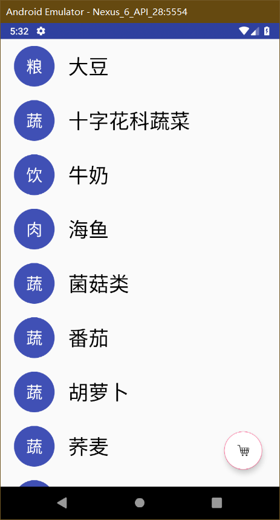
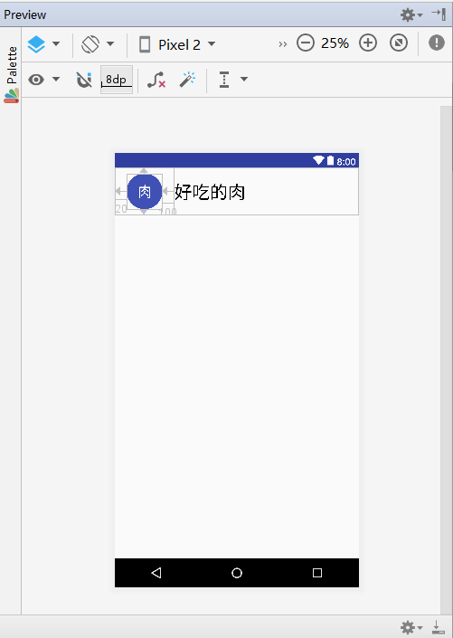
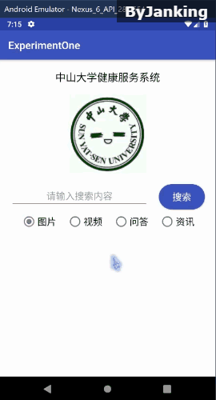
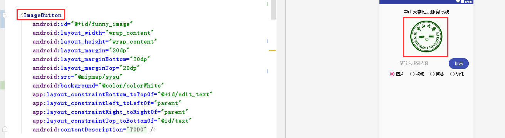
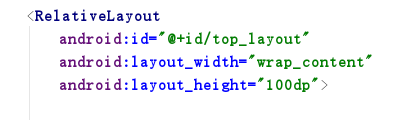
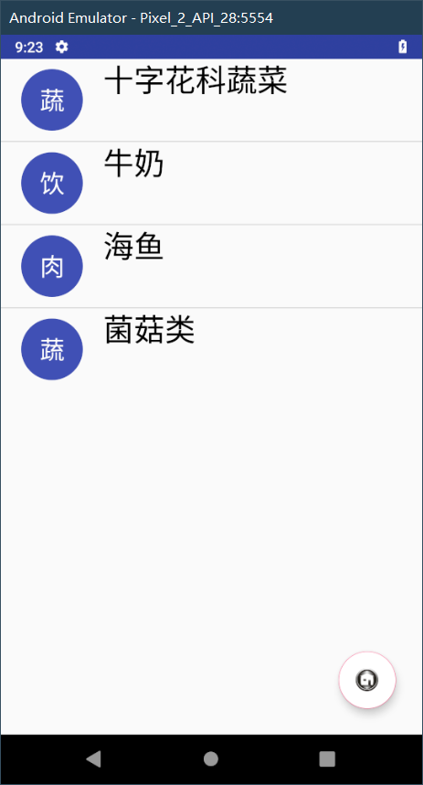

中山大学数据科学与计算机学院本科生实验报告

## （2018年秋季学期）

| 课程名称 | 手机平台应用开发 |   任课老师   |         郑贵锋         |
| :------: | :--------------: | :----------: | :--------------------: |
|   年级   |       2016       | 专业（方向） |          嵌软          |
|   学号   |     16340215     |     姓名     |          王建          |
|   电话   |   13246824607    |    Email     | jankingwon@foxmail.com |
| 开始日期 |       2018       |   完成日期   |          2018          |

------

## 一、实验题目

1. 复习事件处理。
2. 学习Intent、Bundle在Activity跳转中的应用。
3. 学习RecyclerView、ListView以及各类适配器的用法。
4. 学习FloatingActionBar的用法。

------

## 二、实现内容

- 使用RecyclerView实现食品列表。点击某个食品会跳转到该食品的详情界面，呈现该食品的详细信息。长按列表中某个食品会删除该食品，并弹出Toast，提示 **"删除XX"** 。
- 点击右下方的FloatingActionButton，从食品列表切换到收藏夹或从收藏夹切换到食品列表，并且该按钮的图片作出相应改变。
- 使用ListView实现收藏夹。点击收藏夹的某个食品会跳转到食品详情界面，呈现该食品的详细信息。长按收藏夹中的某个食品会弹出对话框询问是否移出该食品，点击确定则移除该食品，点击取消则对话框消失。对话框内容如下图所示。
- 商品详情界面中点击返回图标会返回上一层。点击星标会切换状态，如果原本是空心星星，则会变成实心星星；原本是实心星星，则会变成空心星星。点击收藏图表则将该食品添加到收藏夹并弹出Toast提示 **"已收藏"** 。
- 食品列表和收藏夹中，圆圈是圆的，圆圈内的字居中，圆圈和食品名字垂直居中。
- 食品详情界面中，顶部占三分之一的**实现方法**。以及界面顶部各控件的位置与对齐关系。
- 食品详情界面中，中部收藏符号旁边的分割线上下与符号等高且垂直居中。
- 食品列表用RecyclerView实现，收藏夹用ListView实现，食品详情底部的四个操作列表用ListView实现。
- 单击后跳转各项资料显示正确，星星点击后行为正常，返回图表功能正常。
- 食品列表中的食品长按后能正确删除食品，且删除后列表工作正常（点击其他食品显示信息正确，长按其他食品删除操作正确）。
- 收藏夹中的食品长按后弹出框显示内容正确，点击确定后能正确删除食品，且删除后列表工作正常（点击其他食品显示信息正确，长按其他食品删除操作正确）。
- 长按事件能正确处理，不会报错
- 悬浮按钮的功能正确。
- 从收藏夹界面点击食品X进入食品X的详情界面，点击收藏图标后，点击返回按钮，回到收藏夹界面且收藏夹内多出食品X这一项。若在食品X的详情界面没有点击收藏图标，返回后收藏夹界面也不会多出食品X的条目。
- 详情界面点击返回按钮，是返回上一界面，而非跳转到新的界面中，即不是跳转到新建的食品列表界面或收藏夹界面。
- 点击收藏夹界面的"收藏夹"一项，应用不会出错。

------

## 三、课堂实验结果

### (1)实验截图

#### RecyclerView



#### ListView


#### Detail


#### activity_single_recyclerview



#### Final



------


### (2)实验步骤以及关键代码

#### 首先

本次任务我是在第一二次作业的基础上完成的，我把这个地方从`ImageView`改成了`ImageButton`，点击之后进入`activity_second`，就是列表项了



#### 去掉标题栏

现在来讨论去掉标题栏的问题

打开文件`res/values/styles.xml`，添加

```xml
<style name="NoTitle" parent="Theme.AppCompat.Light.NoActionBar">
    <!-- Customize your theme here. -->
    <item name="colorPrimary">@color/colorPrimary</item>
    <item name="colorPrimaryDark">@color/colorPrimaryDark</item>
    <item name="colorAccent">@color/colorAccent</item>
</style>
```

打开文件`manifests/AndroidManifests.xml`

把`application`里面的`android:theme="@style/AppTheme"`

改为`android:theme="@style/NoTitle"`

**如果有多个`Activity`，但是只想去掉某个Activity的标题栏怎么办呢？**

那就不要改`application`的属性，找到需要修改的`activity`，改成下面的样子

```xml
<activity
    android:name=".SecondActivity"
    android:theme="@style/NoTitle"></activity
```

#### RecyclerView

首先在`build.gradle(Module:app)`的`dependencies`处添加依赖

`
implementation 'com.android.support:recyclerview-v7:28.0.0'
`

> 这里的28.0.0根据`Android`项目的sdk版本来选择

然后在`res/layout`创建一个`RecyclerView`的单项布局文件`activity_single_recyclerview.xml`

```xml
<--file:activity_single_recyclerview.xml-->

<?xml version="1.0" encoding="utf-8"?>
<android.support.constraint.ConstraintLayout xmlns:android="http://schemas.android.com/apk/res/android"
    xmlns:tools="http://schemas.android.com/tools"
    android:layout_width="match_parent"
    android:layout_height="80dp"
    xmlns:app="http://schemas.android.com/apk/res-auto">

    <TextView
        android:id="@+id/rv_icon"
        android:layout_width="wrap_content"
        android:layout_height="wrap_content"
        android:layout_marginBottom="10dp"
        android:layout_marginStart="20dp"
        android:layout_marginTop="10dp"
        android:background="@drawable/food_icon"
        android:gravity="center"
        android:text="肉"
        android:textColor="@color/colorWhite"
        android:textSize="24sp"
        app:layout_constraintBottom_toBottomOf="parent"
        app:layout_constraintStart_toStartOf="parent"
        app:layout_constraintTop_toTopOf="parent" />

    <TextView
        android:id="@+id/rv_text"
        android:layout_width="match_parent"
        android:layout_height="match_parent"
        android:layout_marginLeft="100dp"
        android:paddingTop="20dp"
        android:text="好吃的肉"
        android:textColor="@color/colorBlack"
        android:textSize="30sp"
        app:layout_constraintStart_toEndOf="@id/rv_icon" />

</android.support.constraint.ConstraintLayout>
```

在`java/com.example.yourname`，比如我的是`java/com.janking.sysuhealth`

新建一个数据类`Food.java`，用来给`RecyclerView`填充数据

> 这里用了`implements Serializable`，是为了方便后面传递`Intent`

```java
package com.janking.sysuhealth;

import android.graphics.Color;

import java.io.Serializable;

public class Food implements Serializable {
    private String name;
    private String category;
    private String nutrition;
    private Boolean favorite;
    private String color;

    public Food(String a, String b, String c, String d){
        name = a;
        category = b;
        nutrition = c;
        favorite = false;
        color = d;
    }

    public void setName(String name) {
        this.name = name;
    }

    public void setCategory(String category) {
        this.category = category;
    }

    public void setNutrition(String nutrition) {
        this.nutrition = nutrition;
    }

    public void setFavorite(Boolean favorite) {
        this.favorite = favorite;
    }

    public Boolean getFavorite() {
        return favorite;
    }

    public String getCategory() {
        return category;
    }

    public String getName() {
        return name;
    }

    public String getNutrition() {
        return nutrition;
    }

    public String getColor() {
        return color;
    }
}
```

接下来新建一个类`MyAdapter.java`，用来决定数据信息以及展示的UI

```java
package com.janking.sysuhealth;

import android.graphics.Color;
import android.support.v4.view.ViewCompat;
import android.support.v4.view.ViewPropertyAnimatorListener;
import android.support.v7.widget.RecyclerView;
import android.view.LayoutInflater;
import android.view.View;
import android.view.ViewGroup;
import android.widget.TextView;

import java.util.ArrayList;
import java.util.List;

import jp.wasabeef.recyclerview.animators.holder.AnimateViewHolder;


public class MyAdapter extends RecyclerView.Adapter<MyAdapter.ViewHolder> {

    private List<Food> mDatas;
    private MyAdapter.OnItemClickListener onItemClickListener;

    public MyAdapter(){
        initData();
    }

    public void initData()
    {
        mDatas = new ArrayList<Food>();
        mDatas.add(new Food("大豆", "粮食", "蛋白质", "#BB4C3B"));
        mDatas.add(new Food("十字花科蔬菜","蔬菜","维生素C", "#C48D30"));
        mDatas.add(new Food("牛奶","饮品","钙","#4469B0"));
        mDatas.add(new Food("海鱼","肉食","蛋白质", "#20A17B"));
        mDatas.add(new Food("菌菇类","蔬菜","微量元素", "#BB4C3B"));
        mDatas.add(new Food("番茄","蔬菜","番茄红素","#4469B0"));
        mDatas.add(new Food("胡萝卜","蔬菜","胡萝卜素", "#20A17B"));
        mDatas.add(new Food("荞麦","蔬菜","膳食纤维", "#BB4C3B"));
        mDatas.add(new Food("鸡蛋","杂","几乎包含所有营养物质", "#C48D30"));
    }


    @Override
    public ViewHolder onCreateViewHolder(ViewGroup parent, int viewType)
    {
        // 实例化展示的view
        View v = LayoutInflater.from(parent.getContext()).inflate(R.layout.activity_single_recyclerview, parent, false);
        // 实例化viewholder
        ViewHolder viewHolder = new ViewHolder(v);
        return viewHolder;
    }

    @Override
    public void onBindViewHolder(final ViewHolder holder, int position) {
        // 绑定数据
        holder.mTv.setText(mDatas.get(position).getName());
        holder.mIcon.setText(mDatas.get(position).getCategory().subSequence(0,1));
        //listener
        holder.itemView.setOnClickListener(new View.OnClickListener() {
            @Override
            public void onClick(final View v) {
                if(onItemClickListener != null) {
                    int pos = holder.getLayoutPosition();
                    onItemClickListener.onItemClick(holder.itemView, pos);
                }
            }
        });

        holder.itemView.setOnLongClickListener(new View.OnLongClickListener() {
            @Override
            public boolean onLongClick(View v) {
                if(onItemClickListener != null) {
                    int pos = holder.getLayoutPosition();
                    onItemClickListener.onItemLongClick(holder.itemView, pos);
                }
                //表示此事件已经消费，不会触发单击事件
                return true;
            }
        });

    }

        @Override
        public int getItemCount()
        {
            return mDatas.size();
        }

        public void addNewItem(Food f) {
            if(mDatas == null) {
                mDatas = new ArrayList<>();
            }
            mDatas.add(0, f);
            notifyItemInserted(0);
        }

        public void deleteItem(int pos) {
            if(mDatas == null || mDatas.isEmpty()) {
                return;
            }
            mDatas.remove(pos);
            notifyItemRemoved(pos);
        }

        public Food getItem(int pos){
            if(mDatas == null || mDatas.isEmpty())
                return null;
            return mDatas.get(pos);
        }


    public boolean updateData(String name, Boolean favorite) {
        for(Food i : mDatas){
            if(i.getName().equals(name)){
                if(i.getFavorite().equals(favorite))
                    return false;
                i.setFavorite(favorite);
                return true;
            }
        }
        return false;

    }

    /**
     * 设置回调监听
     *
     * @param listener
     */
    public void setOnItemClickListener(MyAdapter.OnItemClickListener listener) {
        this.onItemClickListener = listener;
    }

    public interface OnItemClickListener {
        void onItemClick(View view, int position);
        void onItemLongClick(View view, int position);
    }

    public static class ViewHolder extends RecyclerView.ViewHolder {
        TextView mTv, mIcon;
        public ViewHolder(View itemView) {
            super(itemView);
            mTv = (TextView) itemView.findViewById(R.id.rv_text);
            mIcon = (TextView)itemView.findViewById(R.id.rv_icon);
        }


    }
}
```

在`Activity`的`xml`文件里面添加`RecyclerView`的组件

```java
<android.support.v7.widget.RecyclerView
    android:id="@+id/id_recyclerview"
    android:dividerHeight="10dp"
    android:layout_width="match_parent"
    android:layout_height="match_parent" />
```

在`Activity`的`java`文件里面添加对`RecyclerView`的解析

```java
private RecyclerView mRecyclerView;
private RecyclerView.LayoutManager mLayoutManager;
private MyAdapter mAdapter;
@Override
    protected void onCreate(Bundle savedInstanceState)
    {
        super.onCreate(savedInstanceState);
        setContentView(R.layout.activity_second);

        //about RecyclerView
        mLayoutManager = new LinearLayoutManager(this, LinearLayoutManager.VERTICAL, false);
        mAdapter = new MyAdapter();
        mRecyclerView = (RecyclerView) findViewById(R.id.id_recyclerview);
        mRecyclerView.setLayoutManager(mLayoutManager);
        //这里省去了点击事件，后面再讨论
    }
```

#### ListView

这个就要简单一点了，不过也得添加自己的`Adapter`

新建一个`MyListViewAdapter.java`

```java
package com.janking.sysuhealth;

import android.util.Log;
import android.view.LayoutInflater;
import android.view.View;
import android.view.ViewGroup;
import android.widget.BaseAdapter;
import android.widget.TextView;
import android.widget.Toast;

import java.util.ArrayList;
import java.util.List;

public class MyListViewAdapter extends BaseAdapter {
    private List<Food> list;

    public MyListViewAdapter() {

        list = new ArrayList<Food>();
        list.add(new Food("收藏夹", "*", "*" , "#000000"));
    }
    @Override
    public int getCount() {
        if (list == null) {
            return 0;
        }
        return list.size();
    }

    @Override
    public long getItemId(int i) {
        return i;
    }

    @Override
    public Food getItem(int i) {
        if (list == null) {
            return null;
        }
        return list.get(i);
    }

    public void addNewItem(Food f) {
        if(list == null) {
            list = new ArrayList<>();
        }
        list.add(f);
        notifyDataSetChanged();
    }

    public void deleteItem(int pos) {
        if(list == null || list.isEmpty()) {
            return;
        }
        list.remove(pos);
        notifyDataSetChanged();
    }

    public void deleteItemByName(String name) {
        if(list == null || list.isEmpty()) {
            return;
        }
        for(Food i : list){
            if(i.getName().equals(name)){
                list.remove(i);
                System.out.print("successful");
                break;
            }
        }
        notifyDataSetChanged();
    }

    @Override
    public View getView(int i, View convertView, ViewGroup viewGroup) {
        // 新声明一个ViewHoleder变量
        ViewHolder viewHolder;
        // 当view为空时才加载布局，否则，直接修改内容
        if (convertView == null) {
            // 通过inflate的方法加载布局，context需要在使用这个Adapter的Activity中传入。
            convertView = LayoutInflater.from(viewGroup.getContext()).inflate(R.layout.activity_single_recyclerview, null);
            viewHolder = new ViewHolder();
            viewHolder.mTv = (TextView) convertView.findViewById(R.id.rv_text);
            viewHolder.mIcon= (TextView) convertView.findViewById(R.id.rv_icon);
            convertView.setTag(viewHolder); // 用setTag方法将处理好的viewHolder放入view中
        } else { // 否则，让convertView等于view，然后从中取出ViewHolder即可
            viewHolder = (ViewHolder) convertView.getTag();
        }
        // 从viewHolder中取出对应的对象，然后赋值给他们
        viewHolder.mTv.setText(list.get(i).getName());
        viewHolder.mIcon.setText(list.get(i).getCategory().subSequence(0,1));
        // 将这个处理好的view返回
        return convertView;
    }

    private class ViewHolder {
        public TextView mTv, mIcon;
    }
}
```

在`Activity`的`xml`文件里面添加`ListView`的组件

```xml
<ListView
    android:visibility="invisible"
    android:id="@+id/listView"
    android:layout_width="match_parent"
    android:layout_height="wrap_content" />
```

在`Activity`的`java`文件里面添加对`ListView`的解析

```java
private ListView mListView;
private MyListViewAdapter myListViewAdapter;
protected void onCreate(Bundle savedInstanceState)
    {
        super.onCreate(savedInstanceState);
        setContentView(R.layout.activity_second);

        //about ListView
        mListView = (ListView) findViewById(R.id.listView);
        myListViewAdapter = new MyListViewAdapter();
        mListView.setAdapter(myListViewAdapter);
        //这里省去了点击事件，后面再讨论

    }
```

#### FloatingActionBar

仍然在`build.gradle(Module:app)`里面添加依赖

版本号记得根据自己项目的版本更改

```gradle
implementation 'com.android.support:design:28.0.0'
```

在`activity`的`xml`布局文件中添加

```xml
<android.support.design.widget.FloatingActionButton
    android:id="@+id/float_btn"
    android:layout_width="wrap_content"
    android:layout_height="wrap_content"
    android:src="@mipmap/collect"
    android:backgroundTint="@color/colorWhite"
    android:backgroundTintMode="src_atop"
    app:layout_constraintBottom_toBottomOf="parent"
    app:layout_constraintRight_toRightOf="parent"
    android:layout_margin="25dp" />
```

现在我们想把之前的`RecyclerView`和`ListView`都放在一个`Activity`里面，然后通过点击`FloatingActionBar`来切换，并且动态改变`FloatingActionBar`的图标

在`Activity`的`java`文件中添加

```java
private FloatingActionButton mButton;
private boolean isHome;
@Override
protected void onCreate(Bundle savedInstanceState)
    {
        super.onCreate(savedInstanceState);
        setContentView(R.layout.activity_second);
         //about FloatingActionButton
        isHome = true;
        event();
    }
public void event(){
        /* 为FloatingActionButton设置点击事件 */
        mButton = (FloatingActionButton) findViewById(R.id.float_btn);
        mButton.setOnClickListener(new View.OnClickListener() {
            @Override
            public void onClick(View view) {
                if(isHome){
                    findViewById(R.id.id_recyclerview).setVisibility(View.INVISIBLE);
                    findViewById(R.id.listView).setVisibility(View.VISIBLE);
                    mButton.setImageResource(R.mipmap.mainpage);
                    isHome = false;
                }else{
                    findViewById(R.id.id_recyclerview).setVisibility(View.VISIBLE);
                    findViewById(R.id.listView).setVisibility(View.INVISIBLE);
                    mButton.setImageResource(R.mipmap.collect);
                    isHome = true;
                }
            }
        });

    }

```

这样是通过更改`RecyclerView`和`ListView`的`Visibility`属性来切换两个列表的，并没有切换`Activity`，那怎么切换`Activity`呢？

#### 切换Activity|Intent的传送和接收

这里讨论的不是没有灵魂的切换页面，而是要有**数据的传递和同步**，

不然的话下面一句代码就可以了

```java
startActivity(new Intent(MainActivity.this,SecondActivity.class));
```

> 这里说明我该篇博客使用的都是`SecondActivity`，它是从`MainActivity`里跳转过来的

> 两个Activity之间传递数据，数据的附加有两种方式：
> 一种是 直接 intent.putxx(); 
> 另一种是  先bundle.putxx(), 然后再调用public Intent putExtras (Bundle extras)  添加bundle.

**其实两种的本质是一样的！**

**对于即将跳转的页面`SecondActivity`**

这里是使用`Bundle`，它可以通过调用

```java
public void putBoolean(String key, boolean value);  
public void putByte(String key, byte value);  
public void putChar(String key, char value);  
```

等方法放入特定类型的数据，那我们怎么把自己定义的类放进去呢，所以前面我们定义数据类的时候加入了`implements Serializable`，然后就可以调用

```java
Bundle bundle=new Bundle();
bundle.putSerializable("Click_Food", myListViewAdapter.getItem(i));
```

然后把它放入`Intent`

```java
Intent intent=new Intent(SecondActivity.this, Detail.class);
intent.putExtras(bundle);
```

然后启动

```java
startActivityForResult(intent, 0);//这里采用startActivityForResult来做跳转
//这里传入的参数0很关键，它在后面是用来接收Activity回调数据的依据
```

**然后对于新页面:Detail，要怎么接收呢？**

最好在`OnCreate`函数里加上下面代码

```java
private Food display_food;
display_food = (Food)getIntent().getSerializableExtra("Click_Food");
```

这样就可以接收到传过来的`Food`类数据了

那如果这个页面想再次回去刚刚的`SecondActivity`还要像它一样使用`startActivityForResult`吗？

**不用!**

我在这个`Detail`页面做了一个返回的`ImageButton`，然后给它添加事件

```java
//0 表示没有更改，1表示更改过了
int change = 0;
back_bt.setOnClickListener(new View.OnClickListener() {
    @Override
    public void onClick(View view) {
        Intent intent=new Intent();
        Bundle bundle=new Bundle();
        if(change > 0){
            bundle.putSerializable("display",display_food);
            setResult(1, intent);
            //Toast.makeText(Detail.this,"change:" + String.valueOf(change), Toast.LENGTH_SHORT).show();
        }
        else{
            setResult(0, intent);
        }
        intent.putExtras(bundle);
        finish();//此处一定要调用finish()方法
    }
});
```

发现没，这里新建了一个`Intent`，但是调用的是`setResult`，因为这次数据传送是作为上次别人传过来的一个结果，有来有回嘛！最后调用`finish`，数据就又回到之前的`Activity`了

> 还是要注意，这里使用了
>
> setResult(1, intent); 或者 setResult(0, intent);

**对于收到Detail回应的页面`SecondActivity`**

要处理经过一个来回的数据改变，所以在这个Activity里要重写一个方法

```java
protected void onActivityResult(int requestCode, int resultCode, Intent data) {

    if (requestCode == 0) {//表示来自Detail跳转的
        if (resultCode == 1) {//表示内容更改过
            Food f = (Food) data.getSerializableExtra("display");
            //change RecyclerView
            mAdapter.updateData(f.getName(), f.getFavorite());
            myListViewAdapter.addNewItem(f);
        }
    }
}
```

> requestCode：跟之前startActivityForResult过去的参数0一致，因为一个页面可能在不同情况会跳到不同页面，而只有一个处理Result的方法，通过这个参数确认是来自哪一个页面的回应
>
> resultCode：这个其它页面给予回应时对结果的一个修饰，比如这里通过resultCode可以知道传过去的Food数据有没有被修改

#### RecyclerView和ListView的点击事件

准确的说分为**点击**和**长按**

这里实现的是点击跳转到新页面**Detail**，长按**删除该元素**

```java
//Click events for RecyclerView
mAdapter.setOnItemClickListener(new MyAdapter.OnItemClickListener() {
    @Override
    public void onItemClick(View view, int position) {
        //go to detail
        Intent intent=new Intent(SecondActivity.this, Detail.class);
        Bundle bundle=new Bundle();
        bundle.putSerializable("Click_Food", mAdapter.getItem(position));
        intent.putExtras(bundle);
        startActivityForResult(intent, 0);//这里采用startActivityForResult来做跳转，此处的0为一个依据，可以写其他的值，但一定要>=0

    }
    @Override
    public void onItemLongClick(View view, int position) {
        //delete
        String deleteName = mAdapter.getItem(position).getName();
        //顺序很重要，先删除收藏夹中的，再删除总列表中的
        myListViewAdapter.deleteItemByName(deleteName);
        mAdapter.deleteItem(position);

        Toast.makeText(SecondActivity.this,"删除 " + deleteName, Toast.LENGTH_SHORT).show();
    }
```

这里实现的是点击跳转到新页面**Detail**，长按**跳出对话框是否删除该元素**

```java
//Click events for ListView
mListView.setOnItemClickListener(new AdapterView.OnItemClickListener() {
    @Override
    public void onItemClick(AdapterView<?> adapterView, View view, int i, long l) {
        if(i == 0)
            return;
        // 处理单击事件
        Intent intent=new Intent(SecondActivity.this, Detail.class);
        Bundle bundle=new Bundle();
        bundle.putSerializable("Click_Food", myListViewAdapter.getItem(i));
        intent.putExtras(bundle);
        startActivityForResult(intent, 0);//这里采用startActivityForResult来做跳转，此处的0为一个依据，可以写其他的值，但一定要>=0
    }
});
mListView.setOnItemLongClickListener(new AdapterView.OnItemLongClickListener() {
    @Override
    public boolean onItemLongClick(AdapterView<?> adapterView, View view,final int i, long l) {
        if(i == 0)
            return false;
        // 处理长按事件
        final AlertDialog.Builder alertDialog = new AlertDialog.Builder(SecondActivity.this);
        alertDialog.setTitle("提示").setMessage("是否确定删除" + myListViewAdapter.getItem(i).getName() + "？").setPositiveButton("确认",
                new DialogInterface.OnClickListener() {
                    @Override
                    public void onClick(DialogInterface dialog, int which) {
                        //先更新总列表中元素的数据，再删除
                        mAdapter.updateData(myListViewAdapter.getItem(i).getName(), false);
                        myListViewAdapter.deleteItem(i);
                    }
                }).setNegativeButton("取消",null).create().show();
        return true;
    }
});
```

#### 用java代码更改View背景颜色

```java
top_view = findViewById(R.id.top_view);
top_view.setBackgroundColor(Color.parseColor(display_food.getColor()));
```

注意我这里的Food类的Color成员是用String存储的，类似于`"#BB4C3B"`，而不是十六进制数字！

PS:从之前的`Adapter`中的赋值也可以看的出来


#### 更改RecyclerView动画

先在`build.gradle`里面添加依赖

```gradle
implementation 'jp.wasabeef:recyclerview-animators:2.3.0'
implementation 'com.android.support:support-core-utils:28.0.0'
```

大概来说呢，就是有两种办法加动画

1. 通过`setItemAnimator

   ```java
   //SecondActivity.java
   //animation remove and add
   SlideInRightAnimator animator = new SlideInRightAnimator(new OvershootInterpolator(1f));
   mRecyclerView.setItemAnimator(animator);
   ```

   **实现了添加和删除条目的动画**

   ### 通过`setAdapter

   ```java
   //SecondActivity.java
   //animation general
   SlideInRightAnimationAdapter slideInRightAnimationAdapter = new SlideInRightAnimationAdapter(mAdapter);
   slideInRightAnimationAdapter.setFirstOnly(false);
   mRecyclerView.setAdapter(new SlideInBottomAnimationAdapter(slideInRightAnimationAdapter));
   ```

   **实现了滚动时的动画**


   我也不明白为什么它们为什么不能独自完成所有动画，看了下`Github`源码，其实感觉这个`Animator`功能都实现了，不过好在它们**不冲突**，所以我干脆两个都加上了

#### 设置View控件占据屏幕的比例

**如何实现某个控件按照屏幕比例来布局(把`Layout`姑且也算为控件吧)？**

**思路一**：通过`Android`已经拥有的方法或者`Layout`方式来布局

查了下Android的布局类型

- **线性布局（Linear Layout）**
- 相对布局（Relative Layout）
- 表格布局（Table Layout）
- 网格视图（Grid View）
- 绝对布局（Absolute Layout）
- 标签布局（Tab Layout）
- 列表视图（List View）

**暂时**只发现线性布局有这个按照比例布局的功能，我试过，但是**不好用**，因为我现在的布局就是当时尝试的Linear Layout，然而我还是得尝试别的办法……

> 不好用不是说不能用，就是布局复杂起来就不太好弄，而且也才刚学，能力有限……

**思路二**：通过`java`代码动态获取屏幕的高度和宽度来设置控件的布局

**话不多少，直接操作**

在`layout`文件里找到需要改变布局宽度或者高度的控件添加`id`，我这里是想调整一整个`RelativeLayout`，这里的高度我是随便设置的，待会就是要改变它



在java代码里添加下列代码（如果是在`Activity`里最好写在`Oncreate()`里面）

```java
DisplayMetrics dm = getResources().getDisplayMetrics();
RelativeLayout top_layout = findViewById(R.id.top_layout);
ViewGroup.LayoutParams lp = top_layout.getLayoutParams();
lp.height = dm.heightPixels / 3;//设置1/3
lp.width = ViewGroup.LayoutParams.WRAP_CONTENT;
top_layout.setLayoutParams(lp); //设置
```

**注**：这个`LayoutParams`的方式设置的单位是`像素`即`px`，而不是`dp`不过我们通过`getResources().getDisplayMetrics()`得到的也是屏幕的宽度和高度的像素，按照比例来讲是没有问题，如果想要设置dp的话则需要将像素转换为像素密度了

------


### (3)实验遇到的困难以及解决思路

#### 删除顺序

之前写了如下代码

```java
public void onItemLongClick(Viewview,intposition){
//StringdeleteName=mAdapter.getItem(position).name;
mAdapter.deleteItem(position);
Toast.makeText(SecondActivity.this,"删除"+mAdapter.getItem(position).name,Toast.LENGTH_SHORT).show();
}
```

然后崩溃了，因为我在删除了`postion`位置的元素之后还使用`mAdapter.getItem(position)`去获取它，虽然不是一定出错，但是当`postion`位置的元素不存在时就访问了越界的`List`……

所以应该改为

```java
public void onItemLongClick(Viewview,intposition){
StringdeleteName = mAdapter.getItem(position).name;
mAdapter.deleteItem(position);
Toast.makeText(SecondActivity.this,"删除"+deleteName,Toast.LENGTH_SHORT).show();
}
```

#### setText的类型

我想让列表左边的圆圈里显示类别的第一个字

```java
holder.mIcon.setText(mDatas.get(position).category[0]);
```

这样是错的，暂时忘记了错的原因，也许可能差不多就是`setText`只能接受`String`类吧

反正这样写就好了

```java
holder.mIcon.setText(mDatas.get(position).category.subSequence(0,1));
```

#### RecyclerView和ListView布局

之前我的单个布局文件是这样的(省略其它)

```xml
<TextView
android:id="@+id/rv_text"
android:layout_width="match_parent"
android:layout_height="match_parent"
android:layout_marginLeft="100dp"
android:gravity="center_vertical"
android:text="好吃的肉"
android:textColor="@color/colorBlack"
android:textSize="30sp"
app:layout_constraintStart_toEndOf="@id/rv_icon"/>

```

**然后发现在RecyclerView中正常，但是ListView中不正常**（文字不居中）



改成这样才行

```xml
<TextView
        android:id="@+id/rv_text"
        android:layout_width="match_parent"
        android:layout_height="match_parent"
        android:layout_marginLeft="100dp"
        android:paddingTop="20dp"
        android:text="好吃的肉"
        android:textColor="@color/colorBlack"
        android:textSize="30sp"
        app:layout_constraintStart_toEndOf="@id/rv_icon" />

```

#### Intent传值而不是引用

当我改了一个Food类型的favorite属性之后，原来Activity的那个数据的属性并没有变，因为传的是值，所以改了favorite属性之后要传回去

------

## 四、课后实验结果

博客地址:[https://janking.wang/post/android3](https://janking.wang/post/android3)

------

## 五、实验思考及感想

一定要看`Android Studio`提示的错误，有时候自认为的错误其实并不是真正的错误！

当日事当日毕，第二天就会看不懂昨天写了啥……
