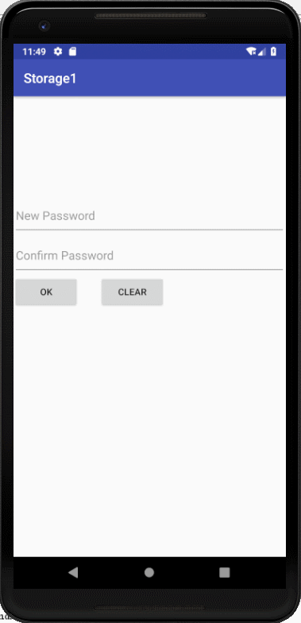
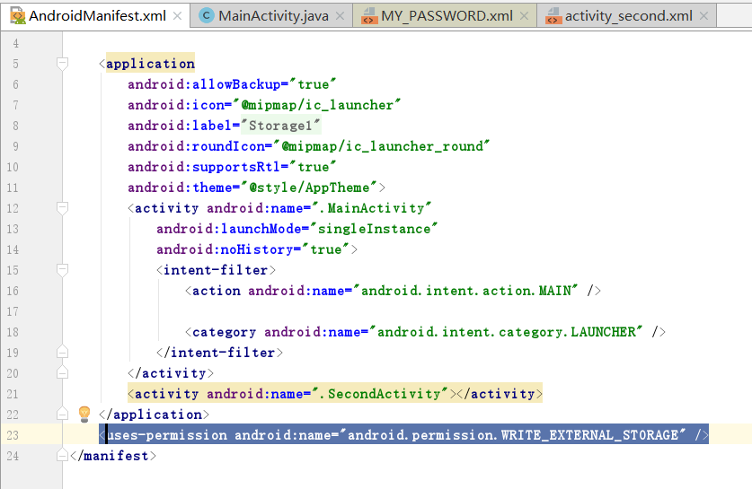
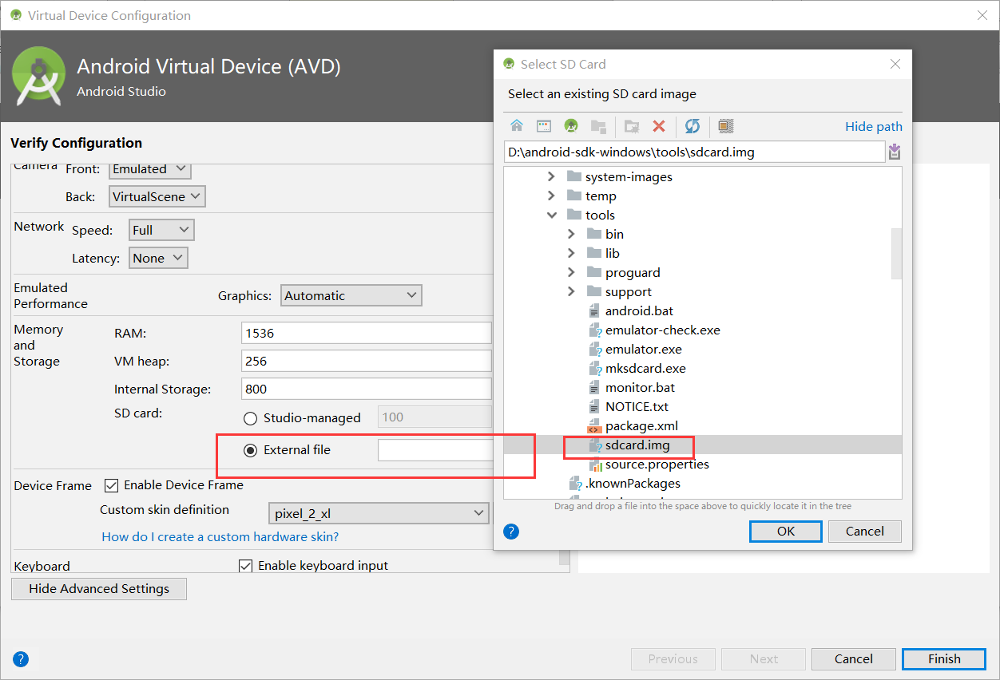
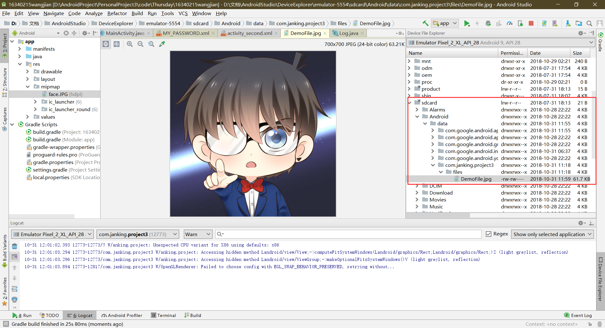
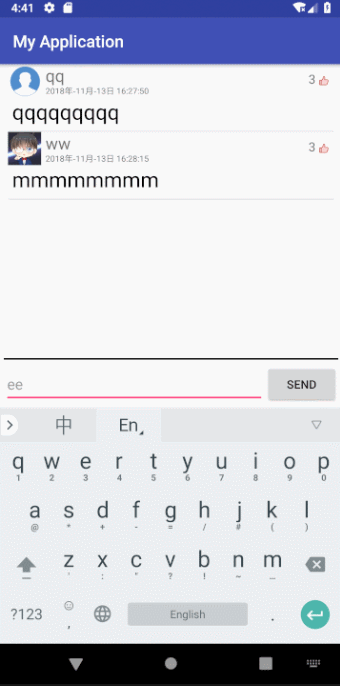
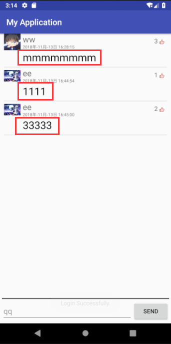
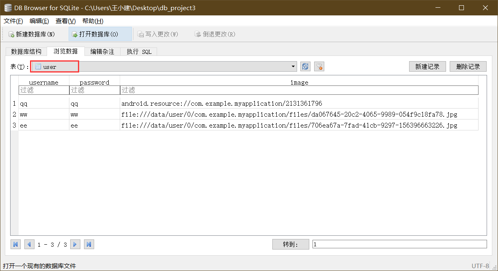

# 中山大学数据科学与计算机学院本科生实验报告

## （2018年秋季学期）
| 课程名称 | 手机平台应用开发 |   任课老师   |         郑贵锋         |
| :------: | :--------------: | :----------: | :--------------------: |
|   年级   |       2016       | 专业（方向） |          嵌软          |
|   学号   |     16340215     |     姓名     |          王建          |
|   电话   |   13246824607    |    Email     | jankingwon@foxmail.com |
| 开始日期 |       2018       |   完成日期   |          2018          |

---

# LAB6

## 一、实验题目

1. 学习SharedPreference的基本使用。
2. 学习Android中常见的文件操作方法。
3. 复习Android界面编程。

---

## 二、实现内容

- Figure 1：首次进入，呈现创建密码界面。
  
- Figure 2：若密码不匹配，弹出Toast提示。
  
- Figure 3：若密码为空，弹出Toast提示。
  
- Figure 4：退出后第二次进入呈现输入密码界面。
  
- Figure 5：若密码不正确，弹出Toast提示。
  
- Figure 6：文件加载失败，弹出Toast提示。
  
- Figure 7：成功保存文件，弹出Toast提示。
  
- Figure 8：成功导入文件，弹出Toast提示。
  

### 

1. 如Figure 1至Figure 8所示，本次实验演示应用包含两个Activity。
2. 首先是密码输入Activity：
   - 若应用首次启动，则界面呈现出两个输入框，分别为新密码输入框和确认密码输入框。
   - 输入框下方有两个按钮：
     - OK按钮点击后：
       - 若New Password为空，则发出Toast提示。见Figure 3。
       - 若New Password与Confirm Password不匹配，则发出Toast提示，见Figure 2。
       - 若两密码匹配，则保存此密码，并进入文件编辑Activity。
     - CLEAR按钮点击后：清楚两输入框的内容。
   - 完成创建密码后，退出应用再进入应用，则只呈现一个密码输入框，见Figure 4。
     - 点击OK按钮后，若输入的密码与之前的密码不匹配，则弹出Toast提示，见Figure 5。
     - 点击CLEAR按钮后，清除密码输入框的内容。
   - **出于演示和学习的目的，本次实验我们使用SharedPreferences来保存密码。但实际应用中不会使用这种方式来存储敏感信息，而是采用更安全的机制。见这里和这里。**
3. 文件编辑Activity：
   - 界面底部有三个按钮，高度一致，顶对齐，按钮水平均匀分布，三个按钮上方除ActionBar和StatusBar之外的全部空间由一个EditText占据（保留margin）。EditText内的文字竖直方向置顶，左对齐。
   - 在编辑区域输入任意内容，点击SAVE按钮后能保存到指定文件（文件名随意）。成功保存后，弹出Toast提示，见Figure 8。
   - 点击CLEAR按钮，能清空编辑区域的内容。
   - 点击LOAD按钮，能够从同一文件导入内容，并显示到编辑框中。若成功导入，则弹出Toast提示。见Figure 7.若读取文件过程中出现异常（如文件不存在），则弹出Toast提示。见Figure 6.
4. 特殊要求：进入文件编辑Activity后，若点击返回按钮，则直接返回Home界面，不再返回密码输入Activity。

---

## 三、课堂实验结果

### (1)实验截图



### (2)实验步骤以及关键代码

#### SharedPreference的使用

> 它是一个轻量级的存储类，特别适合用于保存软件配置参数。使用`SharedPreferences`保存数据，其背后是用xml文件存放数据，文件存放在`/data/data/<package name>/shared_prefs`目录下

##### 先来创建一个简单的设置密码的页面


```xml
<?xml version="1.0" encoding="utf-8"?>
<android.support.constraint.ConstraintLayout xmlns:android="http://schemas.android.com/apk/res/android"
    xmlns:app="http://schemas.android.com/apk/res-auto"
    xmlns:tools="http://schemas.android.com/tools"
    android:layout_width="match_parent"
    android:layout_height="match_parent"
    tools:context=".MainActivity">

   <EditText
       android:id="@+id/new_password"
       android:layout_marginTop="150dp"
       android:layout_width="match_parent"
       android:layout_height="60dp"
       android:hint="New Password"
       android:inputType="textPassword"
       app:layout_constraintTop_toTopOf="parent"
       />

    <EditText
        android:id="@+id/confirm_password"
        android:layout_marginTop="60dp"
        android:layout_width="match_parent"
        android:layout_height="60dp"
        android:hint="Confirm Password"
        android:inputType="textPassword"
        app:layout_constraintTop_toTopOf="@id/new_password"
        />
    <Button
        android:id="@+id/ok"
        android:layout_width="100dp"
        android:layout_height="50dp"
        android:text="OK"
        app:layout_constraintTop_toBottomOf="@id/confirm_password"/>

    <EditText
        android:id="@+id/login_password"
        android:layout_width="match_parent"
        android:visibility="invisible"
        android:hint="Password"
        android:inputType="textPassword"
        android:layout_height="60dp"
        app:layout_constraintTop_toBottomOf="@id/new_password"/>
    
    <Button
        android:id="@+id/clear"
        android:layout_width="100dp"
        android:layout_height="50dp"
        android:text="Clear"
        android:layout_marginStart="30dp"
        app:layout_constraintTop_toBottomOf="@id/confirm_password"
        app:layout_constraintStart_toEndOf="@id/ok"
        />

</android.support.constraint.ConstraintLayout>
```

其实这个页面是有三个`EditText`的，

**有两个是设置密码时的输入框**

**有一个是登陆时的密码输入框**

此时还没有设置密码，所以另外一个`EditText`设置不可见`INVISIBLE`

##### 处理按钮点击的事件

**文本清除按钮：**

```java
button_clear.setOnClickListener(new View.OnClickListener() {
    @Override
    public void onClick(View v) {
        //清空文本框中内容
        pw1.setText("");
        pw2.setText("");
        pw.setText("");
    }
});
```

**确定按钮：**

```java
button_ok.setOnClickListener(new View.OnClickListener() {
    @Override
    public void onClick(View v) {
        //还没注册密码成功
        if(pw.getVisibility() != View.VISIBLE){
            if(pw1.getText().toString().isEmpty()){
                Toast.makeText(MainActivity.this, "Password cannot be empty.", Toast.LENGTH_SHORT).show();
                //清空文本框中内容
                //模拟点击按钮
                button_clear.performClick();
            }else if(! pw1.getText().toString().equals(pw2.getText().toString())){
                Toast.makeText(MainActivity.this, "Password mismatch.", Toast.LENGTH_SHORT).show();
                button_clear.performClick();
            }else{
                 //简单两句代码，把密码写进存储中
                //getActivity()得到的就是MainActivity.this，不需要用这个函数了
                SharedPreferences sharedPref = MainActivity.this.getSharedPreferences("MY_PASSWORD", Context.MODE_PRIVATE);
                SharedPreferences.Editor editor = sharedPref.edit();
                //保存注册密码
                editor.putString("NEW_PASSWORD", pw1.getText().toString());
                //保存已注册状态
                editor.putString("STATUS", "LOGIN");
                //系统提醒我将commit改成apply的
                editor.apply();
                //登陆成功
                Intent intent = new Intent(MainActivity.this, SecondActivity.class);
                startActivity(intent);
            }
        }else{
           //获取密码比较是否正确
            SharedPreferences sharedPref = MainActivity.this.getSharedPreferences("MY_PASSWORD", Context.MODE_PRIVATE);
            String real_password = sharedPref.getString("NEW_PASSWORD", null);
            //if(!pw.getText().equals(real_password))我之前这样写是错误的
            if(!pw.getText().toString().equals(real_password)){
                //登录失败
                Toast.makeText(MainActivity.this, "Password incorrect", Toast.LENGTH_SHORT).show();
                button_clear.performClick();
            }else{
                //登陆成功
                Intent intent = new Intent(MainActivity.this, SecondActivity.class);
                startActivity(intent);
            }
        }

    }
});
```

输入密码之后，查看虚拟机的文件

`Logcat`->`Device File Explore`->`data/data/com.janking.project3.shared_prefs`->`MY_PASSWORD`

可以发现，确实存进去了密码，而且还存进去了一个关键字为`STATUS`的东西，这个是用来辨别是否已经设置了密码的


为了利用好这个`STATUS`字段，在`MainActivity`的`onCreate`方法里添加

```java
//这三句话也很重要，即使xml已经设置了三个可见度是，但是经过测试，中途删除了SharedPreference里面的文件的话输入框布局还是没变
pw1.setVisibility(View.VISIBLE);
pw2.setVisibility(View.VISIBLE);
pw.setVisibility(View.INVISIBLE);
//读取状态
SharedPreferences sp = MainActivity.this.getSharedPreferences("MY_PASSWORD", Context.MODE_PRIVATE);
if(sp != null){
    String last_status = sp.getString("STATUS", null);
    //不用判断是否是“LOGIN”，只要存在就行
    if(last_status != null){
        pw1.setVisibility(View.INVISIBLE);
        pw2.setVisibility(View.INVISIBLE);
        pw.setVisibility(View.VISIBLE);
    }
}
```


#### Internal Storage文件的操作

在`MainActivity`设置密码之后，再登录成功之后，跳到另一个页面`SecondActivity`在这里简单使用一下文件的操作

##### 布局


```xml
<?xml version="1.0" encoding="utf-8"?>
<LinearLayout xmlns:android="http://schemas.android.com/apk/res/android"
    xmlns:app="http://schemas.android.com/apk/res-auto"
    xmlns:tools="http://schemas.android.com/tools"
    android:layout_width="match_parent"
    android:layout_height="match_parent"
    android:orientation="vertical"
    tools:context=".SecondActivity">

    <EditText
        android:layout_margin="10dp"
        android:id="@+id/tv"
        android:layout_width="match_parent"
        android:layout_height="match_parent"
        android:hint="Write like HelloWorld?"
        android:gravity="top"
        android:layout_weight="1"/>

    <LinearLayout
        android:layout_width="match_parent"
        android:layout_height="60dp"
        android:layout_gravity="fill"
        android:paddingStart="30dp"
        android:paddingEnd="30dp"
        android:orientation="horizontal">

        <!--按钮均匀分布-->
        <Button
            android:id="@+id/button_save"
            android:layout_width="0dp"
            android:layout_weight="1"
            android:text="SAVE"
            android:layout_marginEnd="30dp"
            android:layout_height="match_parent" />

        <Button
            android:id="@+id/button_load"
            android:layout_width="0dp"
            android:layout_weight="1"
            android:text="LOAD"
            android:layout_marginEnd="30dp"
            android:layout_height="match_parent" />

        <Button
            android:id="@+id/button_clear"
            android:layout_width="0dp"
            android:text="CLEAR"
            android:layout_weight="1"
            android:layout_height="match_parent" />

    </LinearLayout>

</LinearLayout>
```

##### `LOAD`和`SAVE`按钮的事件处理

```java
//前面记得加
final String FILE_NAME = "data.txt";

//读取文件
bt_load.setOnClickListener(new View.OnClickListener() {
    @Override
    public void onClick(View v) {
        try (FileInputStream fileInputStream = openFileInput(FILE_NAME)) {
            byte[] contents = new byte[fileInputStream.available()];
            fileInputStream.read(contents);
            //et.setText(contents.toString())竟然不行
            et.setText(new String(contents));
            Toast.makeText(SecondActivity.this, "Load successfully.", Toast.LENGTH_SHORT).show();
        } catch (IOException ex) {
            Toast.makeText(SecondActivity.this, "Fail to load file.", Toast.LENGTH_SHORT).show();
        }
    }
});
//保存文件
        bt_save.setOnClickListener(new View.OnClickListener() {
            @Override
            public void onClick(View v) {
                try (FileOutputStream fileOutputStream = openFileOutput(FILE_NAME, MODE_PRIVATE)) {
                    fileOutputStream.write(et.getText().toString().getBytes());
                    Toast.makeText(SecondActivity.this, "Save successfully.", Toast.LENGTH_SHORT).show();
                } catch (IOException ex) {
                    Toast.makeText(SecondActivity.this, "Fail to save file.", Toast.LENGTH_SHORT).show();
                }
            }
        });
```

这其中有个小问题，就是读取的文件流是用`byte`数组接收的，开始我想把它转换为`String`用的是`toString`方法，但是得到的是乱码，然后改成`new String()`就可以了

> **toString()与new String ()用法区别**
>
> `str.toString`是调用了`object`对象的类的`toString`方法。一般是返回这么一个`String`：`[class name]@[hashCode]`。
> `new String(str)`是根据parameter是一个字节数组，使用`java`虚拟机默认的编码格式，将这个字节数组`decode`为对应的字符。若虚拟机默认的编码格式是`ISO-8859-1`，按照`ascii`编码表即可得到字节对应的字符。
>
> **什么时候用什么方法呢？**
>
> `new String（）`一般使用字符转码的时候,`byte[]`数组的时候
>
> `toString（）`将对象打印的时候使用 


经检验，文件内容确实写了进去（内容很乱，是我写的，而不是乱码……)，文件存放在`files`文件夹中


#### 当 Activity 不可⻅时，如何将其从 activity stack 中除去（按返回键直接返回Home）

- 让不处于活动状态的`MainActivity`直接调用`finish`方法，点击返回按钮后会发现它就没了……

```java
//当此Acticity暂停时直接结束（移出栈）
@Override
protected void onPause() {
    super.onPause();
    MainActivity.this.finish();
}
```

- 还有一种办法，在`manifests`文件中添加

`android:noHistory="true"`


#### External Storage文件的操作

在`manifests`中添加

```
<uses-permission android:name="android.permission.WRITE_EXTERNAL_STORAGE" />
```

[](https://janking.wang/post/android6/1541001942041.png)

进入`sdk`目录下的`tools`文件夹，输入下列命令

```
.\mksdcard 128M sdcard.img
```

即可创建一个`128M`大小的命名为`sdcard`的映像文件，它可以挂载到虚拟机上作为`sd`卡目录

[](https://janking.wang/post/android6/1541001233162.png)

添加一个图片文件到`mipmap`中，这里我加了我的头像`face.jpg`

在`SecondActivity`中新建一个方法

```
void createExternalStoragePrivateFile(){
    File file = new File(getExternalFilesDir(null), "DemoFile.jpg");
    try {
        @SuppressLint("ResourceType") InputStream is = getResources().openRawResource(R.mipmap.face);
        OutputStream os = new FileOutputStream(file);
        byte[] data = new byte[is.available()];
        is.read(data);
        os.write(data);
        is.close();
        os.close();
    } catch (IOException e) {
        // Unable to create file, likely because external storage is
        // not currently mounted.
        Log.w("ExternalStorage", "Error writing " + file, e);
    }
}
```

并在`onCreate`中调用它

应用启动到`SecondActivity`中时，查看文件确实存在

[](https://janking.wang/post/android6/1541001890672.png)

### (3)实验遇到的困难以及解决思路

**其实有很多都写在实验步骤里面了**

比如用字节数组转换为`String`出现下面的情况

```java
//et.setText(contents.toString())竟然不行
et.setText(new String(contents));
```

还有下面的情况

```java
//if(!pw.getText().equals(real_password))我之前这样写是错误的
if(!pw.getText().toString().equals(real_password)){
```


---

## 四、课后实验结果

https://janking.wang/post/android6.html

### Internal Storage和External Storage的区别

- **Internal storage:**

总是可用的
这里的文件默认只能被我们的`app`所访问。
当用户卸载`app`的时候，系统会把`internal`内该`app`相关的文件都清除干净。
`Internal`是我们在想确保不被用户与其他`app`所访问的最佳存储区域。

- **External storage:**

并不总是可用的，因为用户有时会通过`USB`存储模式挂载外部存储器，当取下挂载的这部分后，就无法对其进行访问了。
是大家都可以访问的，因此保存在这里的文件可能被其他程序访问。
当用户卸载我们的`app`时，系统仅仅会删除`external`根目录`（getExternalFilesDir()）`下的相关文件。
`External`是在不需要严格的访问权限并且希望这些文件能够被其他app所共享或者是允许用户通过电脑访问时的最佳存储区域。

### Internal Storage和External Storage的适用场景

- `Internal Storage`主要是存放程序运行所需要的数据，如图标、背景音乐、数据库等等，一般不允许用户访问或修改
- `External Storage`是一些比较大容量的文件或者可以允许用户自行访问的数据，如下载的文件，用户主动导出的数据，备份的数据等等


## 五、实验思考及感想

`SharedPreference`用起来真的很顺手，对于一些小数据读取真的特别简单！还不容易出错

多调试，`LogCat`出现的提示信息很有用，最简单的调试就是弹出一个`Toast`

存储String字符串可以很容易的转换为`Byte`数组，然后放进去，取出来也是很简单，毕竟有现成的方法调用，要是图片就要麻烦一点了（需要用`bitmap`转换），更麻烦的是音频或者视频，似乎还要自己解码和编码……

---


# LAB7

## 一、实验题目

1. 学习SQLite数据库的使用。
2. 学习ContentProvider的使用。
3. 复习Android界面编程。

------

## 二、实现内容

<table>
    <tr>
        <td >点击Login切换到登录界面</td>
        <td >图1.2 若Username为空，则发出Toast提示</td>
    </tr>
    <tr>
        <td>图1.3 若Password为空，则发出Toast提示</td>
        <td >图1.4 若Username不存在，则发出Toast提示 </td>
    </tr>
    <tr>
        <td> 图1.5 若密码不正确，则发出Toast提示</td>
        <td></td>
    </tr>
    <tr>
        <td>图2.1 点击Register切换到注册页面</td>
        <td >图2.2 若Username为空，则发出Toast提示 </td>
    </tr>
    <tr>
        <td>图2.3 若New Password为空，则发出Toast提示</td>
        <td >图2.4 若New Password与Confirm Password不匹配，则发出Toast提示 </td>
    </tr>
    <tr>
        <td>图2.5 若Username已经存在，则发出Toast提示</td>
        <td > </td>
    </tr>  
    <tr>
        <td>图3.1 评论页面</td>
        <td >图3.2 若EditText为空，则发出Toast提示 </td>
    </tr>  
    <tr>
        <td>图3.3 短按评论：弹出对话框，显示该评论的用户以及通讯录中该用户的电话号码</td>
        <td >图3.4 短按评论：弹出对话框，显示该评论的用户以及通讯录中该用户的电话号码 </td>
    </tr>  
    <tr>
        <td>图3.5 弹出是否删除的对话框</td>
        <td >图3.6 弹出是否举报的对话框 </td>
    </tr>  
    <tr>
        <td>图4.1 进入手机图库进行图片选择</td>
        <td >图4.2 ImageView显示本次选择的图片 </td>
    </tr>  
    <tr>
        <td>图4.3 在评论页面，每条Item应当正确显示用户的头像</td>
        <td > </td>
    </tr>  
</table>

* #### 技术要求： 
    1. 使用SQLite数据库保存用户的相关信息和评论的相关信息，使得每次运行程序都可以使用数据库进行用户的登陆与注册，以及显示数据库中的评论；
    2. 使用ContentProvider来获取对应用户的电话号码；
* #### 功能要求：  
    1. 如图1至图8所示，本次实验演示应包含2个Activity。
    2. 首页Activity包含登录功能和注册功能，通过radioButton在两个页面进行切换,在登陆界面输入正确的用户名和密码后跳转到评论页面。
    3. 评论Activity,界面由ListView、EditText和Button组成，ListView中展示数据库中保存的评论信息，在EditText写评论，点击Send按钮发送评论。
    4. 首页Activity：
        * 应用启动时，界面初始化为登录界面，通过Login和Register两个RadioButton进行登录与注册之间的切换。
        * 点击Login切换到登录界面（见图1.1），可以保留注册界面时的Username，但不保存密码：
            - OK按钮点击后：
                + 若Username为空，则发出Toast提示。见图1.2.
                + 若Password为空，则发出Toast提示。见图1.3.
                + 若Username不存在，则发出Toast提示。见图1.4.
                + 若密码不正确，则发出Toast提示。见图1.5.
            - CLEAR按钮点击后：清除两个输入框的内容。
        * 点击Register切换到注册页面（见图2.1），可以保留登录界面时的Username，但不保存密码，在输入框和RadioButto之间存在一个头像ImageView，水平居中：
            - OK按钮点击后：
                + 若Username为空，则发出Toast提示。见图2.2.
                + 若New Password为空，则发出Toast提示。见图2.3.
                + 若New Password与Confirm Password不匹配，则发出Toast提示。见图2.4.
                + 若Username已经存在，则发出Toast提示。见图2.5. 
            - CLEAR按钮点击后：清除三个输入框的内容。
    5. 评论页面：
        * 界面底部有一个EditText和一个按钮，高度一致，EditText占据按钮左边的全部空间。上方的全部剩余空间由一个ListView占据（保留margin）。见图3.1.
        * ListView中的每条Item，包含了头像、点赞按钮这两个ImageView和用户名、评论时间、评论内容、点赞数这4个TextView。
            - 用户名、评论时间、评论内容在头像的右边。
            - 点赞按钮在Item的最右边，而且在用户名+评论时间的总高度上处于竖直方向上居中，**注意：总高度不包括评论占据的高度**
            - 点赞数在点赞按钮的左边，竖直方向居中要求同点赞按钮。
            - **以下样式供参考，不做强制要求，但要求至少美观：**
                + Item整体margin：10dp，
                + 头像width、hight：40sp，
                + 用户名textColor：#7a7a7a、textSize：20sp
                + 评论时间textColor：#7a7a7a、textSize：10sp
                + 评论textColor：#3e3e3e、textSize：20sp
                + 点赞数textSize：15sp 
        * 点击EditText写评论
        * 点击Send按钮发送评论
            - 若EditText为空，则发出Toast提示。如图3.2.
            - 若EditText不为空，则发送评论，在数据库和ListView中添加新评论。
        * ListView中的Item点击事件：
            - 短按评论：弹出对话框，显示该评论的用户以及通讯录中该用户的电话号码。如图3.3和图3.4.
            - 长按评论：
                + 若该评论为当前用户发送的，弹出是否删除的对话框,若选择了Yes，则删除该条评论并更新数据库和ListView。如图3.5.
                + 若该评论不为当前用户发送的，弹出是否举报的对话框，若选择了Yes，则弹出Toast提示，不需做任何数据库和ListView的更改。如图3.6.

    **附加内容（加分项，本次实验与（一）合计100分，加分项每项占10分）**

    1. **头像**
        在用户注册页面可以选择用户头像，ImageView初始化为图add，如图2.1。点击ImageView，进入手机图库进行图片选择。如图4.1.
        * 如果正确选择了一张图片，则ImageView显示本次选择的图片。如图4.2.
        * 如果没有正确选择图片（如在图片选择页面点击了取消或按了手机的BACK键），则ImageView保留本次点击事件发生前的状态，如初始的＋号图片，如图4.1，或者是上一个被正确选择的图像。如图4.2.
          在评论页面，每条Item应当正确显示用户的头像，如果用户没有在注册页面选择头像，则使用默认头像。如图4.3.
    2. **点赞**
        在评论界面，点赞按钮可以被点击，点赞数可以正常统计，用户点赞状态可以被正常记录，白色的未点赞状态经用户点击后变为红色的点赞状态，点赞数加1；再次点击点赞按钮可取消点赞，点赞数减1.要求用数据库记录点赞的信息，使得应用重启后用户的点赞状态，评论的点赞数可以正常显示，注意：用户的对每条评论的点赞状态是唯一的，即不同用户对每条评论的点赞状态应当分开记录，同一用户对不同评论的点赞状态也应当分开记录。同理，每条评论的点赞数也应当分开记录。请参考demo自行体会。

------

## 三、课堂实验结果

### (1)实验截图




**（UI中评论页面评论对齐的问题已经修改）**



### (2)实验步骤以及关键代码

#### 登录注册页面的切换


两个按钮用`RadioButton`就可以实现了

```xml
<RadioGroup
    android:id="@+id/radio_group"
    android:layout_marginTop="120dp"
    app:layout_constraintTop_toTopOf="parent"
    android:layout_width="match_parent"
    android:layout_height="40dp"
    android:orientation="horizontal">
    <RadioButton
        android:id="@+id/login_button"
        android:text="Login"
        android:checked="true"
        android:layout_width="wrap_content"
        android:layout_height="match_parent" />

    <RadioButton
        android:id="@+id/register_button"
        android:text="Register"
        android:layout_width="wrap_content"
        android:layout_height="match_parent" />
</RadioGroup>
```

**但是**，如何实现两种情况下显示不同布局，并且两个按钮都刚好在填写的信息底下呢

这里可以用设置控件的`Visibility`实现的！


我把按钮上方的所有东西放在一个`View`里面（也就是登录界面的两个输入框，注册页面的三个输入框，一个头像显示框）

通过`ConstraintLayout`的特点让两个按钮固定在这个大的View里面，登录状态或者注册状态让头像框和确认密框隐藏就好了

> 其实还有另一种办法：
>
> 只需要用四个控件（**复用两个输入框**）
>
> **登录页面的头像框隐藏，确认密码栏隐藏， 然后在注册页面时显示**
>
> 但是会有挺多问题（感觉是），因为注册和登录用同样的输入框会让后期事件处理以及显示`HINT`的操作有点繁琐


这就是那个大的`View`，包含了6个控件

```xml
<android.support.constraint.ConstraintLayout
    android:id="@+id/edit_area"
    app:layout_constraintTop_toBottomOf="@id/radio_group"
    android:layout_width="match_parent"
    android:layout_height="wrap_content">
    <EditText
        android:id="@+id/login_username"
        android:layout_width="match_parent"
        android:layout_height="40dp"
        android:hint="Username"/>
    <EditText
        android:id="@+id/login_password"
        android:layout_width="match_parent"
        android:inputType="textPassword"
        android:layout_height="40dp"
        android:hint="Password"
        app:layout_constraintTop_toBottomOf="@id/login_username"/>

    <ImageButton
        android:visibility="gone"
        android:src="@mipmap/add"
        android:id="@+id/register_image"
        android:layout_width="100dp"
        android:layout_height="100dp"
        android:scaleType="fitXY"
        android:padding="0dp"
        app:layout_constraintStart_toStartOf="parent"
        app:layout_constraintEnd_toEndOf="parent"/>
    <EditText
        android:visibility="gone"
        android:id="@+id/register_username"
        android:layout_width="match_parent"
        android:layout_height="40dp"
        android:hint="Username"
        app:layout_constraintTop_toBottomOf="@id/register_image"/>
    <EditText
        android:visibility="gone"
        android:inputType="textPassword"
        android:id="@+id/register_password"
        android:layout_width="match_parent"
        android:layout_height="40dp"
        android:hint="New Password"
        app:layout_constraintTop_toBottomOf="@id/register_username"/>
    <EditText
        android:visibility="gone"
        android:id="@+id/register_confirm_password"
        android:inputType="textPassword"
        android:layout_width="match_parent"
        android:layout_height="40dp"
        android:hint="Confirm Password"
        app:layout_constraintTop_toBottomOf="@id/register_password"/>
</android.support.constraint.ConstraintLayout>
```

这是底下的两个按钮

```xml
<Button
    android:id="@+id/button_ok"
    android:layout_width="90dp"
    android:layout_height="50dp"
    android:text="OK"
    app:layout_constraintTop_toBottomOf="@id/edit_area"/>
<Button
    android:id="@+id/button_clear"
    android:layout_width="90dp"
    android:layout_height="50dp"
    android:text="CLEAR"
    android:layout_marginStart="30dp"
    app:layout_constraintStart_toEndOf="@id/button_ok"
    app:layout_constraintTop_toBottomOf="@id/edit_area"/>
```

然后在`JAVA`代码里切换`VISIBILITY`属性

```java
final RadioGroup radioGroup = findViewById(R.id.radio_group);
radioGroup.setOnCheckedChangeListener(new RadioGroup.OnCheckedChangeListener() {
    @Override
    public void onCheckedChanged(RadioGroup group, int checkedId) {
        if(((RadioButton)findViewById(checkedId)).getText().toString().equals("Login")){
            register_confirm_password.setVisibility(View.GONE);
            register_image.setVisibility(View.GONE);
            register_password.setVisibility(View.GONE);
            register_username.setVisibility(View.GONE);

            login_username.setVisibility(View.VISIBLE);
            login_password.setVisibility(View.VISIBLE);
            status = true;
        }else{
            register_confirm_password.setVisibility(View.VISIBLE);
            register_image.setVisibility(View.VISIBLE);
            register_password.setVisibility(View.VISIBLE);
            register_username.setVisibility(View.VISIBLE);

            login_username.setVisibility(View.GONE);
            login_password.setVisibility(View.GONE);
            status = false;
        }
    }
});
```

> 注意：这里设置为`GONE`而不是`INVISIBLE`，因为`INVISIBLE`虽然不显示但是占用空间，而`GONE`不会占用空间

#### SQLite的简单使用

这里创建一个`SQLiteHelper`用来存储用户名，密码，和头像

```java
package com.example.myapplication;
import android.content.ContentValues;
import android.content.Context;
import android.database.Cursor;
import android.database.sqlite.SQLiteDatabase;
import android.database.sqlite.SQLiteOpenHelper;

import java.util.ArrayList;

public class UserSQLiteHelper extends SQLiteOpenHelper {
    private static final String DB_NAME= "db_project3";
    private static final String TABLE_NAME = "user";
    private static final int DB_VERSION = 1;

    private static final String[] COLUMNS = {"username","password","image"};

    public UserSQLiteHelper(Context context) {
        super(context, DB_NAME, null, DB_VERSION);
    }
    @Override
    public void onCreate(SQLiteDatabase sqLiteDatabase) {
        String CREATE_TABLE = "CREATE TABLE if not exists "
                + TABLE_NAME
                + " ( username TEXT PRIMARY KEY, password TEXT, image TEXT)";
        sqLiteDatabase.execSQL(CREATE_TABLE);
    }
    @Override
    public void onUpgrade(SQLiteDatabase sqLiteDatabase, int i, int ii) {

    }
    //添加操作
    public Boolean addUser(String name, String password, String image) {
        SQLiteDatabase db = getWritableDatabase();
        Cursor cursor =
                db.query(TABLE_NAME, // a. table
                        COLUMNS, // b. column names
                        " username = ?", // c. selections
                        new String[] { name }, // d. selections args
                        null, // e. group by
                        null, // f. having
                        null, // g. order by
                        null); // h. limit

        // 3. if we got results get the first one
        if (cursor.moveToFirst()){
            db.close();
            return false;
        }
        ContentValues cv = new ContentValues();
        cv.put("username", name);
        cv.put("password", password);
        cv.put("image", image);
        db.insert(TABLE_NAME, null, cv);
        db.close();
        return true;
    }
    //验证登录
    public int loginVerify(String name, String password){
        SQLiteDatabase db = getWritableDatabase();
        Cursor cursor =
                db.query(TABLE_NAME, // a. table
                        COLUMNS, // b. column names
                        " username = ?", // c. selections
                        new String[] { name }, // d. selections args
                        null, // e. group by
                        null, // f. having
                        null, // g. order by
                        null); // h. limit

        if (!cursor.moveToFirst()){
            db.close();
            return 1;//username not found
        }

        if(!password.equals(cursor.getString(1))){
            db.close();
            return 2;//user password not correct
        }
        db.close();
        return 0;
    }
    //得到用户头像
    public String getImage(String name){
        SQLiteDatabase db = getWritableDatabase();
        Cursor cursor =
                db.query(TABLE_NAME, // a. table
                        COLUMNS, // b. column names
                        " username = ?", // c. selections
                        new String[] { name }, // d. selections args
                        null, // e. group by
                        null, // f. having
                        null, // g. order by
                        null); // h. limit

        if (!cursor.moveToFirst()){
            db.close();
            return null;//username not found
        }else {
            String image =  cursor.getString(2);
            cursor.close();
            db.close();
            return  image;
        }
    }
	//删除用户表
    public void dropUser(){
//删除表的SQL语句
        String sql ="DROP TABLE user";
//执行SQL
        this.getWritableDatabase().execSQL(sql);
    }
}
```

在`Activity`的`onCreate`方法中new一个`SQLiteHelper`的实例

```java
userSQLiteHelper = new UserSQLiteHelper(this);
```

然后在注册页面的`button_ok`的监听事件里调用添加用户的方法就实现了注册功能

```java
if(userSQLiteHelper.addUser(register_username.getText().toString(), register_password.getText().toString(), default_image)){
    Toast.makeText(MainActivity.this, "Register Successfully.",Toast.LENGTH_SHORT).show();
    return;
```

在登录页面的button_ok的监听事件里调用验证用户的方法就实现了登录功能

```java
switch (userSQLiteHelper.loginVerify(login_username.getText().toString(), login_password.getText().toString())){
    case 0:
        //跳转到评论页面
        Toast.makeText(MainActivity.this, "Login Successfully.",Toast.LENGTH_SHORT).show();
        Intent intent = new Intent(MainActivity.this, CommentActivity.class);
        intent.putExtra("username", login_username.getText().toString());
        intent.putExtra("image",userSQLiteHelper.getImage(login_username.getText().toString()));
        startActivity(intent);
        break;
    case 1:
        Toast.makeText(MainActivity.this, "Username not existed.",Toast.LENGTH_SHORT).show();
        break;
    case 2:
        Toast.makeText(MainActivity.this, "Invalid Password.",Toast.LENGTH_SHORT).show();
        break;
}
```

#### 调用系统相册选择图片


这里的用户头像其实是一个`ImageButton`，设置监听事件为

```java
String default_image = "android.resource://com.example.myapplication/" + R.mipmap.me;

register_image = findViewById(R.id.register_image);
register_image.setImageURI(Uri.parse(default_image));
register_image.setOnClickListener(new View.OnClickListener() {
    @Override
    public void onClick(View v) {
        Intent intent = new Intent();
        intent.setAction(Intent.ACTION_PICK);
        intent.setType("image/*");
        startActivityForResult(intent, 0);
    }
});
```

这样通过调用`Intent`打开了系统的图片查看器，然后还是用`onActivityResult`方法接收点击的图片


#### SQLite中保存图片

`Android`数据库中存取图片通常使用两种方式

- 保存图片所在路径
- 将图片以二进制的形式存储（`sqlite3`支持`BLOB`数据类型）

从我之前的代码中可以看出我是通过存储图片的`Uri`存储头像，以后显示该头像就用该`Uri`做参数就好了


> `Android`中的`URI`和`Uri`是不一样的，从`import`的包就可以看出来
>
> import java.net.URI;
> import android.net.Uri;
>
>

```java
protected void onActivityResult(int requestCode, int resultCode, Intent data) {
    if (data != null) {
        // 得到图片的全路径
        Uri uri = data.getData();
        //图片预览
        this.register_image.setImageURI(uri);
        //保存该URI
        default_image = image_file_uri.toString();
    }
    super.onActivityResult(requestCode, resultCode, data);
}
```

> 注：这里的`default_image`保存的是默认用户头像，如果选择了自定义的用户头像它也会改成新的头像，因为最后添加头像的时候是调用它


**但是！！！这样是有问题的**

就是刚添加的时候图片能成功显示，但是关闭APP重新启动或者放在后台又返回的话**图片就显示不了了**

会出现如下警告

```
W/ImageView: Unable to open content: content://com.google.android.apps.photos.contentprovider/-1/1/content%3A%2F%2Fmedia%2Fexternal%2Fimages%2Fmedia%2F6217/NO_TRANSFORM/1633586863

             java.lang.SecurityException: Permission Denial: opening provider com.google.android.apps.photos.contentprovider.MediaContentProvider from ProcessRecord{2e6acd5 26947:com.example.myapplication/u0a67} (pid=26947, uid=10067) that is not exported from uid 10030
```

可以看到是因为没有权限访问这个图片，应该是打开选择图片窗口的`Intent`是一次性的，即使存储了它的路径，以后想得到它操作系统也不允许，为了解决这个问题，而且又不想学习`BLOB`的使用，最简单的办法

**把图片存到自己的地盘！**

就是使用`InternalStorage`把图片复制一份到本应用的`files`文件夹中：[参考教程](https://janking.wang/post/android6.html)

所以修改`onActivityResult`

```java
protected void onActivityResult(int requestCode, int resultCode, Intent data) {
    if (data != null) {
        // 得到图片的全路径
        Uri uri = data.getData();
        ContentResolver cr = this.getContentResolver();
        //存储副本
        try {
            Bitmap bitmap = BitmapFactory.decodeStream(cr.openInputStream(uri));
            //通过UUID生成字符串文件名
            String image_name = UUID.randomUUID().toString() + ".jpg";
            //存储图片
            FileOutputStream out = openFileOutput(image_name, MODE_PRIVATE);
            bitmap.compress(Bitmap.CompressFormat.JPEG, 100, out);
            //获取复制后文件的uri
            Uri image_file_uri = Uri.fromFile(getFileStreamPath(image_name));
            //图片预览
            this.register_image.setImageURI(uri);
            //保存该URI
            default_image = image_file_uri.toString();
            out.flush();
            out.close();
        } catch (FileNotFoundException e) {
            Log.e("FileNotFoundException", e.getMessage(),e);
        } catch (IOException e) {
            Log.w("IOException", e.getMessage(), e);
        }
    }
    super.onActivityResult(requestCode, resultCode, data);
}
```

以后再也不用担心别人不要我读取这个文件了，因为这个文件已经属于我自己了！

#### SQLite存储评论

想了又想，还是把评论新建一个表吧，不然每个用户发表很多评论，每个评论又有很多人点赞，还要点赞别人的评论……（想想就恐怖）


修改`UserSQLiteHelper`

这里我用的是**评论发送时间**作为该表的主键，因为时间精确到秒，理论上不会冲突

```java
package com.example.myapplication;

import android.content.ContentValues;
import android.content.Context;
import android.database.Cursor;
import android.database.sqlite.SQLiteDatabase;
import android.database.sqlite.SQLiteOpenHelper;

import java.util.ArrayList;

public class UserSQLiteHelper extends SQLiteOpenHelper {
    private static final String DB_NAME= "db_project3";
    private static final String TABLE_NAME = "user";
    private static final String TABLE_COMMENT_NAME = "comment";
    private static final int DB_VERSION = 1;

    private static final String[] COLUMNS = {"username","password","image"};

    public UserSQLiteHelper(Context context) {
        super(context, DB_NAME, null, DB_VERSION);
    }
    @Override
    public void onCreate(SQLiteDatabase sqLiteDatabase) {
        String CREATE_TABLE = "CREATE TABLE if not exists "
                + TABLE_NAME
                + " ( username TEXT PRIMARY KEY, password TEXT, image TEXT)";
        sqLiteDatabase.execSQL(CREATE_TABLE);
        String CREATE_COMMENT = "CREATE TABLE if not exists "
                + TABLE_COMMENT_NAME
                + " ( date TEXT PRIMARY KEY, username TEXT, comment TEXT, image TEXT, praise_users TEXT)";
        sqLiteDatabase.execSQL(CREATE_COMMENT);
    }
    @Override
    public void onUpgrade(SQLiteDatabase sqLiteDatabase, int i, int ii) {

    }
    public Boolean addUser(String name, String password, String image) {
        SQLiteDatabase db = getWritableDatabase();
        Cursor cursor =
                db.query(TABLE_NAME, // a. table
                        COLUMNS, // b. column names
                        " username = ?", // c. selections
                        new String[] { name }, // d. selections args
                        null, // e. group by
                        null, // f. having
                        null, // g. order by
                        null); // h. limit

        // 3. if we got results get the first one
        if (cursor.moveToFirst()){
            db.close();
            return false;
        }
        ContentValues cv = new ContentValues();
        cv.put("username", name);
        cv.put("password", password);
        cv.put("image", image);
        db.insert(TABLE_NAME, null, cv);
        db.close();
        return true;
    }
    public int loginVerify(String name, String password){
        SQLiteDatabase db = getWritableDatabase();
        Cursor cursor =
                db.query(TABLE_NAME, // a. table
                        COLUMNS, // b. column names
                        " username = ?", // c. selections
                        new String[] { name }, // d. selections args
                        null, // e. group by
                        null, // f. having
                        null, // g. order by
                        null); // h. limit

        if (!cursor.moveToFirst()){
            db.close();
            return 1;//username not found
        }

        if(!password.equals(cursor.getString(1))){
            db.close();
            return 2;//user password not correct
        }
        db.close();
        return 0;
    }
    public String getImage(String name){
        SQLiteDatabase db = getWritableDatabase();
        Cursor cursor =
                db.query(TABLE_NAME, // a. table
                        COLUMNS, // b. column names
                        " username = ?", // c. selections
                        new String[] { name }, // d. selections args
                        null, // e. group by
                        null, // f. having
                        null, // g. order by
                        null); // h. limit

        if (!cursor.moveToFirst()){
            db.close();
            return null;//username not found
        }else {
            String image =  cursor.getString(2);
            cursor.close();
            db.close();
            return  image;
        }
    }

    public void addComment(CommentInfo commentInfo){
        SQLiteDatabase db = getWritableDatabase();
        ContentValues cv = new ContentValues();
        cv.put("date", commentInfo.getDate());
        cv.put("username", commentInfo.getUsername());
        cv.put("comment", commentInfo.getComment());
        cv.put("image", commentInfo.getImage());
        cv.put("praise_users", new Convert().array2String(commentInfo.getPraise_users()));
        db.insert(TABLE_COMMENT_NAME, null, cv);
        db.close();
    }

    public void removeComment(CommentInfo commentInfo){
        SQLiteDatabase db = getWritableDatabase();
        String whereClause = "date = ?";
        String[] whereArgs = new String[] { commentInfo.getDate() };
        db.delete(TABLE_COMMENT_NAME, whereClause, whereArgs);
        db.close();
    }

    public void updateComment(String date, ArrayList<String> new_users){
        SQLiteDatabase db = getWritableDatabase();
        ContentValues cv = new ContentValues();
        cv.put("praise_users", new Convert().array2String(new_users));
        String whereClause = "date = ?";
        String[] whereArgs = new String[] { date };
        db.update(TABLE_COMMENT_NAME, cv, whereClause, whereArgs );
        db.close();
    }

    public ArrayList<CommentInfo> getAllComments(){
        ArrayList<CommentInfo> arrayList = new ArrayList<>();

        String query = "SELECT  * FROM " + TABLE_COMMENT_NAME;
        SQLiteDatabase db = this.getWritableDatabase();
        Cursor cursor = db.rawQuery(query, null);

        if (cursor.moveToFirst()) {
            do {
                arrayList.add(new CommentInfo(
                        cursor.getString(0),
                        cursor.getString(1),
                        cursor.getString(2),
                        cursor.getString(3),
                        new Convert().string2Array( cursor.getString(4))));
            } while (cursor.moveToNext());
        }
        cursor.close();
        db.close();
        return arrayList;
    }

    public void dropUser(){
//删除表的SQL语句
        String sql ="DROP TABLE user";
//执行SQL
        this.getWritableDatabase().execSQL(sql);
    }
    public void dropComment(){
//删除表的SQL语句
        String sql ="DROP TABLE comment";
//执行SQL
        this.getWritableDatabase().execSQL(sql);
    }
}

```


还要新建一个存储评论的实体类`CommentInfo.java`

```java
package com.example.myapplication;

import android.text.method.SingleLineTransformationMethod;

import java.util.ArrayList;

public class CommentInfo {
    private String username, date, comment, image;
    private int praise_count;
    private ArrayList<String> praise_users;
    public CommentInfo(String date,String username, String comment, String image, ArrayList<String> praise_users){
        this.username = username;
        this.date = date;
        this.comment = comment;
        this.image = image;
        this.praise_count = praise_users.size();
        this.praise_users = praise_users;
    }

    public String getComment() {
        return comment;
    }

    public String getDate() {
        return date;
    }

    public String getImage() {
        return image;
    }

    public int getPraise_count() {
        return praise_count;
    }

    public String getUsername() {
        return username;
    }

    public void setImage(String image) {
        this.image = image;
    }

    public void setComment(String comment) {
        this.comment = comment;
    }

    public void setDate(String date) {
        this.date = date;
    }

    public void setPraise_count(int praise_count) {
        this.praise_count = praise_count;
    }

    public void setUsername(String username) {
        this.username = username;
    }

    public void setPraise_users(ArrayList<String> praise_users) {
        this.praise_users = praise_users;
    }

    public ArrayList<String> getPraise_users() {
        return praise_users;
    }
    //点赞图标点击事件的具体处理
    public Boolean praise_count_change(String current_user){
        //如果该用户之前已经点赞
        for(String u : getPraise_users()){
            if(u.equals(current_user)){
                praise_users.remove(u);
                praise_count--;
                return false;
            }
        }
        //如果该用户之前没有点赞过
        praise_users.add(current_user);
        praise_count++;
        return true;
    }
}
```


这其中涉及到评论点赞的问题，一个评论可能会有很多用户点赞，如何记录下这些用户，因为用户数不是固定的，甚至会无限增长，于是想到把存储点赞用户的数组合并到一个列里，以后再提取出来

最简单的办法就是使用**分隔符分隔用户名**

新建一个转换类`Convert.java`

```java
package com.example.myapplication;
import java.util.ArrayList;
import java.util.Collections;
//用$分割
public class Convert {
    public ArrayList<String> string2Array(String s){
        if(s.isEmpty())
            return new ArrayList<>();
        //下面这句相当关键，不是String[] strings = s.split("$");
        String[] strings = s.split("[$]");
        ArrayList<String> list = new ArrayList(strings.length);
        Collections.addAll(list, strings);
        return list;
    }
    public String array2String(ArrayList<String> arrayList){
        StringBuffer stringBuffer = new StringBuffer();
        for(String i : arrayList){
            stringBuffer.append(i);
            stringBuffer.append("$");
        }
        return  stringBuffer.toString();
    }

}
```

#### ListView的使用

效果：


### Item项布局

```xml
<?xml version="1.0" encoding="utf-8"?>
<android.support.constraint.ConstraintLayout xmlns:android="http://schemas.android.com/apk/res/android"
    android:layout_width="match_parent"
    android:layout_height="80dp"
    xmlns:app="http://schemas.android.com/apk/res-auto"
    android:descendantFocusability="blocksDescendants"
    android:layout_margin="10dp">
    <ImageView
        android:id="@+id/item_image"
        android:layout_width="40sp"
        android:layout_height="40sp"
        android:src="@mipmap/add"/>
    <TextView
        android:id="@+id/item_username"
        android:layout_width="wrap_content"
        android:layout_height="25dp"
        android:layout_marginStart="5dp"
        android:textSize="20sp"
        android:text="1234567890"
        app:layout_constraintStart_toEndOf="@id/item_image"/>
    <TextView
        android:id="@+id/item_date"
        android:layout_width="wrap_content"
        android:layout_height="15dp"
        android:text="qwertyuiop"
        android:textSize="10sp"
        app:layout_constraintTop_toBottomOf="@id/item_username"
        app:layout_constraintStart_toStartOf="@id/item_username"/>
    <TextView
        android:id="@+id/item_praise_count"
        android:layout_width="wrap_content"
        android:layout_height="wrap_content"
        android:text="10"
        android:textSize="15sp"
        android:layout_marginEnd="2dp"
        app:layout_constraintBottom_toBottomOf="@id/item_praise_icon"
        app:layout_constraintEnd_toStartOf="@id/item_praise_icon"
        />
    <ImageButton
        android:id="@+id/item_praise_icon"
        android:layout_width="15dp"
        android:layout_height="15dp"
        android:src="@mipmap/red"
        android:scaleType="fitCenter"
        android:padding="0dp"
        android:layout_marginEnd="5dp"
        app:layout_constraintTop_toTopOf="@id/item_username"
        app:layout_constraintBottom_toBottomOf="@id/item_date"
        app:layout_constraintEnd_toEndOf="parent"/>
    
    <TextView
        android:id="@+id/item_comment"
        android:layout_width="match_parent"
        android:layout_height="40dp"
        app:layout_constraintStart_toStartOf="parent"
        android:text="zxcvbnm"
        android:layout_marginStart="5dp"
        android:textSize="25sp"
        android:textColor="@android:color/black"
        app:layout_constraintTop_toBottomOf="@id/item_image"/>

</android.support.constraint.ConstraintLayout>
```

这个里面很关键的一句

```xml
android:descendantFocusability="blocksDescendants"
```

是为了后面点击事件的处理，**这个属性值表示子有子的焦点，父有父的焦点**

如果没有这个的话，整个`Item`项和内部的`Button`将不会同时可以点击

> 属性`android:descendantFocusability`的值有三种：
>
> ```
> beforeDescendants：viewgroup会优先其子类控件而获取到焦点
> afterDescendants：viewgroup只有当其子类控件不需要获取焦点时才获取焦点
> blocksDescendants：viewgroup会覆盖子类控件而直接获得焦点，也就是各有各的焦点
> ```


### Adapter的使用

> 有这三种常用的Adapter
>
> `ArrayAdapter`：支持泛型操作，最简单的一个`Adapter`，只能展现一行文字
>
> `SimpleAdapter`：同样具有良好扩展性的一个`Adapter`，可以自定义多种效果
>
> `BaseAdapter`：抽象类，实际开发中我们会继承这个类并且重写相关方法，用得最多的一个`Adapter`


因为`ListView`中设计的元素比较多，还是自己继承`BaseAdapter`写一个`Adapter`吧，

新建`CommentAdapter.java`

```java
package com.example.myapplication;

import android.content.Context;
import android.icu.text.IDNA;
import android.net.Uri;
import android.support.annotation.NonNull;
import android.view.LayoutInflater;
import android.view.View;
import android.view.ViewGroup;
import android.widget.BaseAdapter;
import android.widget.ImageButton;
import android.widget.ImageView;
import android.widget.TextView;

import java.util.ArrayList;
import java.util.Date;
import java.util.List;

public class CommentAdapter extends BaseAdapter{
    private ArrayList<CommentInfo> data;
    private String current_user;
    private Context mContext = null;
    private UserSQLiteHelper userSQLiteHelper;


    public CommentAdapter(Context context, String current_user)
    {
        userSQLiteHelper = new UserSQLiteHelper(context);
        data= userSQLiteHelper.getAllComments();
        mContext = context;
        this.current_user= current_user;
    }

    @Override
    public int getCount()
    {
        int count = 0;
        if (data != null)
        {
            count = data.size();
        }
        return count;
    }

    @Override
    public CommentInfo getItem(int position)
    {
        CommentInfo item = null;

        if (null != data)
        {
            item = data.get(position);
        }

        return item;
    }

    public void removeItem(int position){

        userSQLiteHelper.removeComment(data.get(position));
        if(data!=null && !data.isEmpty()){
            data.remove(position);
            notifyDataSetChanged();
        }

    }

    public void addItem(CommentInfo commentInfo){
        if(data != null && commentInfo!= null){
            data.add(commentInfo);
            notifyDataSetChanged();
        }
        userSQLiteHelper.addComment(commentInfo);
    }

    @Override
    public long getItemId(int position) {
        return 0;
    }

    @Override
    public View getView(final int position, View convertView, ViewGroup parent)
    {
        ViewHolder viewHolder = null;
        if (null == convertView)
        {
            viewHolder = new ViewHolder();
            LayoutInflater mInflater = LayoutInflater.from(mContext);
            convertView = mInflater.inflate(R.layout.comment_item, null);

            viewHolder.item_image= convertView.findViewById(R.id.item_image);
            viewHolder.item_username= convertView.findViewById(R.id.item_username);
            viewHolder.item_date= convertView.findViewById(R.id.item_date);
            viewHolder.item_comment = convertView.findViewById(R.id.item_comment);
            viewHolder.item_praise_count = convertView.findViewById(R.id.item_praise_count);
            viewHolder.praise_button = convertView.findViewById(R.id.item_praise_icon);
            convertView.setTag(viewHolder);
        }
        else
        {
            viewHolder = (ViewHolder) convertView.getTag();
        }

        // set item values to the viewHolder:

        final CommentInfo commentInfo = getItem(position);
        if (null != commentInfo)
        {
            viewHolder.item_image.setImageURI(Uri.parse(commentInfo.getImage()));
            viewHolder.item_username.setText(commentInfo.getUsername());
            viewHolder.item_date.setText(commentInfo.getDate());
            viewHolder.item_comment.setText(commentInfo.getComment());
            viewHolder.item_praise_count.setText(String.valueOf(commentInfo.getPraise_count()));

            //实现点赞图标的初始化
            viewHolder.praise_button.setImageResource(R.mipmap.white);
            for(String user : commentInfo.getPraise_users()){
                if(user.equals(current_user)){
                    viewHolder.praise_button.setImageResource(R.mipmap.red);
                    break;
                }
            }
            //内部控件监听器
            viewHolder.praise_button.setOnClickListener(new View.OnClickListener() {
                @Override
                public void onClick(View v) {
                    ImageButton imageButton = v.findViewById(R.id.item_praise_icon);
                    //点赞图标的变化
                    if(commentInfo.praise_count_change(current_user)) {
                        imageButton.setImageResource(R.mipmap.red);
                    }else{
                        imageButton.setImageResource(R.mipmap.white);
                    }
                    notifyDataSetChanged();
                    userSQLiteHelper.updateComment(commentInfo.getDate(), commentInfo.getPraise_users());
                }
            });
        }

        return convertView;
    }

    private static class ViewHolder
    {
        ImageView item_image;
        TextView item_username, item_date, item_comment, item_praise_count;
        ImageButton praise_button;
    }

}
```

### Click点击事件的添加

```java
commentAdapter = new CommentAdapter(this, username);

listView = findViewById(R.id.comment_list);
listView.setAdapter(commentAdapter);
listView.setOnItemClickListener(new AdapterView.OnItemClickListener() {
    @Override
    public void onItemClick(AdapterView<?> parent, View view, int position, long id) {
        //to do
    }
});
listView.setOnItemLongClickListener(new AdapterView.OnItemLongClickListener() {
    @Override
    public boolean onItemLongClick(AdapterView<?> parent, View view, final int position, long id) {
        if(commentAdapter.getItem(position).getUsername().equals(username)){
            //删除评论
                    new AlertDialog.Builder(CommentActivity.this).setTitle("Delete or not").setPositiveButton("YES",
                            new DialogInterface.OnClickListener() {
                                @Override
                                public void onClick(DialogInterface dialog, int which) {
                                    //Toast.makeText(getApplicationContext(),"对话框“确定”按钮被点击",Toast.LENGTH_SHORT).show();
                                    commentAdapter.removeItem(position);
                                }
                            }).setNegativeButton("NO",
                            new DialogInterface.OnClickListener() {
                                @Override
                                public void onClick(DialogInterface dialog, int which) {
                                    //Toast.makeText(getApplicationContext(),"对话框“取消”按钮被点击",Toast.LENGTH_SHORT).show();
                                }
                            }).create().show();
                }else{
            //举报评论
                    new AlertDialog.Builder(CommentActivity.this).setTitle("Report or not").setPositiveButton("YES",
                            new DialogInterface.OnClickListener() {
                                @Override
                                public void onClick(DialogInterface dialog, int which) {
                                    Toast.makeText(getApplicationContext(),"Report Successfully.",Toast.LENGTH_SHORT).show();
                                }
                            }).setNegativeButton("NO",
                            new DialogInterface.OnClickListener() {
                                @Override
                                public void onClick(DialogInterface dialog, int which) {
                                    //Toast.makeText(getApplicationContext(),"对话框“取消”按钮被点击",Toast.LENGTH_SHORT).show();
                                }
                            }).create().show();
                }
        //去除重复的单击事件
        return true;
    }
});
```

### 发送评论

```java
Button button = findViewById(R.id.comment_submit);
button.setOnClickListener(new View.OnClickListener() {
    @Override
    public void onClick(View v) {
        if(editText.getText().toString().isEmpty()){
            Toast.makeText(CommentActivity.this, "Comment is empty.",Toast.LENGTH_SHORT).show();
            return;
        }
        //获取系统日期
        commentAdapter.addItem(new CommentInfo(formatter.format(new Date(System.currentTimeMillis())), username, editText.getText().toString(),image,new ArrayList<String>()));
        //清空发送框中的内容
        editText.setText("");
    }
});
```

#### 获取本机的通讯录

这里实现的是点击评论出现评论的**用户名**以及其**电话号码**的对话框


首先需要**静态申请权限**，在`AndroidManifest.xml`里添加

```xml
<?xml version="1.0" encoding="utf-8"?>
<manifest xmlns:android="http://schemas.android.com/apk/res/android"
    package="com.example.myapplication">
    <uses-permission android:name="android.permission.READ_CONTACTS"/>
    <application
    ...
    </application>
</manifest>
```

但是还是需要**动态申请权限**

在`listview`的点击事件中添加

```java
//动态申请权限
requestPermissions(new String[]{Manifest.permission.READ_CONTACTS}, PERMISSIONS_REQUEST_READ_CONTACTS);
//得到手机号码
show_number = "\nPhone number not existed.";
Cursor cursor = getContentResolver().query(ContactsContract.CommonDataKinds.Phone.CONTENT_URI,null, ContactsContract.CommonDataKinds.Phone.DISPLAY_NAME + " = \"" + commentAdapter.getItem(position).getUsername() + "\"", null, null);
if(cursor!= null && cursor.moveToFirst()){
    show_number = "\nPhone: ";
    do {
        show_number += cursor.getString(cursor.getColumnIndex(ContactsContract.CommonDataKinds.Phone.NUMBER)) + "         ";
    } while (cursor.moveToNext());
}
if(cursor != null)
    cursor.close();

new AlertDialog.Builder(CommentActivity.this).setTitle("Info").setMessage("Username: " + commentAdapter.getItem(position).getUsername() + show_number).setPositiveButton("OK",
        new DialogInterface.OnClickListener() {
            @Override
            public void onClick(DialogInterface dialog, int which) {
                //Toast.makeText(getApplicationContext(),"对话框“确定”按钮被点击",Toast.LENGTH_SHORT).show();
            }
        }).create().show();
```


### (3)实验遇到的困难以及解决思路

#### 获取通讯录

出现了一些状况，就是运行到这一句的时候

```
Cursor cursor = getContentResolver().query(ContactsContract.CommonDataKinds.Phone.CONTENT_URI,null, ContactsContract.CommonDataKinds.Phone.DISPLAY_NAME + " = \"" + commentAdapter.getItem(position).getUsername() + "\"", null, null);

```

申请权限的对话框还没有弹出来，也就是说此时**权限还没有申请到**，但是却执行了搜索通讯录的操作，所以会出现以下报错


**解决办法：确保申请到了权限再显示电话号码**

修改单击事件

```java
listView.setOnItemClickListener(new AdapterView.OnItemClickListener() {
    @Override
    public void onItemClick(AdapterView<?> parent, View view, int position, long id) {
        //动态申请权限
        requestPermissions(new String[]{Manifest.permission.READ_CONTACTS}, PERMISSIONS_REQUEST_READ_CONTACTS);
        click_comment = commentAdapter.getItem(position);
    }
});
```

并添加申请结果的处理方法

```java
@Override
public void onRequestPermissionsResult(int requestCode, String[] permissions,
                                       int[] grantResults) {
    if (requestCode == PERMISSIONS_REQUEST_READ_CONTACTS) {
        if (grantResults[0] == PackageManager.PERMISSION_GRANTED) {
            // Permission is granted
            //得到手机号码
            show_number = "\nPhone number not existed.";
            Cursor cursor = getContentResolver().query(ContactsContract.CommonDataKinds.Phone.CONTENT_URI,null, ContactsContract.CommonDataKinds.Phone.DISPLAY_NAME + " = \"" + click_comment.getUsername() + "\"", null, null);
            if(cursor!= null && cursor.moveToFirst()){
                show_number = "\nPhone: ";
                do {
                    show_number += cursor.getString(cursor.getColumnIndex(ContactsContract.CommonDataKinds.Phone.NUMBER)) + "         ";
                } while (cursor.moveToNext());
            }
            if(cursor != null)
                cursor.close();

            new AlertDialog.Builder(CommentActivity.this).setTitle("Info").setMessage("Username: " + click_comment.getUsername() + show_number).setPositiveButton("OK",
                    new DialogInterface.OnClickListener() {
                        @Override
                        public void onClick(DialogInterface dialog, int which) {
                            //Toast.makeText(getApplicationContext(),"对话框“确定”按钮被点击",Toast.LENGTH_SHORT).show();
                        }
                    }).create().show();
        } else {
            Toast.makeText(this, "Until you grant the permission, we canot display the names", Toast.LENGTH_SHORT).show();
        }
    }
}
```

这样子对话框在申请到了权限之后才会显示，就不会出错了！

#### 添加图片

添加图片到资源文件夹引用的时候又一次出现错误

```
java.lang.RuntimeException: Unable to start activity
ComponentInfo{com.example.myapplication/com.example.myapplication.MainActivity}:android.view.InflateException: Binary XML file line #47: Binary XML file line#47: Error inflating class ImageButton
```

**解决办法：**

把图片从`mipmap-anydpi-v26`放到`mipmap-hdpi`

## 为了防止写的太多，下面是重点检查的点

### 数据库中表的信息

有两个表`TABLE_NAME`和`TABLE_COMMENT_NAME`

分别存储用户信息，和评论信息

```java
private static final String DB_NAME= "db_project3";
private static final String TABLE_NAME = "user";
private static final String TABLE_COMMENT_NAME = "comment";
......
String CREATE_TABLE = "CREATE TABLE if not exists "
        + TABLE_NAME
        + " ( username TEXT PRIMARY KEY, password TEXT, image TEXT)";
sqLiteDatabase.execSQL(CREATE_TABLE);
String CREATE_COMMENT = "CREATE TABLE if not exists "
         + TABLE_COMMENT_NAME
        + " ( date TEXT PRIMARY KEY, username TEXT, comment TEXT, image TEXT, praise_users TEXT)";
sqLiteDatabase.execSQL(CREATE_COMMENT);
```




### 重要的SQL语句
```java
public Boolean addUser(String name, String password, String image) {
        SQLiteDatabase db = getWritableDatabase();
        Cursor cursor =
                db.query(TABLE_NAME, // a. table
                        COLUMNS, // b. column names
                        " username = ?", // c. selections
                        new String[] { name }, // d. selections args
                       null, // e. group by
                       null, // f. having
                        null, // g. order by
                        null); // h. limit


    // 3. if we got results get the first one
    if (cursor.moveToFirst()){
        db.close();
        return false;
    }
    ContentValues cv = new ContentValues();
    cv.put("username", name);
    cv.put("password", password);
    cv.put("image", image);
    db.insert(TABLE_NAME, null, cv);
    db.close();
    return true;
}
public int loginVerify(String name, String password){
    SQLiteDatabase db = getWritableDatabase();
    Cursor cursor =
            db.query(TABLE_NAME, // a. table
                    COLUMNS, // b. column names
                    " username = ?", // c. selections
                    new String[] { name }, // d. selections args
                    null, // e. group by
                    null, // f. having
                    null, // g. order by
                    null); // h. limit

    if (!cursor.moveToFirst()){
        db.close();
        return 1;//username not found
    }

    if(!password.equals(cursor.getString(1))){
        db.close();
        return 2;//user password not correct
    }
    db.close();
    return 0;
}
public String getImage(String name){
    SQLiteDatabase db = getWritableDatabase();
    Cursor cursor =
            db.query(TABLE_NAME, // a. table
                    COLUMNS, // b. column names
                    " username = ?", // c. selections
                    new String[] { name }, // d. selections args
                    null, // e. group by
                    null, // f. having
                    null, // g. order by
                    null); // h. limit

    if (!cursor.moveToFirst()){
        db.close();
        return null;//username not found
    }else {
        String image =  cursor.getString(2);
        cursor.close();
        db.close();
        return  image;
    }
}

public void addComment(CommentInfo commentInfo){
    SQLiteDatabase db = getWritableDatabase();
    ContentValues cv = new ContentValues();
    cv.put("date", commentInfo.getDate());
    cv.put("username", commentInfo.getUsername());
    cv.put("comment", commentInfo.getComment());
    cv.put("image", commentInfo.getImage());
    cv.put("praise_users", new Convert().array2String(commentInfo.getPraise_users()));
    db.insert(TABLE_COMMENT_NAME, null, cv);
    db.close();
}

public void removeComment(CommentInfo commentInfo){
    SQLiteDatabase db = getWritableDatabase();
    String whereClause = "date = ?";
    String[] whereArgs = new String[] { commentInfo.getDate() };
    db.delete(TABLE_COMMENT_NAME, whereClause, whereArgs);
    db.close();
}

public void updateComment(String date, ArrayList<String> new_users){
    SQLiteDatabase db = getWritableDatabase();
    ContentValues cv = new ContentValues();
    cv.put("praise_users", new Convert().array2String(new_users));
    String whereClause = "date = ?";
    String[] whereArgs = new String[] { date };
    db.update(TABLE_COMMENT_NAME, cv, whereClause, whereArgs );
    db.close();
}

public ArrayList<CommentInfo> getAllComments(){
    ArrayList<CommentInfo> arrayList = new ArrayList<>();

    String query = "SELECT  * FROM " + TABLE_COMMENT_NAME;
    SQLiteDatabase db = this.getWritableDatabase();
    Cursor cursor = db.rawQuery(query, null);

    if (cursor.moveToFirst()) {
        do {
            arrayList.add(new CommentInfo(
                    cursor.getString(0),
                    cursor.getString(1),
                    cursor.getString(2),
                    cursor.getString(3),
                    new Convert().string2Array( cursor.getString(4))));
        } while (cursor.moveToNext());
    }
    cursor.close();
    db.close();
    return arrayList;
}
```
### 使用数据库存储头像

用的是保存Uri的方法，前面已经写了，而且为了防止访问权限失效，我把添加的头像复制一份到了`Internal Storage`

### 评论与用户点赞的关联表

`TABLE_NAME` 仅仅存储用户名，密码，头像，跟评论没有任何关系！

`TABLE_COMMENT_NAME` 主键是评论日期，有评论内容，评论用户，评论用户头像，和**点赞用户**

> 这里的点赞用户使用自定义的转换方法，就是用户名之间添加一个$作为分隔符，提取的时候去掉分隔符就成了一个`String`数组（其实是`ArrayList`）
>
>
### 点赞的点击事件

在自定义的`ListView`的`Adapter`里面设置内容的时候设置了点赞按钮的监听器

```java
//内部控件监听器
            viewHolder.praise_button.setOnClickListener(new View.OnClickListener() {
                @Override
                public void onClick(View v) {
                    ImageButton imageButton = v.findViewById(R.id.item_praise_icon);
                    //点赞图标的变化
                    if(commentInfo.praise_count_change(current_user)) {
                        imageButton.setImageResource(R.mipmap.red);
                    }else{
                        imageButton.setImageResource(R.mipmap.white);
                    }
                    notifyDataSetChanged();
                    userSQLiteHelper.updateComment(commentInfo.getDate(), commentInfo.getPraise_users());
                }
            });
```

最关键的是这个方法`praise_count_change`

通过查询该评论所有已点赞的用户，如果当前用户在里面，就把点赞数减一，把当前用户移出已点赞用户的数组 ，并且返回一个让点赞图标变暗的`false`值

```java
//点赞图标点击事件的具体处理
    public Boolean praise_count_change(String current_user){
        //如果该用户之前已经点赞
        for(String u : getPraise_users()){
            if(u.equals(current_user)){
                praise_users.remove(u);
                praise_count--;
                return false;
            }
        }
        //如果该用户之前没有点赞过
        praise_users.add(current_user);
        praise_count++;
        return true;
    }
```

------

## 四、课后实验结果

https://janking.wang/post/android7.html

## 五、实验思考及感想

SQLite数据库还是比较方便的，只是数据库的操作确实没有学得很好，比如评论上显示头像，我就是最直白的从存储了个头像在评论的表里面，其实这样会造成冗余，数据多了起来还是造成跟用户表中的头像不一致，如果能做成指向用户表中的头像的外键就好了


Android和Java还是有很多不一样的

比如分割字符串的时候

```
一定要这样

String[]strings=s.split("[$]");//Android写法

不能

String[]strings=s.split("$");//java写法
```


------


