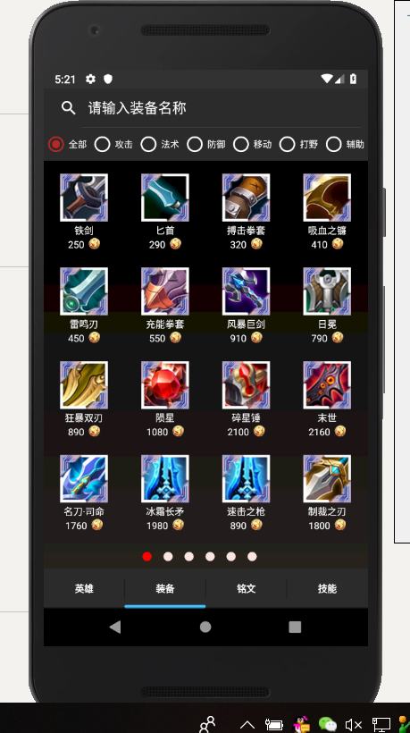
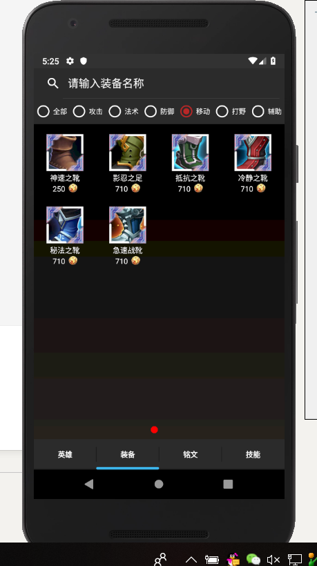
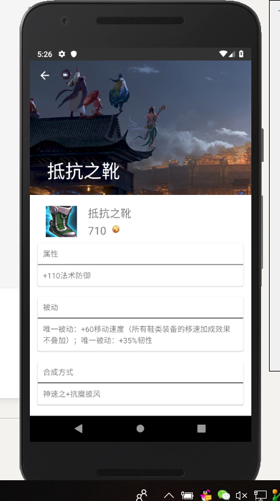
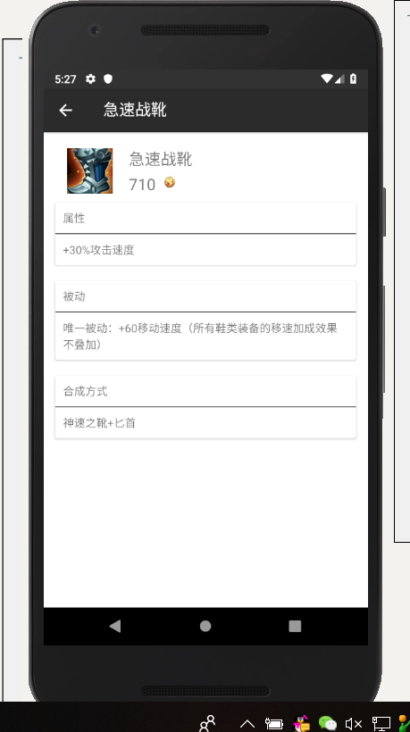

# 中山大学数据科学与计算机学院本科生实验报告

## （2018年秋季学期）
| 课程名称 | 手机平台应用开发 | 任课老师 | 郑贵锋 |
| :------------: | :-------------: | :------------: | :-------------: |
| 年级 | 16级 | 专业（方向） | 嵌入式软件与系统 |
| 学号 | 16340192 | 姓名 | 宋晓彤 |
| 电话 | 15521506587 | Email | 1252418308@qq.com |
| 开始日期 | 2018.11.10 | 完成日期 |2018.11.24|

---

## 一、实验题目

王者荣耀攻略手册

---

## 二、实现内容

制作王者荣耀的装备攻略

---

## 三、实验结果
### (1)实验截图









### (2)实验步骤以及关键代码

步骤一：制作fragment2（装备fragment）的xml文件

其中，使用SearchView制作顶部搜索栏，使用RadioButton制作中部条件筛选；使用ViewPager占位下方的多页面装备展示；同时添加圆点做页面位置指示

```
<android.support.v7.widget.SearchView
    android:id="@+id/search_equipment"
    android:background="@color/colorPrimaryDark"
    android:layout_width="match_parent"
    android:layout_height="50dp"
    android:gravity="center_vertical"
    android:queryHint="sdfsfd"
    android:textColor="@color/white"
    />
```

步骤二：制作equipment_detail的xml文件、以及后续完成简单的java（略）

其中，使用 AppBarLayout、CollapsingToolbarLayout、ToolBar的结合制作折叠标题栏；使用CardView组件制作带样式的卡片式显示

```
<android.support.design.widget.AppBarLayout
    android:id="@+id/appBar"
    android:layout_width="match_parent"
    android:layout_height="250dp">

    <android.support.design.widget.CollapsingToolbarLayout
        android:id="@+id/collapsing_toolbar"
        android:layout_width="match_parent"
        android:layout_height="match_parent"
        android:theme="@style/ThemeOverlay.AppCompat.Dark.ActionBar"
        app:contentScrim="@color/colorPrimaryDark"
        app:layout_scrollFlags="scroll|exitUntilCollapsed">

        <ImageView
            android:id="@+id/imageview_equip"
            android:layout_width="match_parent"
            android:layout_height="match_parent"
            android:scaleType="centerCrop"
            android:src="@mipmap/wangzherongyao"
            app:layout_collapseMode="parallax" />

        <android.support.v7.widget.Toolbar
            android:layout_width="match_parent"
            android:layout_height="?attr/actionBarSize"
            android:id="@+id/equip_toolbar"
            android:theme="@style/ThemeOverlay.AppCompat.Dark.ActionBar"
            app:layout_collapseMode="pin"
            android:navigationIcon="@mipmap/back">
        </android.support.v7.widget.Toolbar>

    </android.support.design.widget.CollapsingToolbarLayout>
```

步骤三：使用gridView布局制作装备的显示

```
<GridView xmlns:android="http://schemas.android.com/apk/res/android"
    android:layout_width="match_parent"
    android:layout_height="match_parent"
    android:id="@+id/grid_view"
    android:numColumns="4"
    android:descendantFocusability="blocksDescendants"
    >
</GridView>
```

步骤四：制作单个装备显示的布局，略

步骤五：编写equipment类，包含属性为名称、图片、属性、加成、合成路径、类别，略

步骤六：编写装备的gridviewadapter

```
public View getView(int i, View view, ViewGroup viewGroup) {
    ViewHolder holder;
    if (view == null){
        holder = new ViewHolder();
        view = View.inflate(context, R.layout.equipment_view, null);
        holder.equip_name = (TextView) view.findViewById(R.id.equip_name);
        holder.equip_photo = (ImageView) view.findViewById(R.id.imgUrl);
        holder.getEquip_price = (TextView) view.findViewById(R.id.equip_price);
        view.setTag(holder);
    }else {
        holder = (ViewHolder) view.getTag();
    }
    final int pos = i + mIndex*mPagerSize;
    holder.equip_photo.setBackgroundResource(list.get(pos).getImage());
    holder.equip_name.setText(list.get(pos).getName());
    holder.getEquip_price.setText(String.valueOf(list.get(pos).getPrice()));
    return view;
}
```

步骤七：在数据库中添加equipment表，编写搜索函数和插入函数

```
public ArrayList<Equipment> getEquipmentsWithCategory(String categoryId){
    ArrayList<Equipment> equipmentArrayList = new ArrayList<>();
    SQLiteDatabase db = this.getWritableDatabase();
    Cursor cursor = db.rawQuery("select * from equipments where category = ?", new String[]{categoryId});
    if(cursor.moveToFirst()){
        do{
            Equipment equipment = new Equipment();
            equipment.setImage(cursor.getInt(cursor.getColumnIndex("image")));
            equipment.setName(cursor.getString(cursor.getColumnIndex("name")));
            equipment.setPrice(cursor.getInt(cursor.getColumnIndex("price")));
            equipment.setProperty(cursor.getString(cursor.getColumnIndex("property")));
            equipment.setSkill(cursor.getString(cursor.getColumnIndex("skill")));
            equipment.setProcess(cursor.getString(cursor.getColumnIndex("process")));
            equipment.setCategory(cursor.getString(cursor.getColumnIndex("category")));
            equipmentArrayList.add(equipment);
        }while (cursor.moveToNext());
    }
    return equipmentArrayList;
}
public Equipment getEquipmentsWithName(String name){
    Equipment equipment = new Equipment();
    SQLiteDatabase db = this.getWritableDatabase();
    Cursor cursor = db.rawQuery("select * from equipments where name = ?", new String[]{name});
    if(cursor.moveToFirst()){
            equipment.setImage(cursor.getInt(cursor.getColumnIndex("image")));
            equipment.setName(cursor.getString(cursor.getColumnIndex("name")));
            equipment.setPrice(cursor.getInt(cursor.getColumnIndex("price")));
            equipment.setProperty(cursor.getString(cursor.getColumnIndex("property")));
            equipment.setSkill(cursor.getString(cursor.getColumnIndex("skill")));
            equipment.setProcess(cursor.getString(cursor.getColumnIndex("process")));
            equipment.setCategory(cursor.getString(cursor.getColumnIndex("category")));
    }
    return equipment;
}
```

步骤八：编写fragment2的java文件；在main中添加数据、添加通知栏；

其中

设置小圆点

```
ivPoints = new ImageView[totalPage];
for (int i = 0; i < totalPage; i++){
    ImageView imageView = new ImageView(getActivity());
    LinearLayout.LayoutParams params=new LinearLayout.LayoutParams(30,30);//布局参数,point的布局宽与高
    params.rightMargin = 40;//右边距
    imageView.setLayoutParams(params);
    imageView.setBackgroundResource(R.drawable.point_bg);
    if (i == 0){
        imageView.setEnabled(true);
    }
    else {
        imageView.setEnabled(false);
    }
    ivPoints[i] = imageView;
    group.addView(imageView);
}
//圆点设置
    private void setImageBackground(int selectItems) {
        for (int i = 0; i < ivPoints.length; i++) {
            if (i == selectItems) {
                ivPoints[i].setBackgroundResource(R.drawable.point_focus);
            } else {
                ivPoints[i].setBackgroundResource(R.drawable.point_normal);
            }
        }
    }
```

搜索框

```
//搜索框
        searchView.setIconified(false);//设置searchView处于展开状态
        searchView.setIconifiedByDefault(false);//搜索图标是否显示在搜索框内
        searchView.setSubmitButtonEnabled(true);//设置搜索框展开时是否显示提交按钮，可不显示
        searchView.setImeOptions(EditorInfo.IME_ACTION_SEARCH);//让键盘的回车键设置成搜索
        searchView.setQueryHint("请输入装备名称");
        searchView.clearFocus();//清除焦点

        autoCompleteTextView = (AutoCompleteTextView) searchView.findViewById(android.support.v7.appcompat.R.id.search_src_text);
        autoCompleteTextView.setThreshold(1);//补全触发需要的字符
        autoCompleteTextView.setCompletionHint("最近5条记录");
        String[] mSearchHistory = getHistoryArray(SP_KEY_SEARCH);
        searchHistoryAdapter = new ArrayAdapter<String>(getContext(),android.R.layout.simple_dropdown_item_1line,mSearchHistory);
        autoCompleteTextView.setAdapter(searchHistoryAdapter);
        autoCompleteTextView.setOnItemClickListener(new AdapterView.OnItemClickListener() {
            @Override
            public void onItemClick(AdapterView<?> adapterView, View view, int i, long l) {
                searchView.setQuery(searchHistoryAdapter.getItem(i),true);
            }
        });

        //搜索触发
        searchView.setOnQueryTextListener(new SearchView.OnQueryTextListener() {
            @Override
            public boolean onQueryTextSubmit(String s) {
                for (int i = 0; i < equipmentArrayList.size(); i++){
                    if (equipmentArrayList.get(i).getName().equals(s)){
                        Equipment equip = equipmentArrayList.get(i);
                        Intent intent = new Intent(getContext(), equipment_detail.class);
                        intent.putExtra("equipment_data", equip);
                        startActivity(intent);
                        searchView.clearFocus();
                        saveSearchHistory();
                        searchHistoryAdapter.add(s);
                        return false;
                    }
                }
                Toast.makeText(getContext(),"没有此装备",Toast.LENGTH_SHORT).show();
                return false;
            }

            @Override
            public boolean onQueryTextChange(String s) {
                return false;
            }
        });
```

切换类别

```
radioGroup.setOnCheckedChangeListener(new RadioGroup.OnCheckedChangeListener() {
        @Override
        public void onCheckedChanged(RadioGroup radioGroup, int i) {
            viewPagerList.clear();
            if (((RadioButton)view.findViewById(i)).getText().toString().equals("全部")){
                equipmentArrayList = heroSQLiteHelper.getAllEquipment();
                totalPage = 6;
            }
            else if(((RadioButton)view.findViewById(i)).getText().toString().equals("攻击") || ((RadioButton)view.findViewById(i)).getText().toString().equals("法术") || ((RadioButton)view.findViewById(i)).getText().toString().equals("防御")){
                equipmentArrayList = heroSQLiteHelper.getEquipmentsWithCategory(((RadioButton)view.findViewById(i)).getText().toString());
                totalPage = 2;
            }

            else{
                equipmentArrayList = heroSQLiteHelper.getEquipmentsWithCategory(((RadioButton)view.findViewById(i)).getText().toString());
                totalPage = 1;
            }
            group.removeAllViews();
            for (int t = 0; t < totalPage; t++){
                ImageView imageView = new ImageView(getActivity());
                LinearLayout.LayoutParams params=new LinearLayout.LayoutParams(30,30);//布局参数,point的布局宽与高
                params.rightMargin = 40;//右边距
                imageView.setLayoutParams(params);
                imageView.setBackgroundResource(R.drawable.point_bg);
                if (t == 0){
                    imageView.setEnabled(true);
                }
                else {
                    imageView.setEnabled(false);
                }
                ivPoints[t] = imageView;
                group.addView(imageView);
            }

            setViewPagerWithGridview();
        }
    });
}
```

步骤九：添加桌面小部件，显示推荐装备，点击进入

### (3)实验遇到的困难以及解决思路

1. 在设置小圆点时，使用在groupview中addview的方法将小圆点加入其中，但是在切换类别时，小圆点的个数有删减，所以需要在切换类别时重新计算totalpage的大小（小圆点个数），并将groupview中所有的小圆点清空后重新添加

2. 装备的图片很丑，打算设置一个外边框：从网上下载了喜欢的图片，使用ps软件制作了边框的png文件，同时将其设置为装备的图标的src属性，而内容的图片则设置为background属性，可以达成边框的设计

3. searchview使用的时候，输入位置在搜索图标上，而且输入文字后搜索图标消失了，以及对searchview进行一些细节的设置

   ```
   searchView.setIconifiedByDefault(false);//搜索图标是否显示在搜索框内
   searchView.setSubmitButtonEnabled(true);//设置搜索框展开时是否显示提交按钮，可不显示
   searchView.setImeOptions(EditorInfo.IME_ACTION_SEARCH);//让键盘的回车键设置成搜索
   ```

4. 一共需要插入94条数据，使用插入的函数写进代码很冗余，代码也不够美观，所以在mainactivity的插入中使用了读取本地txt文件的方式，由于数据较为简单所以用了很简单的方法，将每一个需要插入的属性分割，然后进行插入；但是存在的问题是从文件中读取的文字显示在手机上会出现乱码，当出现乱码时，将输入流的标准设为国标GB2312即可

   ```
   // 对从文件中读取的装备信息进行分割存储
       private String[] readEquipFromRaw() {
           String[] res = new String[]{};
           try {
               InputStream is = getResources().openRawResource(R.raw.equipments);
               String text = readTextFromSDcard(is);
               res = text.split(",");
           } catch (Exception e) {
               // TODO Auto-generated catch block
               e.printStackTrace();
           }
           return res;
       }
       // 从文件中读取装备信息
       private String readTextFromSDcard(InputStream is) throws Exception {
           InputStreamReader reader = new InputStreamReader(is, "GB2312");
           BufferedReader bufferedReader = new BufferedReader(reader);
           StringBuffer buffer = new StringBuffer("");
           String str;
           while ((str = bufferedReader.readLine()) != null) {
               buffer.append(str);
               buffer.append(",");
           }
           return buffer.toString();
       }
   ```

5. 使用过程中，讨论后觉得纯色背景比较丑，所以选择使用黑色渐变背景，但是这部分由组员完成。

---

## 四、实验思考及感想

​	首先，在完成较为完整的app项目时，应该依照严谨的开发流程，制作原型图，小组中的队员才能根据原型图判断工作量从而进行较为方便的分工，同时设计UI是很重要很专业的事情，自己动手做了才知道做一个精美的UI是多么不容易。

​	在组件的交互设置上可以多想想，从而提升app的可操作性，降低学习成本，比如在进行装备详情的设计时，原本计划是在页面底部先设置一个简略的显示，随着用户点击的选择进行改变，但是这时候就需要长按图片唤醒装备详情页面，但是这个的学习成本很高，虽然只是一次作业，但是我最后还是没有选择这个方式。

​	要注意组件的细节设置，比如在制作搜索框的时候，就要注意回车搜索、附带增加历史搜索等功能，会让app的使用更加便捷。同时也要注意启动动画、toast通知、通知栏广播、桌面小部件等细节的添加。

---

#### 作业要求
* 命名要求：学号_姓名_实验编号，例如12345678_张三_lab1.md
* 实验报告提交格式为md
* 实验内容不允许抄袭，我们要进行代码相似度对比。如发现抄袭，按0分处理