# 中山大学数据科学与计算机学院本科生实验报告

## （2018年秋季学期）
| 课程名称 | 手机平台应用开发 |   任课老师   |         郑贵锋         |
| :------: | :--------------: | :----------: | :--------------------: |
|   年级   |       2016       | 专业（方向） |          嵌软          |
|   学号   |     16340215     |     姓名     |          王建          |
|   电话   |   13246824607    |    Email     | jankingwon@foxmail.com |
| 开始日期 |       2018       |   完成日期   |          2018          |

---

## 一、实验题目

期中项目

---

## 二、实现内容

这里是本人实现的内容：

- 主界面的fragment布局
- 英雄页、英雄详情页、添加英雄页的UI内容
- 存储英雄信息的SQL数据库

---

## 三、课堂实验结果

### (1)实验截图


### (2)实验步骤以及关键代码

#### 导航栏(SmartTabLayout)

使用了GitHub上的这个UI

https://github.com/ogaclejapan/SmartTabLayout

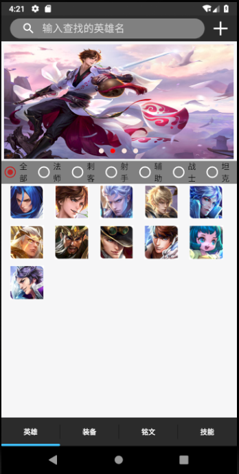

所以`activity_main.xml`中只有一个`ViewPager`和一个导航栏，（其实导航栏是在上面）

```xml
<android.support.v4.view.ViewPager
    android:id="@+id/viewpager"
    android:layout_width="match_parent"
    android:layout_height="match_parent"
    android:layout_weight="1"
    />
<com.ogaclejapan.smarttablayout.SmartTabLayout
    android:background="@color/colorPrimaryDark"
    android:id="@+id/viewpagertab"
    android:layout_width="match_parent"
    android:layout_height="50dp"
    app:stl_indicatorAlwaysInCenter="false"
    app:stl_indicatorWithoutPadding="false"
    app:stl_indicatorInFront="false"
    app:stl_indicatorInterpolation="smart"
    app:stl_indicatorGravity="bottom"
    app:stl_indicatorColor="#40C4FF"
    app:stl_indicatorThickness="4dp"
    app:stl_indicatorWidth="auto"
    app:stl_indicatorCornerRadius="2dp"
    app:stl_overlineColor="@color/colorPrimary"
    app:stl_overlineThickness="0dp"
    app:stl_underlineColor="#4D000000"
    app:stl_underlineThickness="1dp"
    app:stl_dividerColor="#4D000000"
    app:stl_dividerThickness="1dp"
    app:stl_defaultTabBackground="?attr/selectableItemBackground"
    app:stl_defaultTabTextAllCaps="true"
    app:stl_defaultTabTextColor="@color/white"
    app:stl_defaultTabTextSize="12sp"
    app:stl_defaultTabTextHorizontalPadding="16dp"
    app:stl_defaultTabTextMinWidth="0dp"
    app:stl_distributeEvenly="true"
    app:stl_clickable="true"
    app:stl_titleOffset="24dp"
    app:stl_drawDecorationAfterTab="false"
    />
```

`MainActivity.java`

```java
FragmentPagerItemAdapter adapter = new FragmentPagerItemAdapter(
                getSupportFragmentManager(), FragmentPagerItems.with(this)
                .add(R.string.title1, Fragment1.class)
                .add(R.string.title2, Fragment2.class)
                .add(R.string.title3, Fragment3.class)
                .add(R.string.title4, Fragment4.class)
                .create());
        ViewPager viewPager = findViewById(R.id.viewpager);
        viewPager.setAdapter(adapter);
        SmartTabLayout viewPagerTab = findViewById(R.id.viewpagertab);
        viewPagerTab.setViewPager(viewPager);
```

这里的`Fragment1,2,3,4`分别是四个页面：**英雄，装备，明文，技能**

#### 工具栏(ToolBar)

其实有两种`ToolBar`:

- `android.support.v7.widget.Toolbar`

- `Toolbar`

两个都能用，但是有一些区别

**区别一**：`ToolBar`的就是`MenuItem`显示不出来图标，另一个可以


**区别二**：`android.support.v7.widget.Toolbar`在设计页面没有预览，另一个有

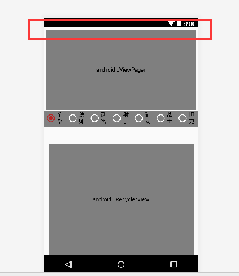

**区别三**：`android.support.v7.widget.Toolbar`如果是来自其他`Activity`跳转过来的，它会自动加上标题，而且会自动有返回按钮，而且添加的菜单栏不太好设计（具体我也忘了），所以除了主界面，其他界面我都是用`Toolbar`，方便自己定制

**使用方法：**

`fragment1.xml`

```xml
<android.support.v7.widget.Toolbar
    android:id="@+id/hero_toolbar"
    android:layout_width="match_parent"
    android:layout_height="45dp"
    android:background="@color/colorPrimaryDark">
</android.support.v7.widget.Toolbar>
```

在`Android`视图下创建一个新的文件夹`menu`

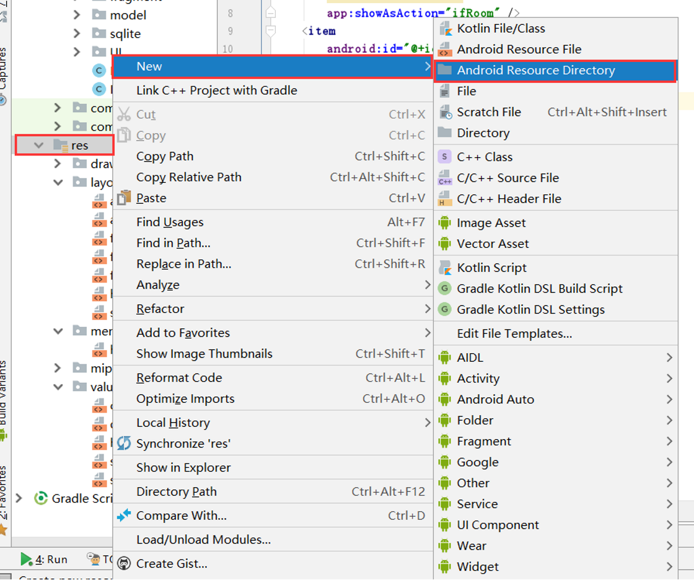


新建`hero_menu.xml`，

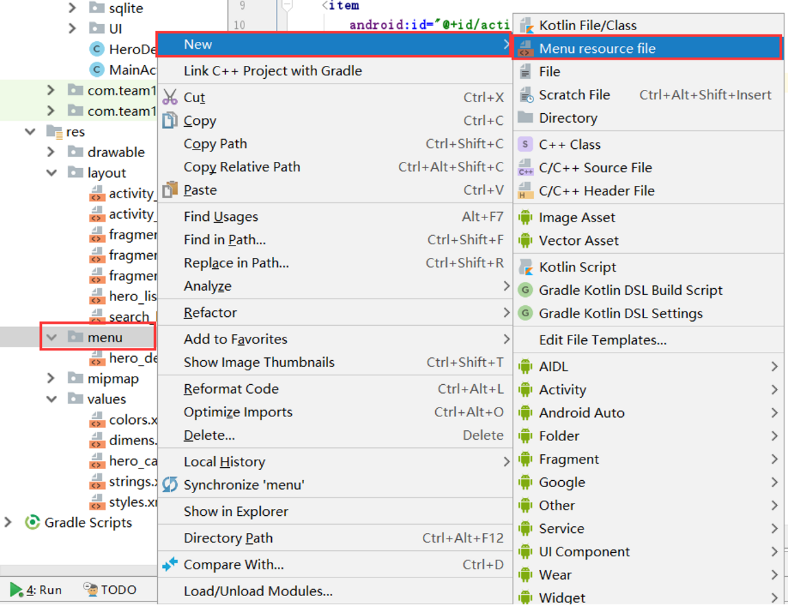


用来保存`ToolBar`上的菜单栏布局

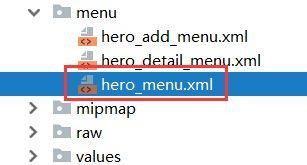

这里只有一个菜单，表示**添加英雄**，而且图标用定义的图标

`showAsAction`表示是否展开到工具栏上

- `always`表示总是展开
- `ifRoom`表示如果有足够的空间就展开
- `never`表示总是不展开
- `withText`表示使菜单项和它的图标，菜单文本一起显示。


那么不展开的菜单会到哪里呢？
比如英雄详情页面，它会隐藏在**更多**按钮里（显示为三个点）


```xml
<?xml version="1.0" encoding="utf-8"?>
<menu xmlns:android="http://schemas.android.com/apk/res/android"
    xmlns:app="http://schemas.android.com/apk/res-auto">

    <item
        android:id="@+id/action_hero_add"
        android:title="添加英雄"
        android:icon="@mipmap/add"
        app:showAsAction="always" />
</menu>
```

然后需要在`Fragment1.java`文件中动态设置`ToolBar`的样式，以及设置点击`Item`响应的事件，这里只有一个事件，就是跳转到**添加英雄**页面

```java
//获取ToolBar控件
android.support.v7.widget.Toolbar toolbar = view.findViewById(R.id.hero_toolbar);
toolbar.inflateMenu(R.menu.hero_menu);//设置右上角的填充菜单
toolbar.setOnMenuItemClickListener(new android.support.v7.widget.Toolbar.OnMenuItemClickListener() {
    @Override
    public boolean onMenuItemClick(MenuItem menuItem) {
        switch (menuItem.getItemId()) {
            //添加英雄
            case R.id.action_hero_add:
                Intent intent = new Intent(getActivity(), HeroAdd.class);
                intent.putStringArrayListExtra("hero_names", mAdapter.getAllNames());
                startActivityForResult(intent, 1);
                break;
        }
        return true;
    }
});
```

还有其他的菜单布局，待会会使用

`hero_detail_menu.xml`

```xml
<?xml version="1.0" encoding="utf-8"?>
<menu xmlns:android="http://schemas.android.com/apk/res/android"
    xmlns:app="http://schemas.android.com/apk/res-auto">

    <item
        android:id="@+id/action_hero_edit"
        android:title="编辑"
        android:icon="@mipmap/edit"
        app:showAsAction="never" />
    <item
        android:id="@+id/action_hero_save"
        android:title="保存"
        android:icon="@mipmap/save"
        app:showAsAction="never" />
    <item
        android:id="@+id/action_hero_delete"
        android:title="删除"
        android:icon="@mipmap/delete"
        app:showAsAction="never"/>
</menu>
```

`hero_add_menu.xml`

```xml
<?xml version="1.0" encoding="utf-8"?>
<menu xmlns:android="http://schemas.android.com/apk/res/android"
    xmlns:app="http://schemas.android.com/apk/res-auto">

    <item
        android:id="@+id/action_hero_add_icon"
        android:title="添加头像"
        app:showAsAction="never"/>
    <item
        android:id="@+id/action_hero_add_voice"
        android:title="添加语音"
        app:showAsAction="never"/>
    <item
        android:id="@+id/action_hero_add_save"
        android:title="保存英雄"
        android:icon="@mipmap/white_save"
        app:showAsAction="ifRoom" />
</menu>
```


> java代码待会再讨论

#### 英雄列表(RecyclerView)

英雄的实体类`Hero.java`

```java
public class Hero implements Serializable{
    //保存的是image的uri
    //英雄海报
    private String image = "android.resource://com.team1.kingofhonor/" +R.mipmap.hero;
    //英雄语音
    private String voice = "android.resource://com.team1.kingofhonor/" +R.raw.pentakill;
    //英雄图标
    private String icon = "android.resource://com.team1.kingofhonor/" +R.mipmap.hero_icon;
    //英雄技能图标
    private String skill1_icon = "android.resource://com.team1.kingofhonor/" +R.mipmap.juyoujing1;
    private String skill2_icon = "android.resource://com.team1.kingofhonor/" +R.mipmap.juyoujing2;
    private String skill3_icon = "android.resource://com.team1.kingofhonor/" +R.mipmap.juyoujing3;
    private String skill4_icon = "android.resource://com.team1.kingofhonor/" +R.mipmap.juyoujing4;
    //英雄技能描述
    private String skill1_description = "技能1";
    private String skill2_description = "技能2";
    private String skill3_description = "技能3";
    private String skill4_description = "技能4";
    //英雄名字
    private String name = "名字未设置";
    //英雄称号
    private String alias = "王者小兵";
    //英雄职业
    private String category;//1.法师 2.刺客 3.射手 4.辅助 5.战士 6.坦克
    //推荐装备
    private String equip1 = "破军";
    private String equip2 = "破军";
    private String equip3 = "破军";
    private String equip4 = "破军";
    private String equip5 = "破军";
    private String equip6 = "破军";
    //生存能力
    private int viability = 1;
    //攻击伤害
    private int attack_damage= 1;
    //技能伤害
    private int skill_damage = 1;
    //上手难度
    private int difficulty = 1;

    private Boolean favorite = false;//收藏
    private Boolean deleted = false;//true表示已经删除
    private Boolean added = false;//true表示是新加的
    private Boolean modified = false;//true表示已经修改

    public Hero(){}
    ...
}
```

> 这里英雄的语音，头像，海报什么的资源文件全都是存储对应的Uri字符串

列表布局`hero_list.xml`

其实就显示了一个英雄头像

```xml
<android.support.constraint.ConstraintLayout xmlns:android="http://schemas.android.com/apk/res/android"
xmlns:tools="http://schemas.android.com/tools"
android:layout_width="60dp"
android:layout_height="60dp"
    android:layout_margin="5dp"
xmlns:app="http://schemas.android.com/apk/res-auto">

    <ImageView
        android:id="@+id/hero_image"
        android:layout_width="match_parent"
        android:layout_height="match_parent"
        android:scaleType="fitXY"
        android:src="@mipmap/juyoujing_icon"/>


</android.support.constraint.ConstraintLayout>
```

页面视图`fragment1.xml`

```xml
<android.support.v7.widget.RecyclerView
    android:layout_width="match_parent"
    android:layout_height="match_parent"
    android:id="@+id/hero_recyclerview"
    tools:listitem="@layout/hero_list"
    android:dividerHeight="10dp"
    android:layout_marginTop="290dp"
    android:layout_marginStart="10dp"
    android:layout_marginEnd="10dp"
    app:layout_constraintStart_toStartOf="parent"
    app:layout_constraintEnd_toEndOf="parent">
</android.support.v7.widget.RecyclerView>
```

列表适配器`HeroAdapter.java`

这里仅仅实现了基本的显示功能，后面还会添加新的方法

```java
package com.team1.kingofhonor.adapter;
import android.database.Cursor;
import android.database.sqlite.SQLiteDatabase;
import android.net.Uri;
import android.support.v7.widget.RecyclerView;
import android.util.Log;
import android.view.LayoutInflater;
import android.view.View;
import android.view.ViewGroup;
import android.widget.ArrayAdapter;
import android.widget.ImageView;
import android.widget.LinearLayout;
import android.widget.TextView;

import com.team1.kingofhonor.R;
import com.team1.kingofhonor.model.Hero;
import com.team1.kingofhonor.sqlite.HeroSQLiteHelper;

import java.util.ArrayList;
import java.util.List;


public class HeroAdapter extends RecyclerView.Adapter<HeroAdapter.ViewHolder> {

    private static List<Hero> mDatas;
    private HeroAdapter.OnItemClickListener onItemClickListener;

    public HeroAdapter(List<Hero> list) {
        mDatas = list;
    }

    @Override
    public ViewHolder onCreateViewHolder(ViewGroup parent, int viewType)
    {
        // 实例化展示的view
        View v = LayoutInflater.from(parent.getContext()).inflate(R.layout.hero_list, parent, false);
        // 实例化viewholder
        ViewHolder viewHolder = new ViewHolder(v);
        return viewHolder;
    }

    @Override
    public void onBindViewHolder(final ViewHolder holder, int position) {
        // 绑定数据
        //holder.hero_name.setText(mDatas.get(position).getName());
        holder.hero_image.setImageURI(Uri.parse(mDatas.get(position).getIcon()));
        //listener
        holder.itemView.setOnClickListener(new View.OnClickListener() {
            @Override
            public void onClick(final View v) {
                if(onItemClickListener != null) {
                    int pos = holder.getLayoutPosition();
                    onItemClickListener.onItemClick(holder.itemView, pos);
                }
            }
        });

        holder.itemView.setOnLongClickListener(new View.OnLongClickListener() {
            @Override
            public boolean onLongClick(View v) {
                if(onItemClickListener != null) {
                    int pos = holder.getLayoutPosition();
                    onItemClickListener.onItemLongClick(holder.itemView, pos);
                }
                //表示此事件已经消费，不会触发单击事件
                return true;
            }
        });

    }

    @Override
    public int getItemCount()
    {
        return mDatas.size();
    }

    public void addNewItem(Hero f) {
        if(mDatas == null) {
            mDatas = new ArrayList<>();
        }
        mDatas.add(0, f);
        notifyItemInserted(0);
    }

    public void deleteItem(int pos) {
        if(mDatas == null || mDatas.isEmpty()) {
            return;
        }
        mDatas.remove(pos);
        notifyItemRemoved(pos);
    }

    public Hero getItem(int pos){
        if(mDatas == null || mDatas.isEmpty())
            return null;
        return mDatas.get(pos);
    }
    /**
     * 设置回调监听
     *
     * @param listener
     */
    public void setOnItemClickListener(HeroAdapter.OnItemClickListener listener) {
        this.onItemClickListener = listener;
    }

    public interface OnItemClickListener {
        void onItemClick(View view, int position);
        void onItemLongClick(View view, int position);
    }

    public static class ViewHolder extends RecyclerView.ViewHolder {
        TextView hero_name;
        ImageView hero_image;
        public ViewHolder(View itemView) {
            super(itemView);
            //hero_name = itemView.findViewById(R.id.hero_name);
            hero_image = itemView.findViewById(R.id.hero_image);
        }
    }
}
```

代码文件`Fragment1.java`

这里设置成网格显示，一共有5列

```java
private View view;
private RecyclerView.LayoutManager mLayoutManager;
private RecyclerView mRecyclerView;
private HeroAdapter mAdapter;
...
public View onCreateView(LayoutInflater inflater, @Nullable ViewGroup container, @Nullable Bundle savedInstanceState) {
        view = LayoutInflater.from(getActivity()).inflate(R.layout.fragment1, container, false);
        //hero list
        mLayoutManager = new GridLayoutManager(getActivity(), 5);
        mAdapter = new HeroAdapter(mySQLiteHelper.getAllHeroes());
        mRecyclerView = view.findViewById(R.id.hero_recyclerview);
        mRecyclerView.setLayoutManager(mLayoutManager);
        mRecyclerView.setAdapter(mAdapter);
        //设置英雄列表的边距
        //mRecyclerView.addItemDecoration(new SpaceItemDecoration(40));
        mAdapter.setOnItemClickListener(new HeroAdapter.OnItemClickListener() {
            @Override
            public void onItemClick(View view, int position) {
                Intent intent = new Intent(getActivity(), HeroDetail.class);
                Bundle bundle=new Bundle();
                bundle.putSerializable("Click_Hero", mAdapter.getItem(position));
                intent.putExtras(bundle);
                clickPosition = position;
                startActivityForResult(intent, 0);
            }
            @Override
            public void onItemLongClick(View view, int position) {

            }
        });
}
```

#### 英雄数据库(HeroSQLiteHelper)

`HeroSQLiteHelper.java`

除了实现基本的功能外，主要是加了个`getAllHeroes`方法，这是为了最开始得到数据库的数据给`HeroAdapter`赋初值


```java
public class HeroSQLiteHelper extends SQLiteOpenHelper {
    // Database Version
    private static final int DATABASE_VERSION = 2;
    // Database Name
    private static final String DATABASE_NAME = "HeroDB";

    public HeroSQLiteHelper(Context context) {
        super(context, DATABASE_NAME, null, DATABASE_VERSION);
    }
    @Override
    public void onCreate(SQLiteDatabase db) {
        // SQL statement to create book table
        String CREATE_HERO_TABLE = "CREATE TABLE heroes ( " +
                "name TEXT PRIMARY KEY, " +
                "image TEXT," +
                "alias TEXT," +
                "category TEXT," +
                "viability INTEGER,"+
                "attack_damage INTEGER,"+
                "skill_damage INTEGER,"+
                "difficulty INTEGER,"+
                "voice TEXT," +
                "icon TEXT," +
                "favorite INTEGER," +
                "skill1_icon TEXT," +
                "skill1_description TEXT," +
                "skill2_icon TEXT," +
                "skill2_description TEXT," +
                "skill3_icon TEXT," +
                "skill3_description TEXT," +
                "skill4_icon TEXT," +
                "skill4_description TEXT)";

        // create books table
        db.execSQL(CREATE_HERO_TABLE);
        db.execSQL(CREATE_EQUIP_TABLE);
    }
    @Override
    public void onUpgrade(SQLiteDatabase db, int oldVersion, int newVersion) {
        // Drop older  table if existed
        db.execSQL("DROP TABLE IF EXISTS heroes");
        this.onCreate(db);
    }
    //执行查询语句
    public Cursor query(String sql, String[] args)
    {
        SQLiteDatabase db = this.getReadableDatabase();
        Cursor cursor = db.rawQuery(sql, args);
        return cursor;
    }
    // table name
    private static final String TABLE_HEROES = "heroes";

    //Table Columns names
    private static final String KEY_NAME = "name";
    private static final String KEY_ALIAS = "alias";
    private static final String KEY_IMAGE = "image";
    private static final String KEY_CATEGORY = "CATEGORY";
    private static final String KEY_VIABILITY = "viability";
    private static final String KEY_ATTACK_DAMAGE = "attack_damage";
    private static final String KEY_SKILL_DAMAGE = "skill_damage";
    private static final String KEY_DIFFICULTY = "difficulty";
    private static final String KEY_VOICE = "voice";
    private static final String KEY_ICON = "icon";
    private static final String KEY_FAVORITE = "favorite";
    private static final String KEY_SKILL1_ICON = "skill1_icon";
    private static final String KEY_SKILL2_ICON = "skill2_icon";
    private static final String KEY_SKILL3_ICON = "skill3_icon";
    private static final String KEY_SKILL4_ICON = "skill4_icon";
    private static final String KEY_SKILL1_DESCRIPTION = "skill1_description";
    private static final String KEY_SKILL2_DESCRIPTION = "skill2_description";
    private static final String KEY_SKILL3_DESCRIPTION = "skill3_description";
    private static final String KEY_SKILL4_DESCRIPTION = "skill4_description";
    private static final String[] COLUMNS = {KEY_NAME,KEY_ALIAS,KEY_IMAGE,KEY_CATEGORY};

    public void addHero(Hero hero){
        Log.d("addHero", hero.toString());
        // 1. get reference to writable DB
        SQLiteDatabase db = this.getWritableDatabase();
        // 2. create ContentValues to add key "column"/value
        ContentValues values = new ContentValues();
        values.put(KEY_NAME, hero.getName());
        values.put(KEY_ALIAS, hero.getAlias());
        values.put(KEY_IMAGE, hero.getImage());
        values.put(KEY_CATEGORY, hero.getCategory());
        values.put(KEY_VIABILITY, hero.getViability());
        values.put(KEY_ATTACK_DAMAGE, hero.getAttack_damage());
        values.put(KEY_SKILL_DAMAGE, hero.getSkill_damage());
        values.put(KEY_DIFFICULTY, hero.getDifficulty());
        values.put(KEY_VOICE, hero.getVoice());
        values.put(KEY_ICON, hero.getIcon());
        values.put(KEY_FAVORITE, hero.getFavorite());
        values.put(KEY_SKILL1_ICON, hero.getSkill1_icon());
        values.put(KEY_SKILL1_DESCRIPTION, hero.getSkill1_description());
        values.put(KEY_SKILL2_ICON, hero.getSkill2_icon());
        values.put(KEY_SKILL2_DESCRIPTION, hero.getSkill2_description());
        values.put(KEY_SKILL3_ICON, hero.getSkill3_icon());
        values.put(KEY_SKILL3_DESCRIPTION, hero.getSkill3_description());
        values.put(KEY_SKILL4_ICON, hero.getSkill4_icon());
        values.put(KEY_SKILL4_DESCRIPTION, hero.getSkill4_description());
        // 3. insert
        db.insert(TABLE_HEROES, // table
                null, //nullColumnHack
                values); // key/value -> keys = column names/ values = column values

        // 4. close
        db.close();
    }
    public Hero getHero(String name){
        // 1. get reference to readable DB
        SQLiteDatabase db = this.getReadableDatabase();
        // 2. build query
        Cursor cursor =
                db.query(TABLE_HEROES, // a. table
                        COLUMNS, // b. column names
                        " name = ?", // c. selections
                        new String[] { name }, // d. selections args
                        null, // e. group by
                        null, // f. having
                        null, // g. order by
                        null); // h. limit

        // 3. if we got results get the first one
        if (cursor != null)
            cursor.moveToFirst();
        // 4. build object
        Hero hero = new Hero();
        hero.setName(cursor.getString(0));
        hero.setImage(cursor.getString(1));
        hero.setAlias(cursor.getString(2));
        hero.setCategory(cursor.getString(3));
        hero.setViability(cursor.getInt(4));
        hero.setAttack_damage(cursor.getInt(5));
        hero.setSkill_damage(cursor.getInt(6));
        hero.setDifficulty(cursor.getInt(7));
        hero.setVoice(cursor.getString(8));
        hero.setIcon(cursor.getString(9));
        hero.setFavorite(cursor.getInt(10) == 1);
        hero.setSkill1_icon(cursor.getString(11));
        hero.setSkill1_description(cursor.getString(12));
        hero.setSkill2_icon(cursor.getString(13));
        hero.setSkill2_description(cursor.getString(14));
        hero.setSkill3_icon(cursor.getString(15));
        hero.setSkill3_description(cursor.getString(16));
        hero.setSkill4_icon(cursor.getString(17));
        hero.setSkill4_description(cursor.getString(18));
        // 5. return hero
        return hero;
    }
    // Get All Heroes
    public List<Hero> getAllHeroes() {
        List<Hero> heroes = new LinkedList<Hero>();
        // 1. build the query
        String query = "SELECT  * FROM " + TABLE_HEROES;
        // 2. get reference to writable DB
        SQLiteDatabase db = this.getWritableDatabase();
        Cursor cursor = db.rawQuery(query, null);
        // 3. go over each row, build book and add it to list
        Hero hero = null;
        if (cursor.moveToFirst()) {
            do {
                hero = new Hero();
                hero.setName(cursor.getString(0));
                hero.setImage(cursor.getString(1));
                hero.setAlias(cursor.getString(2));
                hero.setCategory(cursor.getString(3));
                hero.setViability(cursor.getInt(4));
                hero.setAttack_damage(cursor.getInt(5));
                hero.setSkill_damage(cursor.getInt(6));
                hero.setDifficulty(cursor.getInt(7));
                hero.setVoice(cursor.getString(8));
                hero.setIcon(cursor.getString(9));
                hero.setFavorite(cursor.getInt(10) == 1);
                hero.setSkill1_icon(cursor.getString(11));
                hero.setSkill1_description(cursor.getString(12));
                hero.setSkill2_icon(cursor.getString(13));
                hero.setSkill2_description(cursor.getString(14));
                hero.setSkill3_icon(cursor.getString(15));
                hero.setSkill3_description(cursor.getString(16));
                hero.setSkill4_icon(cursor.getString(17));
                hero.setSkill4_description(cursor.getString(18));
                heroes.add(hero);
            } while (cursor.moveToNext());
        }
        // return heros
        return heroes;
    }

    public void deleteAllHeroes(){
        // 1. get reference to writable DB
        SQLiteDatabase db = this.getWritableDatabase();
        // 2. delete
        db.delete(TABLE_HEROES,null,null);
        // 3. close
        db.close();
    }
    // Updating single book
    public int updateHero(Hero hero) {
        // 1. get reference to writable DB
        SQLiteDatabase db = this.getWritableDatabase();
        // 2. create ContentValues to add key "column"/value
        ContentValues values = new ContentValues();
        values.put("name", hero.getName());
        values.put("image", hero.getImage().toString());
        values.put("alias", hero.getAlias());
        values.put("category", hero.getCategory());
        values.put(KEY_VIABILITY, hero.getViability());
        values.put(KEY_ATTACK_DAMAGE, hero.getAttack_damage());
        values.put(KEY_SKILL_DAMAGE, hero.getSkill_damage());
        values.put(KEY_DIFFICULTY, hero.getDifficulty());
        values.put(KEY_VOICE, hero.getVoice());
        values.put(KEY_ICON, hero.getIcon());
        values.put(KEY_FAVORITE, hero.getFavorite());
        values.put(KEY_SKILL1_ICON, hero.getSkill1_icon());
        values.put(KEY_SKILL1_DESCRIPTION, hero.getSkill1_description());
        values.put(KEY_SKILL2_ICON, hero.getSkill1_icon());
        values.put(KEY_SKILL2_DESCRIPTION, hero.getSkill2_description());
        values.put(KEY_SKILL3_ICON, hero.getSkill1_icon());
        values.put(KEY_SKILL3_DESCRIPTION, hero.getSkill3_description());
        values.put(KEY_SKILL4_ICON, hero.getSkill1_icon());
        values.put(KEY_SKILL4_DESCRIPTION, hero.getSkill4_description());
        // 3. updating row
        int i = db.update(TABLE_HEROES, //table
                values, // column/value
                KEY_NAME+" = ?", // selections
                new String[] { hero.getName() }); //selection args
        // 4. close
        db.close();

        return i;

    }
    // Deleting single hero
    public void deleteHero(Hero hero) {
        // 1. get reference to writable DB
        SQLiteDatabase db = this.getWritableDatabase();
        // 2. delete
        db.delete(TABLE_HEROES,
                KEY_NAME+" = ?",
                new String[] { hero.getName() });
        // 3. close
        db.close();
    }
}
```

> 这里我设置的主键是英雄名，查找起来可能会方便点吧，因此要求英雄不能重名

#### 增加英雄

**静态添加：**

在`MainActivity.java`中会初始化一些英雄数据，放到数据库里

```java
protected void onCreate(Bundle savedInstanceState) {
    super.onCreate(savedInstanceState);
    setContentView(R.layout.activity_main);
    //添加数据库
    heroSQLiteHelper = new HeroSQLiteHelper(this);
    heroSQLiteHelper.deleteAllHeroes();
    //下面用来添加数据
    heroSQLiteHelper.addHero(new Hero("橘右京", "android.resource://" + getApplicationContext().getPackageName() + "/" +R.mipmap.juyoujing, "神梦一刀", "刺客" , 5, 6, 5 ,5,
            "android.resource://com.team1.kingofhonor/" + R.raw.juyoujing,
            "android.resource://com.team1.kingofhonor/" + R.mipmap.juyoujing_icon, true,
            "android.resource://com.team1.kingofhonor/" + R.mipmap.juyoujing1, "秘剑胧刀 冷却值：5消耗：0\n" +
            "\n" +
            "被动：橘右京将下一次普攻将进行一次强力拔刀斩，对前方敌人造成130%物理加成物理伤害并减少50%移动速度，持续2秒；拔刀斩每5秒可准备1次；对处于攻击边缘的敌人将承受50%的额外伤害.",
            "android.resource://com.team1.kingofhonor/" + R.mipmap.juyoujing2, "燕返 冷却值：7消耗：0\n" +
            "\n" +
            "橘右京跃向后方，同时向前方挥刀，对附近的敌人造成200/240/280/320/360/400（+145%物理加成）点物理伤害，若成功命中一名敌方英雄，可激活二段使用",
            "android.resource://com.team1.kingofhonor/" + R.mipmap.juyoujing3, "居合 冷却值：10/9.5/9/8.5/8/7.5消耗：0\n" +
            "\n" +
            "橘右京向指定方向快速拔刀，对路径上的第一个敌人造成330/375/420/465/510/555（+212%物理加成）点物理伤害，对路上的其余敌人造成的伤害将衰减50%,并将路径末端的敌人眩晕0.75秒",
            "android.resource://com.team1.kingofhonor/" + R.mipmap.juyoujing4, "细雪 冷却值：12/11.5/11消耗：0\n" +
            "\n" +
            "橘右京向指定方向连续拔刀四次，每次命中造成100/150/200（+70%物理加成）点物理伤害并且每次命中敌方英雄，自身将回复70/100/130（+35%物理加成）点生命值（命中非英雄单位效果减半）"));
    ...
}
```

在`Fragment1.java`就可以通过数据库中的英雄数据填补`Adapter`

```java
mySQLiteHelper= new HeroSQLiteHelper(getContext());
mAdapter = new HeroAdapter(mySQLiteHelper.getAllHeroes());
```


**动态添加：**

在主界面点击右上角的加号可以进入到一个新的`Activity`


`activity_hero_add.xml`

```xml
<?xml version="1.0" encoding="utf-8"?>
<LinearLayout xmlns:android="http://schemas.android.com/apk/res/android"
    xmlns:app="http://schemas.android.com/apk/res-auto"
    xmlns:tools="http://schemas.android.com/tools"
    android:layout_width="match_parent"
    android:layout_height="match_parent"
    android:orientation="vertical"
    android:scrollbars="vertical"
    tools:context=".HeroAdd">
    <Toolbar
        android:id="@+id/hero_add_toolbar"
        android:layout_width="match_parent"
        android:layout_height="?attr/actionBarSize"
        android:background="@color/colorPrimaryDark"
        android:navigationIcon="@mipmap/back">
        <TextView
            android:layout_width="wrap_content"
            android:layout_height="match_parent"
            android:text="添加英雄"
            android:gravity="center"
            android:textSize="20sp"
            android:textColor="@color/white"/>
    </Toolbar>
    <ScrollView
        android:layout_width="wrap_content"
        android:layout_height="wrap_content"
        android:scrollbars="vertical">
        <LinearLayout
            android:layout_width="wrap_content"
            android:layout_height="wrap_content"
            android:orientation="vertical">
            <ImageButton
                android:id="@+id/hero_add_image"
                android:layout_width="match_parent"
                android:layout_height="wrap_content"
                android:padding="0dp"
                android:scaleType="fitXY"
                android:adjustViewBounds="true"
                android:src="@mipmap/juyoujing" />

            <LinearLayout
                android:layout_marginStart="10dp"
                android:layout_width="wrap_content"
                android:layout_height="50dp"
                android:orientation="horizontal">
                <TextView
                    android:id="@+id/hero_add_name_view"
                    android:layout_width="match_parent"
                    android:layout_height="match_parent"
                    android:text="英雄名称:"
                    android:textSize="22sp"
                    android:layout_marginEnd="10dp"
                    android:gravity="center"/>
                <EditText
                    android:id="@+id/hero_add_name"
                    android:layout_width="wrap_content"
                    android:layout_height="match_parent"
                    android:hint="橘右京"/>
            </LinearLayout>
            <LinearLayout
                android:layout_width="match_parent"
                android:layout_height="2dp"
                android:background="@color/colorPrimary"/>
            <LinearLayout
                android:layout_marginStart="10dp"
                android:layout_width="wrap_content"
                android:layout_height="50dp"
                android:orientation="horizontal">
                <TextView
                    android:id="@+id/hero_add_alias_view"
                    android:layout_width="match_parent"
                    android:layout_height="match_parent"
                    android:gravity="center"
                    android:textSize="22sp"
                    android:layout_marginEnd="10dp"
                    android:text="英雄称号:" />
                <EditText
                    android:id="@+id/hero_add_alias"
                    android:layout_width="match_parent"
                    android:layout_height="match_parent"
                    android:hint="神梦一刀" />
            </LinearLayout>
            <LinearLayout
                android:layout_width="match_parent"
                android:layout_height="2dp"
                android:background="@color/colorPrimary"/>
            <LinearLayout
                android:layout_marginStart="10dp"
                android:layout_width="wrap_content"
                android:layout_height="50dp"
                android:orientation="horizontal">
                <TextView
                    android:id="@+id/hero_add_category_view"
                    android:layout_width="match_parent"
                    android:layout_height="match_parent"
                    android:gravity="center"
                    android:textSize="22sp"
                    android:layout_marginEnd="10dp"
                    android:text="英雄职业:" />
                <Spinner
                    android:id="@+id/hero_add_category"
                    android:layout_width="match_parent"
                    android:layout_height="match_parent"
                    android:entries="@array/herocategory_add"/>
            </LinearLayout>
            <LinearLayout
                android:layout_width="match_parent"
                android:layout_height="2dp"
                android:background="@color/colorPrimary"/>
            <LinearLayout
                android:layout_marginStart="10dp"
                android:layout_width="wrap_content"
                android:layout_height="40dp"
                android:layout_marginTop="5dp"
                android:orientation="horizontal">
                <TextView
                    android:layout_width="match_parent"
                    android:layout_height="match_parent"
                    android:text="生存能力:"
                    android:textSize="22sp"
                    android:layout_marginEnd="10dp"
                    />
                <org.adw.library.widgets.discreteseekbar.DiscreteSeekBar
                    android:id="@+id/hero_add_viability"
                    android:layout_width="match_parent"
                    android:layout_height="wrap_content"
                    app:dsb_min="1"
                    app:dsb_max="9"
                    app:dsb_progressColor="@color/lightblue"
                    android:layout_marginEnd="10dp"
                    />
            </LinearLayout>
            <LinearLayout
                android:layout_marginStart="10dp"
                android:layout_width="wrap_content"
                android:layout_height="40dp"
                android:orientation="horizontal">
                <TextView
                    android:layout_width="match_parent"
                    android:layout_height="match_parent"
                    android:text="攻击伤害:"
                    android:textSize="22sp"
                    android:layout_marginEnd="10dp"
                    />
                <org.adw.library.widgets.discreteseekbar.DiscreteSeekBar
                    android:id="@+id/hero_add_attack_damage"
                    android:layout_width="match_parent"
                    android:layout_height="wrap_content"
                    app:dsb_min="1"
                    app:dsb_max="9"
                    app:dsb_progressColor="@color/red"
                    android:layout_marginEnd="10dp"
                    />
            </LinearLayout>
            <LinearLayout
                android:layout_marginStart="10dp"
                android:layout_width="wrap_content"
                android:layout_height="40dp"
                android:orientation="horizontal">
                <TextView
                    android:layout_width="match_parent"
                    android:layout_height="match_parent"
                    android:text="技能伤害:"
                    android:textSize="22sp"
                    android:layout_marginEnd="10dp"
                    />
                <org.adw.library.widgets.discreteseekbar.DiscreteSeekBar
                    android:id="@+id/hero_add_skill_damage"
                    android:layout_width="match_parent"
                    android:layout_height="wrap_content"
                    app:dsb_min="1"
                    app:dsb_max="9"
                    app:dsb_progressColor="@color/purple"
                    android:layout_marginEnd="10dp"
                    />
            </LinearLayout>
            <LinearLayout
                android:layout_marginStart="10dp"
                android:layout_width="wrap_content"
                android:layout_height="40dp"
                android:orientation="horizontal">
                <TextView
                    android:layout_width="match_parent"
                    android:layout_height="match_parent"
                    android:text="上手难度:"
                    android:textSize="22sp"
                    android:layout_marginEnd="10dp"
                    />
                <org.adw.library.widgets.discreteseekbar.DiscreteSeekBar
                    android:id="@+id/hero_add_difficulty"
                    android:layout_width="match_parent"
                    android:layout_height="wrap_content"
                    app:dsb_min="1"
                    app:dsb_max="9"
                    app:dsb_progressColor="@color/chocolate"
                    android:layout_marginEnd="10dp"
                    />
            </LinearLayout>
            <LinearLayout
                android:layout_width="match_parent"
                android:layout_height="2dp"
                android:background="@color/colorPrimary"/>
        </LinearLayout>
    </ScrollView>
</LinearLayout>
```

`HeroAdd.java`

能添加的属性有**英雄名称，英雄称号，英雄职业，英雄头像，英雄海报，英雄语音，英雄生存能力、攻击伤害、技能伤害、上手难度**（没有添加技能）

其实大部分属性都可以不填就能添加成功，只有**英雄名称**一定要填写（因为且不止因为它是数据库表的主键），然后就有一个判断重名的问题，这是的做法是从`Fagment1`的`ToolBar`跳转过来的时候传入一个**保存所有英雄名的数组**，添加的时候如果新加的英雄名在这个数组里面就会添加失败！

```java
//比较无重复的英雄名称
hero_names = getIntent().getStringArrayListExtra("hero_names");
```

当然需要在`Adapter`新加一个获取所有英雄名称的方法

```java
//返回所有的英雄数据
public ArrayList<String> getAllNames(){
    ArrayList<String> data = new ArrayList<>();
    for(Hero temp : mDatas){
        data.add(temp.getName());
    }
    return data;
}
```

##### 选取图片

> 有两个地方需要添加图片，一个直接点击屏幕上的海报图片选取添加英雄的图片，一个是右上角的菜单添加英雄的头像


以点击页面上的`ImageButton`（中间那个大图片）为例

通过下面的代码调用了系统的文件选择器，当然把文件类型**局限在图片**

这里的 `startActivityForResult`传递的参数是1，是为了跟另外一种选取图片的方式作区别，不然选择的图片不知道该作为英雄的海报还是英雄的头像

```java
imageButton.setOnClickListener(new View.OnClickListener() {
    @Override
    public void onClick(View v) {
        Intent intent = new Intent(Intent.ACTION_GET_CONTENT);
        intent.setType("image/*");
        intent.addCategory(Intent.CATEGORY_OPENABLE);
        startActivityForResult(intent,1);
    }
});
```

重写`onActivityResult`方法，用来选取图片返回结果的处理

这里我做的处理就是把图片复制一份到该应用的file文件夹里（使用`BitmapFactory`），再保存新图片的Uri，其中新图片的名字由UUID生成，如果是海报的话还会更新页面上的图片按钮

> 不这么做而是直接保存选取图片的Uri会有两个问题
>
> - 如果以后删除了相册了这个图片，那么引用就会有问题
> - 更大的问题是其实这次对话结束后，以后再访问这个Uri的图片会出下权限错误，因为这个ACTION_GET_CONTENT权限是一次性的，后来即使知道Uri也不能访问

```java
@Override
protected void onActivityResult(int requestCode, int resultCode, Intent data) {
    if(requestCode == 1){
        if (resultCode == RESULT_OK) {
            Uri uri = data.getData();
            ContentResolver cr = this.getContentResolver();
            try {
                Bitmap bitmap = BitmapFactory.decodeStream(cr.openInputStream(uri));
                //通过UUID生成字符串文件名
                String image_name = UUID.randomUUID().toString() + ".jpg";
                //存储图片
                FileOutputStream out = openFileOutput(image_name, MODE_PRIVATE);
                bitmap.compress(Bitmap.CompressFormat.JPEG, 100, out);
                //获取复制后文件的uri
                Uri image_file_uri = Uri.fromFile(getFileStreamPath(image_name));
                //图片预览
                imageButton.setImageURI(image_file_uri);
                //保存该URI
                image_uri = image_file_uri.toString();
                out.flush();
                out.close();
            } catch (FileNotFoundException e) {
                Log.e("FileNotFoundException", e.getMessage(),e);
            } catch (IOException e) {
                Log.w("IOException", e.getMessage(), e);
            }
        }
    }else if(requestCode == 2){
        if (resultCode == RESULT_OK) {
            Uri uri = data.getData();
            ContentResolver cr = this.getContentResolver();
            try {
                Bitmap bitmap = BitmapFactory.decodeStream(cr.openInputStream(uri));
                //通过UUID生成字符串文件名
                String image_name = UUID.randomUUID().toString() + ".jpg";
                //存储图片
                FileOutputStream out = openFileOutput(image_name, MODE_PRIVATE);
                bitmap.compress(Bitmap.CompressFormat.JPEG, 100, out);
                //获取复制后文件的uri
                Uri image_file_uri = Uri.fromFile(getFileStreamPath(image_name));
                //保存该URI
                icon_uri = image_file_uri.toString();
                out.flush();
                out.close();
            } catch (FileNotFoundException e) {
                Log.e("FileNotFoundException", e.getMessage(),e);
            } catch (IOException e) {
                Log.w("IOException", e.getMessage(), e);
            }
        }
        ...
```

##### 选取语音

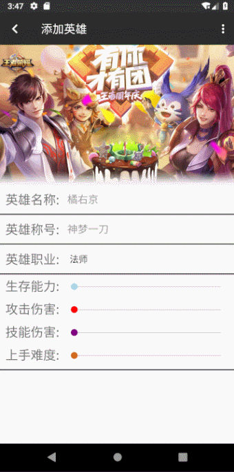

在菜单栏里调用系统文件选取器

> 这里将ResultCode设置为3，跟前面选取图片作区分

```java
//添加语音
case  R.id.action_hero_add_voice:
    intent = new Intent(Intent.ACTION_GET_CONTENT);
    intent.setType("audio/*");
    intent.addCategory(Intent.CATEGORY_OPENABLE);
    startActivityForResult(intent,3);
    break;
```

对返回的结果做解析，这里同样是复制音频，然后也会预览，预览的办法就是调用`MediaPlayer`播放这个音频

> 这也算遇到的一个挺大的问题吧，图片还可以通过`BitmapFactory`编码解码，但是音频我还不知道怎么编码解码，好像网上很多人都是自己写方法调用，于是想了一个很简单的办法，就是直接把这个文件转换为字节流复制过去（所以这跟前面图片的复制本质上是不一样的）

```java
else  if(requestCode == 3){
    if (resultCode == RESULT_OK) {
        voice_uri = data.getData().toString();
        ContentResolver cr = this.getContentResolver();
        //播放预览
        mediaPlayer = MediaPlayer.create(HeroAdd.this, Uri.parse(voice_uri));
        mediaPlayer.start();
        try {
            //通过UUID生成字符串文件名
            String voice_name = UUID.randomUUID().toString() + ".mp3";
            //存储音频
            FileOutputStream out = openFileOutput(voice_name, MODE_PRIVATE);
            InputStream in = cr.openInputStream(data.getData());
            byte[] newVoice = new byte[in.available()];
            in.read(newVoice);
            out.write(newVoice);
            in.close();
            out.close();
            voice_uri = Uri.fromFile(getFileStreamPath(voice_name)).toString();

        } catch (FileNotFoundException e) {
            Log.e("FileNotFoundException", e.getMessage(),e);
        } catch (IOException e) {
            Log.w("IOException", e.getMessage(), e);
        }
    }
```

播放音频的后续工作就是记得在`Activity`销毁的时候记得销毁这个`MediaPlayer`

```java
@Override
protected void onDestroy() {
    super.onDestroy();
    if(mediaPlayer != null)
        mediaPlayer.release();
}
```

##### 选择职业

这里使用了一个`Spinner`控件


```java
<Spinner
    android:id="@+id/hero_add_category"
    android:layout_width="match_parent"
    android:layout_height="match_parent"
    android:entries="@array/herocategory_add"/>
```

展开它能选择的值定义在`values`文件夹中新建一个`xml`文件（文件名任意取）

```xml
<?xml version="1.0" encoding="utf-8"?>
<resources>
    </string-array>
    <string-array name="herocategory_add">
        <item>法师</item>
        <item>刺客</item>
        <item>射手</item>
        <item>辅助</item>
        <item>战士</item>
        <item>坦克</item>
    </string-array>
</resources>
```

获取选择的值也很简单

```java
final Spinner hero_category = findViewById(R.id.hero_add_category);
//获取值
hero_category.getSelectedItem().toString();
```


##### 选择生存能力等值

这里使用了一个GitHub的第三方控件`org.adw.library.widgets.discreteseekbar.DiscreteSeekBar`

[原地址](https://github.com/AnderWeb/discreteSeekBar)

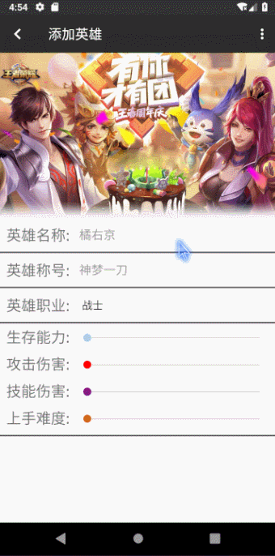

```xml
<org.adw.library.widgets.discreteseekbar.DiscreteSeekBar
    android:id="@+id/hero_add_viability"
    android:layout_width="match_parent"
    android:layout_height="wrap_content"
    app:dsb_min="1"
    app:dsb_max="9"
    app:dsb_progressColor="@color/lightblue"
    android:layout_marginEnd="10dp"
    />
```

`HeroAdd.java`中获取选中的值

```java
final DiscreteSeekBar hero_viability = findViewById(R.id.hero_add_viability);
hero_viability.getProgress()
```


##### 保存结果

点击菜单中的保存按钮的事件

这里有三种情况

- 英雄名为空
- 英雄名重复（跟传进来的已有英雄数组比较）
- 添加成功

三种情况都会弹出`Toast`提示

```java
//设置菜单点击事件
toolbar.setOnMenuItemClickListener(new Toolbar.OnMenuItemClickListener() {
    @Override
    public boolean onMenuItemClick(MenuItem menuItem) {
        switch (menuItem.getItemId()) {
            //保存
            case R.id.action_hero_add_save:
                if(hero_name.getText().toString().isEmpty()){
                    Toast.makeText(HeroAdd.this, "英雄名不能为空!", Toast.LENGTH_SHORT).show();
                    return false;
                }
                for(String i : hero_names){
                    if(i.equals(hero_name.getText().toString())){
                        Toast.makeText(HeroAdd.this, "英雄名重复!", Toast.LENGTH_SHORT).show();
                        return false;
                    }

                }
                add_hero = new Hero(hero_name.getText().toString(), image_uri,  hero_alias.getText().toString(),hero_category.getSelectedItem().toString(),
                        hero_viability.getProgress(),hero_attack_damage.getProgress(),hero_skill_damage.getProgress(), hero_difficulty.getProgress(),voice_uri,icon_uri,false);
                add_hero.setAdded(true);
                EventBus.getDefault().post(add_hero);
                finish();
                Toast.makeText(HeroAdd.this, "添加成功", Toast.LENGTH_SHORT).show();
                break;
                ......
```

但是主要问题是如何把添加的英雄传给主界面呢（因为这里不做英雄数据库的操作），

或者说通知主界面新添加了一个英雄呢（点击`ToolBar`的返回按钮或者虚拟按键返回会放弃添加英雄）

最简单的方法当然是`EventBus`

而且还有用到了`Hero`类的一个属性

```java
private Boolean added = false;//true表示是新加的
```

向下面这样子把新加的`Hero`传递回去，并且调用`finish`方法表示结束该`Acitivity`

这样子只要在`Fragment1.java`中的`EventBus`接收方法中判断英雄的`added`属性是否为`true`就可以判断是否要把这个英雄加到数据库里了

> 之所以要设置added这个变量是为了跟后面的deleted，modified分别表示的已删除，已修改作区分
>
> 根本宗旨就是数据库的更新全部放在英雄主界面（Fragment1）其它页面只能传递参数告诉它要如何更改数据库

```java
add_hero.setAdded(true);
EventBus.getDefault().post(add_hero);
finish();
```

##### 更新数据库

如上面讨论的这个得在`Fragment1.java`中实现

添加`EventBus`的处理方法

判断传递过来的`Hero`的`added`属性是否为`true`，是的话就添加到`Adapter`中

还要添加到`SQLiteHelper`中持久存储

```java
//EventBus
@Subscribe(threadMode = ThreadMode.MAIN)
public void onMessageEvent(Hero h) {
    if(h.getAdded()){
        h.setAdded(false);
        searchAdapter.add(h.getName());
        //searchAdapter.notifyDataSetChanged();
        mAdapter.addNewItem(h);
        mySQLiteHelper.addHero(h);
        //更新当前选中的英雄类型的列表
        mAdapter.updateWithCategory(mySQLiteHelper.getAllHeroes(), ((RadioButton)view.findViewById(hero_category_select.getCheckedRadioButtonId())).getText().toString());
        Log.d("添加英雄", "onMessageEvent: add" + h.getName());
    } else if
        .......

};

//记得注册
public View onCreateView(LayoutInflater inflater, @Nullable ViewGroup container, @Nullable Bundle savedInstanceState) {
        EventBus.getDefault().register(this);
    ......
```

#### 删除英雄

点击主界面上列表中的某个英雄就可以进入到英雄详情页面，再点击右上角的额菜单就会弹出删除的选项，点击弹出对话框的确认按钮就会删除成功，返回英雄主界面

> 英雄详情页面的其他实现后面再讨论，主要讨论删除功能

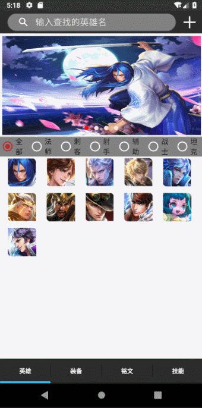


##### 保存结果

`HeroDetail.java`菜单事件的处理

如果点击了确定删除就会把当前的`Hero`通过`EventBus`传过去，并且设置它的`deleted`属性为`true`

```java
    //删除
case R.id.action_hero_delete:
    final AlertDialog.Builder alertDialog = new AlertDialog.Builder(HeroDetail.this);
    alertDialog.setTitle("提示").setMessage("是否确定删除英雄: " + displayHero.getName() + "？").setPositiveButton("确认",
            new DialogInterface.OnClickListener() {
                @Override
                public void onClick(DialogInterface dialog, int which) {
                    displayHero.setDeleted(true);
                    EventBus.getDefault().post(displayHero);
                    finish();

                }
            }).setNegativeButton("取消",null).create().show();
    break;
```

##### 更新数据库

在`Fragment1`中继续修改`EventBus`的处理

```java
public void onMessageEvent(Hero h) {
......
else if(h.getDeleted()){
        h.setDeleted(false);
        if(mAdapter != null) {
            mAdapter.deleteItem(clickPosition);
            searchAdapter.remove(h.getName());
            searchAdapter.notifyDataSetChanged();
        }
        mySQLiteHelper.deleteHero(h);
        Log.d("删除英雄", "onMessageEvent: delete" + h.getName());
    }
```

#### 英雄显示

> 再讨论修改英雄之前，必须要讨论一下英雄显示页面`HeroDetail`的问题
>
> 这里只是说明基本功能的实现

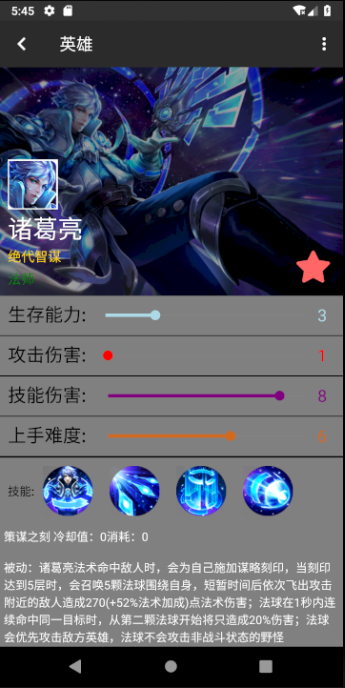


这里的英雄名称，英雄称号，英雄职业，生存能力等四个条**都是可以修改的**（但是需要点击编辑按钮）

> 这也就是为什么这些属性条会有看起来不是很友好的拖动圆点，因为它们本身就不是拿来看的，而是拿来用的

英雄图标，英雄海报也是可以点击的，然后就可以**选择更改的图片**

> 暂时还没做修改技能图标，技能描述，英雄语音，推荐装备的功能
>
> 英雄职业也只是一个输入框，而不是`Spinner`，就是可以输入根本不存在的职业

##### 获取传递过来的英雄

```java
//获取数据
displayHero = (Hero)getIntent().getSerializableExtra("Click_Hero");
```

##### 人物音效播放

如果点击进入英雄页面会播放这个英雄的出场音效的话，那气氛肯定会不一样！

所以当时创建`Hero`类的时候就已经添加了人物语音，这里设置就行了

```java
//音效
MediaPlayer mp = MediaPlayer.create(HeroDetail.this, Uri.parse(displayHero.getVoice()));
mp.start();
......
//记得要销毁
 @Override
    protected void onDestroy() {
        super.onDestroy();
        mp.release();
    } 
```

##### 背景海报图片的变暗处理

不是简单放一个图片作为背景就可以的，如果不做处理的话会看不清字的，像这样

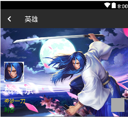

这里做了个最简单的处理，但是也想了好久好久，网上的答案也很少

其实就是在`ImageButton`的属性添加一个

 `android:foreground="#60000000"`

平时颜色的十六进制只有六位

比如说白色是`#FFFFFF`，黄色是`#FFFF00`，黑色是`#000000`

那这里的前面两位是什么呢，叫`Alpha通道值`

简单讲就是透明度，`00`就是全透明，`FF`就是全不透，我这里选了个半透的`60`，并且颜色设置为黑色（000000），就达到了变暗的效果

```xml
<!--背景图片变暗,想了好久！！！-->
                <ImageButton
                    android:id="@+id/hero_detail_image"
                    android:layout_width="match_parent"
                    android:layout_height="wrap_content"
                    android:padding="0dp"
                    android:scaleType="fitXY"
                    android:adjustViewBounds="true"
                    android:src="@mipmap/juyoujing"
                    android:foreground="#60000000"
                    android:clickable="false"
                    />
```

##### 属性条（DiscreteSeekBar）的设置

```java
heroViability.setProgress(displayHero.getViability());
```

##### 属性条（DiscreteSeekBar）的滑动监听事件

```java
//监听数值改变
heroViability.setOnProgressChangeListener(new DiscreteSeekBar.OnProgressChangeListener() {
    @Override
    public void onProgressChanged(DiscreteSeekBar seekBar, int value, boolean fromUser) {
        heroViabilityValue.setText(String.valueOf(value));
    }
    @Override
    public void onStartTrackingTouch(DiscreteSeekBar seekBar) {
    }
    @Override
    public void onStopTrackingTouch(DiscreteSeekBar seekBar) {
    }
});
```

##### 圆形技能图标

本身`ImageButton`是没有给你设置形状这个属性的，所以得自己绘制

在`drawable`中新建`hero_skill_button.xml`

```xml
<?xml version="1.0" encoding="utf-8"?>
<shape xmlns:android="http://schemas.android.com/apk/res/android"
    android:shape="rectangle">
    <size
        android:width="30dp"
        android:height="30dp"/><!-- 宽度和高度 -->
    <solid android:color="#3F51B5" /> //指定颜色
    <corners android:radius="180dp" />  //指定弧度
</shape>
```

在`activity_hero_detail.xml`中的`ImageButton`调用

```xml
android:background="@drawable/hero_skill_button"
```

##### 不同技能的显示

通过点击不同的技能图标可以显示不同的技能详情（默认是一技能图标）

> 对于玩王者的人来说应该是被动技能哈哈哈

```java
//默认显示一技能
skillDescription.setText(displayHero.getSkill1_description());
skill1.setOnClickListener(new View.OnClickListener() {
    @Override
    public void onClick(View v) {
        skillDescription.setText(displayHero.getSkill1_description());
    }
});
```


#### 修改英雄

点击英雄详情页面菜单栏的`编辑`就可以进入编辑模式了

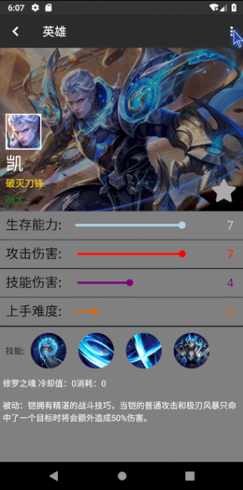

##### 查看模式和编辑模式

开始默认的时候是只能查看不能编辑的，通过调用下面自定义的两个方法进入不同的模式，非编辑模式就会取消`EditText`的焦点，还有设置`ImageButton`不可点击，并且取消滑动条（`DiscreteSeekBar`）的使能（`setEnabled(false)`）

`HeroDetail.java`

```java
void uneditMode(){
    //姓名一直不可更改
    //取消焦点
    heroName.setFocusable(false);
    heroName.clearFocus();
    heroName.setFocusableInTouchMode(false);
    heroAlias.setFocusable(false);
    heroAlias.setFocusableInTouchMode(false);
    heroCategory.setFocusable(false);
    heroCategory.setFocusableInTouchMode(false);
    heroImage.setClickable(false);
    heroIcon.setClickable(false);
    heroDifficulty.setEnabled(false);
    heroSkillDamage.setEnabled(false);
    heroAttackDamage.setEnabled(false);
    heroViability.setEnabled(false);
    //关闭键盘
    InputMethodManager imm = (InputMethodManager)getSystemService(Context.INPUT_METHOD_SERVICE);
    if (imm.isActive()) {
        imm.toggleSoftInput(InputMethodManager.SHOW_IMPLICIT, InputMethodManager.HIDE_NOT_ALWAYS);
    }
}

void editMode(){
    heroCategory.setFocusable(true);
    heroCategory.requestFocus();
    heroCategory.setFocusableInTouchMode(true);
    heroAlias.setFocusable(true);
    heroAlias.requestFocus();
    heroAlias.setFocusableInTouchMode(true);
    heroImage.setClickable(true);
    heroIcon.setClickable(true);
    heroDifficulty.setEnabled(true);
    heroSkillDamage.setEnabled(true);
    heroAttackDamage.setEnabled(true);
    heroViability.setEnabled(true);
}
```

##### 菜单响应事件

仅仅调用了上面的方法进入编辑模式

```java
//设置菜单点击事件
        toolbar.setOnMenuItemClickListener(new Toolbar.OnMenuItemClickListener() {
            @Override
            public boolean onMenuItemClick(MenuItem menuItem) {
                switch (menuItem.getItemId()) {
                        //编辑
                    case R.id.action_hero_edit:
                        editMode();
                        break;
                        .......
```

##### 保存结果

在菜单响应事件里添加

```java
    //保存
case R.id.action_hero_save:
    displayHero.setImage(image_uri);
    displayHero.setAlias(heroAlias.getText().toString());
    displayHero.setCategory(heroCategory.getText().toString());
    displayHero.setViability(heroViability.getProgress());
    displayHero.setAttack_damage(heroAttackDamage.getProgress());
    displayHero.setSkill_damage(heroSkillDamage.getProgress());
    displayHero.setDifficulty(heroDifficulty.getProgress());
    displayHero.setIcon(icon_uri);
    displayHero.setFavorite(heroFavorite.isChecked());
    //不可编辑
    uneditMode();
    displayHero.setModified(true);
    Toast.makeText(HeroDetail.this, "保存成功", Toast.LENGTH_SHORT).show();
    EventBus.getDefault().post(displayHero);
    finish();
    break;
```

可以看到，仍然是通过`EventBus`把数据传回去，而且这里用`setModified`方法设置了英雄的`modified`值，方便区分

##### 更新数据库

回到`fragment1.java`中的`public void onMessageEvent(Hero h)`，下列代码用于保存修改过的英雄

> 其实数据太多，我采取的方式是先删除再添加

```
public void onMessageEvent(Hero h) {
......
else if(h.getModified()){
    h.setModified(false);
    if(mAdapter != null) {
        mAdapter.updateSingleHero(clickPosition, h);
    }
    mySQLiteHelper.deleteHero(h);
    mySQLiteHelper.addHero(h);
    Log.d("修改英雄", "onMessageEvent: modify" + h.getName());
}
......
}
```

#### 查找英雄

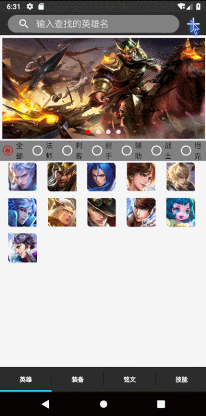

##### 使用控件

`fragment1.xml`

```xml
<android.support.v7.widget.SearchView
    android:layout_marginTop="5dp"
    android:layout_marginBottom="5dp"
    android:background="@drawable/hero_searchbar"
    android:id="@+id/hero_edit_search"
    android:layout_width="match_parent"
    android:layout_height="match_parent"
    android:gravity="center_vertical"
    android:queryHint="@string/search_hero"
    android:textColor="@color/white"
    />
```

我是把这个搜索框嵌入到`ToolBar`中的，比较省空间

> 选取的时候同样遇到了选择android.support.v7.widget.SearchView还是SearchView的问题，SearchView好像是比较新，最起码能预览，我也记不得为啥选择了这个，反正挺好用

这里有个`background`属性，表示下拉栏的样式

在`layout`文件夹的`search_list.xml`中，其实也没写什么，就一个英雄名称，其实还可以自定义显示更多（头像啥的）

```xml
<?xml version="1.0" encoding="utf-8"?>
<android.support.constraint.ConstraintLayout
    xmlns:android="http://schemas.android.com/apk/res/android" android:layout_width="match_parent"
    android:layout_height="match_parent">
    <TextView
        android:id="@+id/search_name"
        android:layout_width="wrap_content"
        android:layout_height="wrap_content"
        android:layout_marginVertical="15dp"
        android:text="橘右京"/>
</android.support.constraint.ConstraintLayout>
```

##### 基础设置

```java
//search
final SearchView searchView = view.findViewById(R.id.hero_edit_search);
searchView.setIconified(false);//设置searchView处于展开状态
searchView.onActionViewExpanded();// 当展开无输入内容的时候，没有关闭的图标
searchView.setQueryHint("输入查找的英雄名");//设置默认无内容时的文字提示
searchView.setIconifiedByDefault(false);//默认为true在框内，设置false则在框外
searchView.setIconified(false);//展开状态
searchView.clearFocus();//清除焦点
searchView.isSubmitButtonEnabled();//键盘上显示搜索图标
```

##### 候选项的设置

我们发现`SearchView`实际上是一个View的集合，里面有个控件叫做`AutoCompleteTextView`

找到这个自动填充的组件并且

```java
AutoCompleteTextView completeText = searchView.findViewById(R.id.search_src_text) ;
completeText.setTextColor(getResources().getColor(android.R.color.white));//设置内容文字颜色
completeText.setHintTextColor(getResources().getColor(R.color.gainsboro));//设置提示文字颜色
completeText.setThreshold(0);
searchAdapter = new ArrayAdapter<>(getActivity(), android.R.layout.simple_list_item_1, mAdapter.getAllNames());
completeText.setAdapter(searchAdapter);
completeText.setOnItemClickListener(new AdapterView.OnItemClickListener() {
    @Override
    public void onItemClick(AdapterView<?> parent, View view,int position,long id){
        searchView.setQuery(searchAdapter.getItem(position),true);
    }
});

```

##### 提交事件的处理

如果有这个英雄就跳到相应的详情页面，不然就会弹出错误的`Toast`

```java
searchView.setOnQueryTextListener(new SearchView.OnQueryTextListener() {
    @Override
    public boolean onQueryTextSubmit(String query){

        Hero temp_hero = mAdapter.getItemByName(query);
        if(temp_hero != null){
            Intent intent = new Intent(getActivity(), HeroDetail.class);
            Bundle bundle=new Bundle();
            bundle.putSerializable("Click_Hero", temp_hero);
            intent.putExtras(bundle);
            startActivityForResult(intent, 0);
        }else{
            Toast.makeText(getActivity(),"该英雄不存在" ,Toast.LENGTH_SHORT).show();
        }

        return false;
    }

    @Override
    public boolean onQueryTextChange(String newText){
        return false;
    }
});
```

#### 图片轮换器的实现

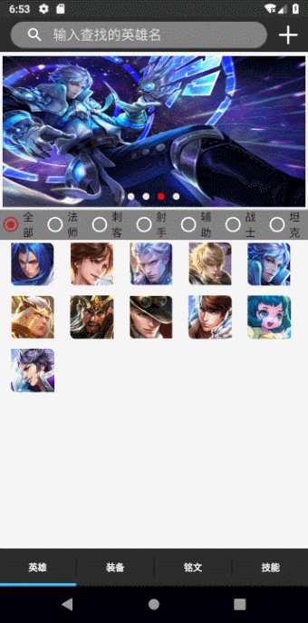

在英雄的主界面会有一个类似广告页一样的图片轮换器，显示一些英雄的海报（后来做成了收藏的功能），它们会自动切换，并且会循环切换

##### 布局

很简单，就是在`fragment1.xml`中的一个`viewpager`和一个空的`LinerLayout`

一个用来播放图片，一个用来显示指示图片的小圆点

```xml
<android.support.v4.view.ViewPager
    android:id="@+id/hero_upper_pager"
    android:layout_marginHorizontal="5dp"
    android:layout_marginVertical="5dp"
    android:layout_width="fill_parent"
    android:layout_height="200dp"
    app:layout_constraintTop_toBottomOf="@id/hero_toolbar"/>
<LinearLayout
        android:layout_width="wrap_content"
        android:layout_height="wrap_content"
        android:id="@+id/point_group"
        android:orientation="horizontal"
        android:layout_marginBottom="10dp"
        android:layout_marginStart="10dp"
        app:layout_constraintStart_toStartOf="parent"
        app:layout_constraintEnd_toEndOf="parent"
        app:layout_constraintBottom_toBottomOf="@id/hero_upper_pager"/>
```

##### 填充图片和圆点

这里卸载了`onResume`方法中而不是`onCreate`方法，因为后来还要更新其中的图片

```java
@Override
    public void onResume() {
        super.onResume();
        lastPointPosition = 0;
        isRunning = true;
        //view pager
        pointGroup = view.findViewById(R.id.point_group);
        imageViewPager = view.findViewById(R.id.hero_upper_pager);
        //添加图片列表
        imageArr = mAdapter.getAllFavoriteHeroes(mySQLiteHelper);
        imgList= new ArrayList<>();
        for (int i=0;i<imageArr.length;i++) {
            //初始化图片
            ImageView image=new ImageView(getActivity());
            image.setImageURI(Uri.parse(imageArr[i]));
            image.setScaleType(ImageView.ScaleType.FIT_XY);
            imgList.add(image);
            //添加图片的指示点
            ImageView point=new ImageView(getActivity());
            LinearLayout.LayoutParams params=new LinearLayout.LayoutParams(30,30);//布局参数,point的布局宽与高
            params.rightMargin = 40;//右边距
            point.setLayoutParams(params);//设置布局参数
            point.setBackgroundResource(R.drawable.point_bg);//point_bg是根据setEnabled的值来确定形状的
            if(i==0){
                point.setEnabled(true);//初始化的时候设置第一张图片的形状
            }else{
                point.setEnabled(false);//根据该属性来确定这个图片的显示形状
            }
            pointGroup.addView(point);//将该指示的图片添加到布局中
        }
        imageViewPager.setAdapter(new ImagePagerAdapter());
        //为viewPager设置监听
        imageViewPager.setOnPageChangeListener(new ViewPager.OnPageChangeListener() {
            //页面改变的时候调用(稳定),positon表示被选中的索引
            @Override
            public void onPageSelected(int position) {

                if(pointGroup.getChildAt(lastPointPosition)!=null)
                    pointGroup.getChildAt(lastPointPosition).setEnabled(false);//将上一个点设置为false
                else
                    Log.e("PointGroupRrror:", "onPageSelected: "+ lastPointPosition);
                lastPointPosition=position;
                //改变指示点的状态
                pointGroup.getChildAt(position).setEnabled(true);//将当前点enbale设置为true
            }
            //页面正在滑动的时候调用,position指的是左侧页面的索引,positionOffset代表偏移量[0,1]的范围,positionOffsetPixels也是偏移量,不过是像素点的偏移量 范围[0,显示的控件的绝对长度]
            @Override
            public void onPageScrolled(int position, float positionOffset,
                                       int positionOffsetPixels) {
            }
            @Override
            //页面滚动状态发送改变的时候回调
            public void onPageScrollStateChanged(int state) {
                //当手指点击屏幕滚动的时状态码为1,当手指离开viewpager自动滚动的状态码为2,自动滚动选中了显示了页面的时候状态码为0
            }

        });
        handler.sendEmptyMessageDelayed(1, 3000);
    }

```

> 刚开始我是把这段代码放在`onStart`中，但是我发现在fragment中来回切换时不会调用`onStart`方法的，只会调用`onResume`

##### 自定义适配器

```java
//图片轮换的适配器
private class ImagePagerAdapter extends PagerAdapter {
    /**
     * 获得页面的总数
     */
    @Override
    public int getCount() {
        return imageArr.length;
    }
    /**
     * 判断view和object的对应关系,如果当前要显示的控件是来之于instantiateItem方法创建的就显示,否则不显示
     * object 为instantiateItem方法返回的对象
     * 如果为false就不会显示该视图
     */
    @Override
    public boolean isViewFromObject(View view, Object object) {
        return view==object;
    }
    /**
     * 实例化下一个要显示的子条目,获取相应位置上的view,这个为当前显示的视图的下一个需要显示的控件
     * container  view的容器,其实就是viewager自身
     * position   ViewPager相应的位置
     */
    @Override
    public Object instantiateItem(ViewGroup container, int position) {
        container.addView(imgList.get(position));
        return imgList.get(position);
    }
    /**
     * 销毁一个子条目,object就为instantiateItem方法创建的返回的对象,也是滑出去需要销毁了的视图对象
     */
    @Override
    public void destroyItem(ViewGroup container, int position, Object object) {
        container.removeView((View) object);
        object=null;
    }
}
```

##### 自动播放

新建一个`Handler`用来处理自动滑动的事件

```java
/**
 * 用于实现自动滑动
 */
@SuppressLint("HandlerLeak")
private Handler handler = new Handler(){
    @Override
    public void handleMessage(Message msg) {
        if(msg.what==1 && isRunning){
            //收到消息,开始滑动
            if(imageViewPager != null){
                int currentItem = imageViewPager.getCurrentItem();//获取当前显示的界面的索引
                //如果当前显示的是最后一个页面,就显示第一张,否则显示下一张
                if(currentItem==imgList.size()-1){
                    imageViewPager.setCurrentItem(0);
                }else{
                    imageViewPager.setCurrentItem(currentItem+1);
                }
            }

            //3ms后再发送消息,实现循环
            handler.sendEmptyMessageDelayed(1, 3000);
        }
    }
};
```

并且开始默认`private boolean isRunning = true;`

在`onCreate`中设置时间间隔定时发送消息

```java
//自动播放
handler.sendEmptyMessageDelayed(1, 3000);
```

#### 收藏功能

根本思想就是讲图片轮换器中填充的图片换成所有已收藏英雄的海报

##### 更新图片集合

所以需要数据更新，首先在`fragment1.java`中添加

```java
@Override
public void onPause() {
    super.onPause();
    isRunning = false;
    pointGroup.removeAllViews();
    imageViewPager.removeAllViews();
    imageViewPager.clearOnPageChangeListeners();
}
```

让程序页面不在活动状态时就要停止轮换，并且移除所有图片

这也就是为什么要在`onStart`中初始化轮换器中的图片

```java
imageArr = mAdapter.getAllFavoriteHeroes();
```

但是这个需要使用`Adapter`中的获取所有已收藏英雄图片的方法

```java
//返回所有已收藏HERO图片
public String[] getAllFavoriteHeroes(){
    ArrayList<String> favoriteHeroes = new ArrayList<>();
    for(Hero h : mDatas){
        if(h.getFavorite())
            favoriteHeroes.add(h.getImage());
    }
    return favoriteHeroes.toArray(new String[favoriteHeroes.size()]);
}
```


##### 收藏按钮

利用了`Hero`类中的`favorite`属性

在英雄详情页面有一个收藏按钮，会有两种形态


同样也是来源于GitHub（[源码地址](https://github.com/ChadCSong/ShineButton)）

##### 点击显示处理

初始化收藏按钮的状态

```java
//关于收藏
heroFavorite.setChecked(displayHero.getFavorite());
```

点击保存按钮后获取按钮的状态

```java
displayHero.setFavorite(heroFavorite.isChecked());
```

> 因为**是否被收藏** 严格意义上讲不属于英雄内在属性，所以它一直都是可以点击的而不用点击**编辑模式**，但是需要点击保存才能更新到数据库

#### 分类显示英雄

##### 布局

使用了控件`RadioGroup`

```xml
<RadioGroup
    android:id="@+id/hero_category"
    android:layout_marginTop="3dp"
    android:layout_width="match_parent"
    android:layout_height="40dp"
    android:orientation="horizontal"
    android:weightSum="7"
    android:background="@color/gray"
    app:layout_constraintTop_toBottomOf="@id/hero_upper_pager">
    <RadioButton
        android:checked="true"
        android:id="@+id/hero_quanbu"
        android:text="全部"
        android:layout_width="60dp"
        android:layout_weight="1"
        android:layout_height="wrap_content" />
    <RadioButton
        android:id="@+id/hero_fashi"
        android:text="法师"
        android:layout_weight="1"
        android:layout_width="wrap_content"
        android:layout_height="wrap_content" />
    <RadioButton
        android:id="@+id/hero_cike"
        android:text="刺客"
        android:layout_weight="1"
        android:layout_width="wrap_content"
        android:layout_height="wrap_content" />
    <RadioButton
        android:id="@+id/hero_sheshou"
        android:text="射手"
        android:layout_weight="1"
        android:layout_width="wrap_content"
        android:layout_height="wrap_content" />
    <RadioButton
        android:id="@+id/hero_fuzhu"
        android:text="辅助"
        android:layout_weight="1"
        android:layout_width="wrap_content"
        android:layout_height="wrap_content" />
    <RadioButton
        android:id="@+id/hero_zhanshi"
        android:text="战士"
        android:layout_weight="1"
        android:layout_width="wrap_content"
        android:layout_height="wrap_content" />
    <RadioButton
        android:id="@+id/hero_tanke"
        android:text="坦克"
        android:layout_weight="1"
        android:layout_width="wrap_content"
        android:layout_height="wrap_content" />
</RadioGroup>
```

##### 代码

```java
//改变显示的英雄类别
hero_category_select = view.findViewById(R.id.hero_category);
hero_category_select.setOnCheckedChangeListener(new RadioGroup.OnCheckedChangeListener() {
    @Override
    public void onCheckedChanged(RadioGroup group, int checkedId) {
        mAdapter.updateWithCategory(mySQLiteHelper.getAllHeroes(), ((RadioButton)view.findViewById(checkedId)).getText().toString());
    }
});
```

##### 方法

```java
//通过英雄职业改变显示的数据
public void updateWithCategory(List<Hero> total, String category){
    mDatas.clear();
    if(category.equals("全部")){
        mDatas = total;
        notifyDataSetChanged();
    }
    for(Hero i: total){
        if(i.getCategory().equals(category))
            mDatas.add(i);
    }
    notifyDataSetChanged();
}
```

#### 英雄推荐装备的跳转


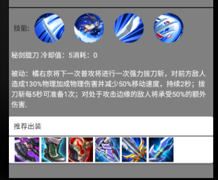

其实`Hero`中只存储了英雄的推荐装备**名称**，在英雄详情页面需要调用数据库得到推荐装备的图标

```java
//获取英雄装备
HeroSQLiteHelper sqLiteHelper = new HeroSQLiteHelper(this);
final Equipment equipment1 = sqLiteHelper.getEquipmentsWithName(displayHero.getEquip1());
```

设置显示图标

```java
//技能图标
equip1.setImageResource(equipment1.getImage());
```

点击跳转到装备详情页面

```java
equip1.setOnClickListener(new View.OnClickListener() {
    @Override
    public void onClick(View v) {
        Intent intent = new Intent(HeroDetail.this, equipment_detail.class);
        intent.putExtra("equipment_data", equipment1);
        startActivity(intent);
    }
});
```

#### 软件图标设置

在`manifests`中修改`android:icon`属性

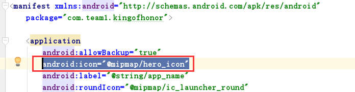

#### 软件启动页面设置

新加一个`LaunchActivity.java`

```java
public class LaunchActivity extends AppCompatActivity {
    @Override
    protected void onCreate(Bundle savedInstanceState) {
        super.onCreate(savedInstanceState);
        //加载启动界面
        setContentView(R.layout.activity_launch);
        Integer time = 10;    //设置等待时间，单位为毫秒
        Handler handler = new Handler();
        //当计时结束时，跳转至主界面
        handler.postDelayed(new Runnable() {
            @Override
            public void run() {
                startActivity(new Intent(LaunchActivity.this, MainActivity.class));
                LaunchActivity.this.finish();
            }
        }, time);
    }
}
```

`activity_launch.xml`

```xml
<?xml version="1.0" encoding="utf-8"?>
<android.support.constraint.ConstraintLayout xmlns:android="http://schemas.android.com/apk/res/android"
    xmlns:app="http://schemas.android.com/apk/res-auto"
    xmlns:tools="http://schemas.android.com/tools"
    android:layout_width="match_parent"
    android:layout_height="match_parent"
    tools:context=".LaunchActivity">

</android.support.constraint.ConstraintLayout>
```

修改`manifests`

设置`LaunchAcitviy`为最先启动的`Activity`

```xml
<activity android:name=".LaunchActivity"
    android:theme="@style/AppWelcome">
    <intent-filter>
        <action android:name="android.intent.action.MAIN" />
        <category android:name="android.intent.category.LAUNCHER" />
    </intent-filter>
</activity>
```

这样子其实能运行，但是！！！

启动页面很快结束后会有**好久好久**的白屏时间才载入主界面，应该是有很多耗时操作，参考网上[安卓冷启动](https://www.jianshu.com/p/03c0fd3fc245)的博客，把主页面设置为`透明色`，这样子还会停留好久在启动页面，就好像是启动页面启动了好久一样，其实早就开始启动主页面了

将下面这一句加到`Theme`的`style`中去

```xml
<item name="android:windowIsTranslucent">true</item>
```

如我的`theme`是`@style/NoTitle`

```xml
<application
    android:allowBackup="true"
    android:icon="@mipmap/hero_icon"
    android:label="@string/app_name"
    android:roundIcon="@mipmap/ic_launcher_round"
    android:supportsRtl="true"
    android:theme="@style/NoTitle">
```

按住`Ctrl`并且点击它跳到`styles`中，找到对应的`style`，修改

```xml
<style name="NoTitle" parent="Theme.AppCompat.Light.NoActionBar">
    <!-- Customize your theme here. -->
    <item name="colorPrimary">#4D4D4D</item>
    <item name="colorPrimaryDark">#333333</item>
    <item name="colorAccent">#B92525</item>
    <item name="android:textColorSecondary">#ffffff</item>
    <item name="android:windowIsTranslucent">true</item>
    <item name="android:windowNoTitle">true</item>
</style>
```


### (3)实验遇到的困难以及解决思路

#### 图片不能占据整个屏幕宽度

通过java代码动态获取屏幕的宽度，并且设置Image的宽度为屏幕的宽度，高度自适应（由`xml`中的`android:scaleType="fitXY"`确定），就可以让图片占据整个屏幕的宽度了

作用：好看很多！

```java
//获取图片选择按钮
imageButton = findViewById(R.id.hero_add_image);
//设置宽度固定，高度自适应
//获取屏幕宽度
int screenWidth = getResources().getDisplayMetrics().widthPixels;
ViewGroup.LayoutParams lp = imageButton.getLayoutParams();
//宽度为屏幕宽度
lp.width = screenWidth;
//高度自适应
lp.height = LinearLayout.LayoutParams.WRAP_CONTENT;
imageButton.setLayoutParams(lp);
//最大允许宽度和高度
imageButton.setMaxWidth(screenWidth);
imageButton.setMaxHeight(2 * screenWidth / 3);
```

但是**一定要记得**在`xml`中设置`ImageButton`的属性中加上一句

`android:adjustViewBounds="true"`

表示允许用代码调整视图


#### 获取搜索框补全控件

网上某位大神用这个方法

```java
intcompleteTextId=searchView.getResources().getIdentifier("android:id/search_src_text",null,null);

AutoCompleteTextViewcompleteText=searchView.findViewById(completeTextId);
```

其实没用，很简单的，用这个就好了

```java
AutoCompleteTextViewcompleteText=searchView.findViewById(R.id.search_src_text);
```

#### 报错

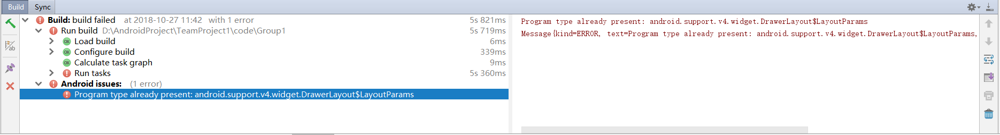

添加依赖

`implementation'com.android.support:support-v4:28.0.0'`

#### 保存图片的问题

之前用资源`id`（`int`类型），后来需要自己添加的资源所以改用`Uri`，

但是会出问题，因为`Uri`这个类型没有实现序列化，`Intent`传递数据需要支持序列化

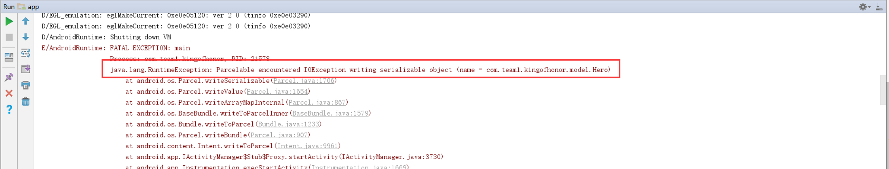

所以就直接用了`Uri`转换的`String`，但是还是会出现权限不够的问题

```
java.lang.RuntimeException: Unable to start activity ComponentInfo{com.team1.kingofhonor/com.team1.kingofhonor.HeroDetail}: java.lang.SecurityException: Permission Denial: opening provider com.android.providers.downloads.DownloadStorageProvider from ProcessRecord{b82627f 23152:com.team1.kingofhonor/u0a85} (pid=23152, uid=10085) requires that you obtain access using ACTION_OPEN_DOCUMENT or related API
```

最后只有复制一份到本软件的目录下

#### AndroidStudio无法预览的问题


把

```
<style name="AppTheme" parent="Theme.AppCompat.Light.DarkActionBar">
</style>
```
换成
```
<style name="AppTheme" parent="Base.Theme.AppCompat.Light.DarkActionBar">
</style>
```

---

#### 虚拟按键遮挡内容的问题

刚开始屏幕内的虚拟按键会遮挡住一部分视图（其实它是在`ScrollView`里面，但是滚动不了），可能它认为虚拟按键底下也是显示区域的一部分吧

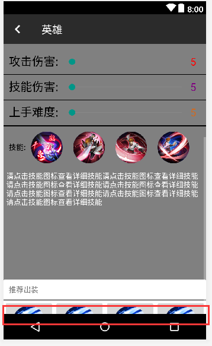

网上的博客看了好多解决办法，什么隐藏任务栏，虚拟按键透明啥的，[比如这篇博客](https://blog.csdn.net/alice_1_1/article/details/52385830)

反正我没有解决，最后自己想了个超级简单的办法：

在`xml`最底下加了个空白的`View`，也就是说让内容变长，即使我看不到最底下的`View`内容（本来就没内容），可那本来就不是我需要的啊，我只要能看到底下`View`上面的内容就好了

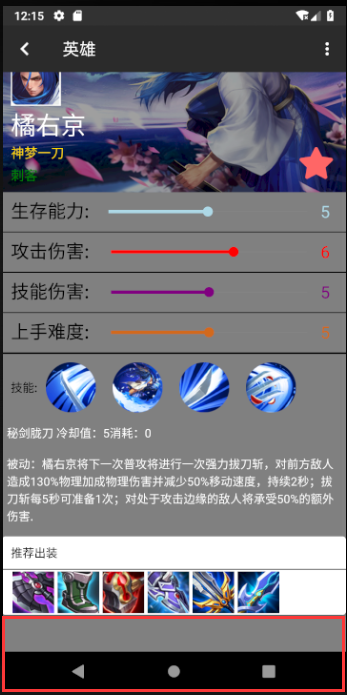

> 自己都觉得这个想法实在太棒了！
>
> （但是我知道实际应用中还是不能这样的）

#### 1


## 四、课后实验结果


---

## 五、实验思考及感想

---

#### 作业要求

* 命名要求：学号_姓名_实验编号，例如12345678_张三_lab1.md
* 实验报告提交格式为md
* 实验内容不允许抄袭，我们要进行代码相似度对比。如发现抄袭，按0分处理