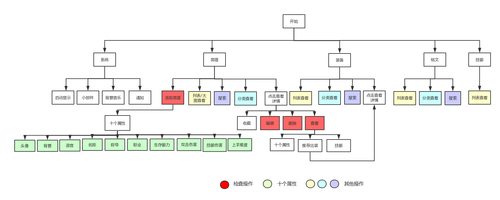
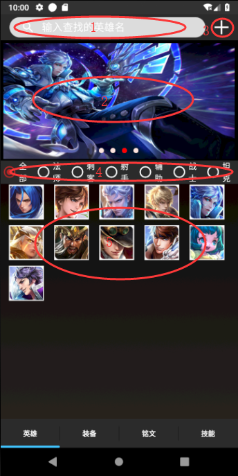
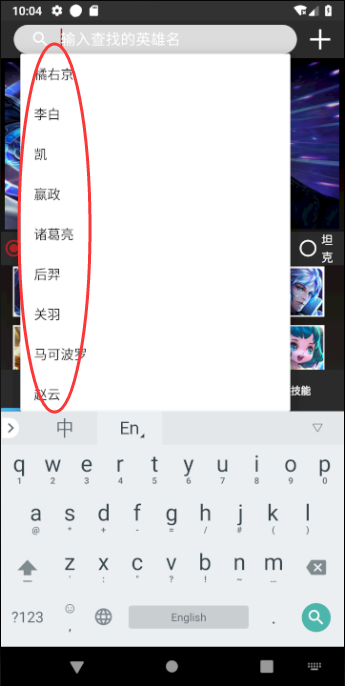
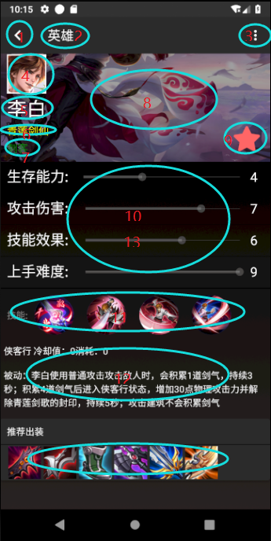
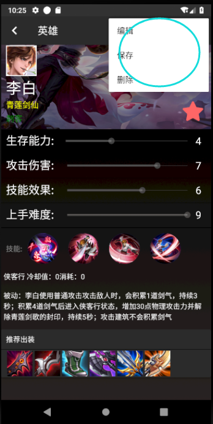
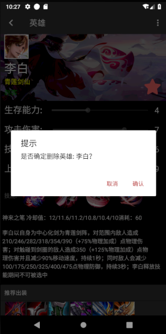
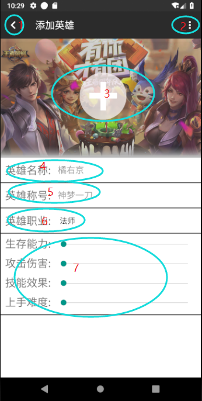
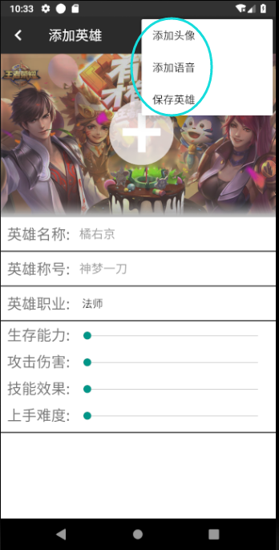
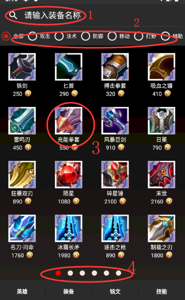
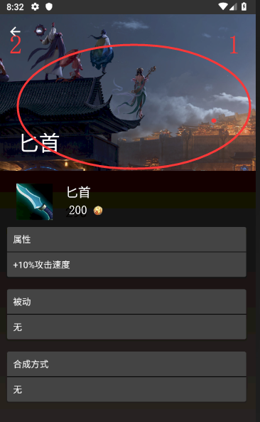

# 用户说明文档

## 软件功能说明

1. **简介**：使用软件查询王者荣耀中英雄、装备、铭文、技能等相关攻略
2. **英雄**：列表查看全部英雄，搜索查看英雄信息、分类查看英雄列表、添加新英雄信息、删除英雄信息、修改英雄信息
3. **装备**：列表查看全部装备、搜索查看装备信息、分类查看装备列表
4. **铭文**：列表查看全部铭文、搜索查看铭文信息、分类查看铭文列表、添加铭文槽查看总属性
5. **技能**：查看全部召唤师技能
6. **系统**：启动显示图片、通知栏显示推荐装备、桌面小部件显示推荐装备、播放背景音乐、

## 软件流程图

## 软件使用交互

**系统** 

1. 自定义了APP的图标

2. 启动app查看到启动动画（图片）

   P.S. 可能会出现启动动画消失回到桌面的情况，等待后进入app

3. 进入app默认显示主界面，底部标签为英雄、装备、铭文、技能

4. 进入app后播放背景音乐

5. 通知栏弹出今日推荐装备信息

6. 桌面小部件提示今日推荐装备信息，点击进入详情

**英雄主界面** 

0. 默认显示：搜索框，工具框（`ToolBar`)，添加英雄按钮，收藏英雄显示，英雄分类显示还有具体的英雄列表

1. 点击搜索框出现候选英雄列表（不输入会默认显示所有英雄列表，输入文字后会匹配输入文本为前缀的英雄名），点击搜索按钮或者候选框中的英雄名称进入英雄详情，如果搜索框中的英雄名不存在会弹出`Toast`提示
2. 这是一个图片轮换器，理论上会**3秒**切换一个英雄（显示英雄**海报**），且支持**循环切换**（最后一个英雄切换回最前面一个），在英雄详情页面会有收藏与取消收藏的操作，下面的小圆点会指示当前图片的位置（红色指示）
3. 添加英雄的按钮，点击之后会跳到添加英雄的页面
4. 英雄职业的分类显示，点击不同的按钮就会过滤出该职业的英雄，更新英雄列表（搜索框提示列表不受影响）
5. 英雄列表，网格布局，一共五列，只显示英雄**头像**，点击会进入英雄详情

**英雄详情** 

1. 返回主界面按钮
2. 当前页面名称（英雄）
3. 更多操作（编辑，删除，保存）
   1. 点击编辑之后，所有可修改的内容都处于可编辑状态（默认是不可编辑状态）
   2. 点击保存之后才能保存内容的修改（包括**收藏**！收藏之后直接返回是无效的，需要点击保存）
   3. 点击删除按钮之后弹出确认对话框，确定之后删除该英雄并且返回主界面
4. 英雄**头像**（可修改）
5. 英雄名字（不可修改）
6. 英雄称号（可修改）
7. 英雄职业（可修改）
8. 英雄海报（可修改）
9. 收藏英雄或者取消收藏（只能点击，不能修改）
10. 英雄生存能力，攻击伤害，技能效果，上手难度数值显示（可修改）
11. 英雄技能图标按钮，点击查看不同的技能（包括被动只有四个技能，天美最近的英雄技能越来越多了……）（不可修改）
12. 英雄技能具体描述（不可修改）
13. 英雄推荐出装（不可修改），点击会跳转到相应的装备详情页面

**添加英雄**

1. 返回主界面
2. 更多操作
   1. 添加头像，弹出系统图片选择框选择图片作为英雄头像（默认是：王者荣耀图标）
   2. 添加语音，弹出系统语音选择框作为英雄语音（默认是：PentaKill语音，享受五杀的感觉！）
3. 选择英雄海报（默认是：当前图片）
4. 填写英雄名字（不可为空，不可重复）
5. 填写英雄称号（默认为：王者小兵）
6. 填写英雄职业（默认为：法师）
7. 填写英雄生存能力，攻击伤害，技能效果，上手难度等信息（范围是1-9，默认是1）

**装备主界面** 

0. 默认显示：搜索框、分类、图标、价格、页码小圆点

1. 搜索栏输入正确装备名称后进入装备详情
2. 点击类别查看相应装备列表
3. 点击装备图标进入装备页查看装备信息
4. 左右滑动装备列表翻页

**装备详情** 

0. 默认显示：图片、名称、价格、图标、属性、被动、合成方式

1. 向下翻看标题栏折叠
2. 点击返回键回到主界面

**铭文主界面**

1. 默认显示：

**技能主界面**

1. 默认显示：

