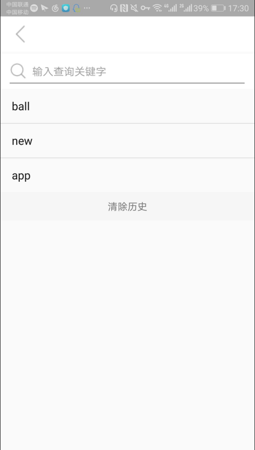
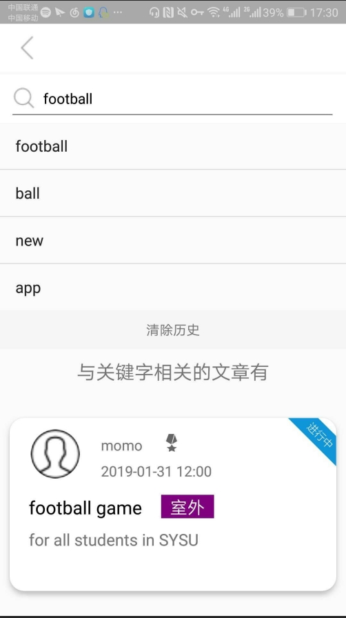
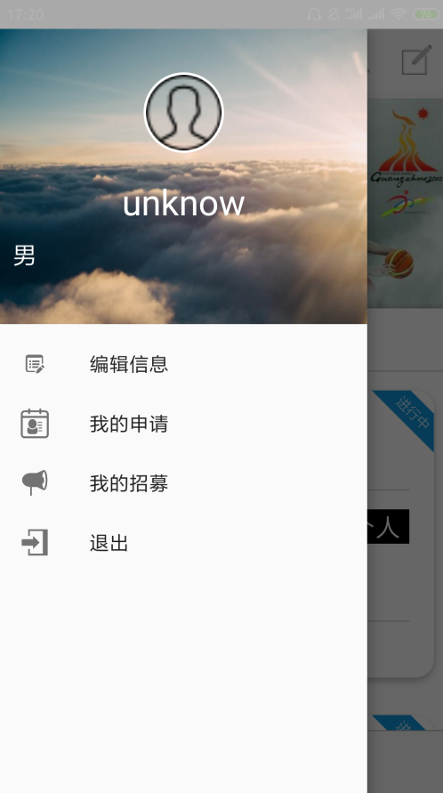
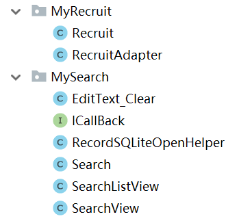

# 中山大学数据科学与计算机学院本科生实验报告
## （2018年秋季学期）
| 课程名称 | 手机平台应用开发 | 任课老师 | 郑贵锋 |
| :------------: | :-------------: | :------------: | :-------------: |
| 年级 | 16级 | 专业（方向） | 软件工程（电政） |
| 学号 | 16340188 | 姓名 | 邵星语 |
| 电话 | 15626237638 | Email | 958465234@qq.com |
| 开始日期 | 2018.12.20 | 完成日期 |2019.1.16|

---

## **一、个人贡献**

本次实验我主要完成了：

1.功能实现：活动搜索、我的招募部分；

2.项目展示：完成展示ppt、完成展示；

3.界面设计：部分UI的设计；

4.文档编写：用户说明文档的编写。

---

## 二、功能代码

#### 实验截图

这次项目中，我完成的部分是活动的搜索与查看当前用户的招募部分，具体截图如下：

1.点击首页的搜索按钮，跳转到按关键字搜索界面；可以查看到之前的搜索记录，也可以清除搜索记录；



2.在输入框内输入关键字，可以对已经存在的活动进行搜索，找到符合要求的结果；并看到搜索记录增加一条。



3.打开侧边栏，点击我的招募；



4.可以查看到我的所有招募信息。


#### 实验代码

该部分代码结构如下：



**我的招募部分**

该部分主要是点击侧边栏后进入的界面，主要由一个cardview拼成的recyclerview构成。cardView中的内容主要包括类型、日期、标题、正文、状态等。布局比较简单，使用一个包括recycler的主界面，和一个cardView的item即可，不再叙述。

完成简单的布局后，首先完成adapter部分。adapter包括context、id与一个string和object构成的map列表组成。

```java
protected Context mContext;
protected int mLayoutid;
protected List<Map<String, Object>> mData;
private RecruitAdapter.OnItemClickListener mOnItemClickListener = null;

public RecruitAdapter (Context context, int layoutid, List<Map<String, Object>> datas ) {
    mContext = context;
    mLayoutid = layoutid;
    mData = datas;
}
```

初始化viewHolder：包括刚才提到的每个活动中的所需内容，并从布局文件中findView到；

```java
static class ViewHolder extends RecyclerView.ViewHolder {
    public TextView mtype;      //类型（比赛、项目、个人）
    public TextView mdate;      //日期
    public TextView mtitle;     //标题
    public TextView mbody;      //正文
    public ImageView mstate;    //状态（招募中、已结束）
    View mView;     //布局视图

    public ViewHolder(View itemView) {
        super(itemView);
        mView = itemView;
        mtype = (TextView) itemView.findViewById(R.id.recruit_item_type);
        mdate = (TextView) itemView.findViewById(R.id.recruit_item_date);
        mtitle = (TextView) itemView.findViewById(R.id.recruit_item_title);
        mbody = (TextView) itemView.findViewById(R.id.recruit_item_body);
        mstate = (ImageView) itemView.findViewById(R.id.recruit_item_state);
    }
    public static RecruitAdapter.ViewHolder get(Context context, ViewGroup parent, int layoutId) {
        View itemView = LayoutInflater.from(context).inflate(layoutId, parent, false);
        RecruitAdapter.ViewHolder holder = new RecruitAdapter.ViewHolder(itemView);
        return holder;
    }
}
```

  重写onBindViewHolder方法，将对应数据放入对应位置内；

```java
@Override
public void onBindViewHolder(final RecruitAdapter.ViewHolder holder, int position) {
    //类型
    TextView type = holder.mtype;
    type.setText(mData.get(position).get("type").toString());
    //日期
    TextView date = holder.mdate;
    date.setText(mData.get(position).get("date").toString());
    //标题
    TextView title = holder.mtitle;
    title.setText(mData.get(position).get("title").toString());
    //正文
    TextView body = holder.mbody;
    body.setText(mData.get(position).get("body").toString());
    //状态
    ImageView state = holder.mstate;
    if(mData.get(position).get("state").toString().equals("1")) state.setImageResource(R.drawable.recruting);
    else state.setImageResource(R.drawable.ending);
```

点击事件与获得count方法：

```java
    if(mOnItemClickListener != null) {
        holder.itemView.setOnClickListener(new View.OnClickListener() {
            @Override
            public void onClick(View view) {
                mOnItemClickListener.OnClick(holder.itemView, holder.getLayoutPosition());
            }
        });
        holder.itemView.setOnLongClickListener(new View.OnLongClickListener() {
            @Override
            public boolean onLongClick (View view) {
                mOnItemClickListener.LongClick(holder.itemView, holder.getLayoutPosition());
                return true;
            }
        });
    }
}

@Override
public int getItemCount() {
    return mData.size();
}
```

接着完成recruit.java：实例化数据库db，创建toolbar、cardView、recyclerView和adapter；

列表使用的类是在其他部分中已经完成的article类，包括活动内容、状态等基本信息；并设置string和object的map列表；使用一个变量来表示是否查找完毕。

```java
private Toolbar toolbar;
private CardView cardView;
private RecyclerView recyclerView;
private RecruitAdapter recruitAdapter;

/* 数据库操作实例 */
private DB db = new DB();

/* 用户Id */
private int user_id;

/*  申请列表 */
private List<Integer> a_ids = new ArrayList<>();
private List<Article> articleList = new ArrayList<>();
private List<Map<String, Object>> recruit_datalist = new ArrayList<>();

/* 申请是否查找完毕 */
boolean recruit_set = false;
```

重写onCreate类：首先设置布局，之后主要包括了initial和setRecyclerView两个函数。initial用于初始化，而setRecyclerView用于设置recyclerView。

```java
@Override
protected void onCreate(Bundle savedInstanceState) {
    super.onCreate(savedInstanceState);
    setContentView(R.layout.activity_my_recruit);

    initial();
    setRecyclerView();
}
```

完成initial函数：设置cardView、recyclerView和toolBar的布局，由于一开始并没有招募，因此将cardView隐藏起来，之后获得该用户的id，缺省值为1。

```java
private void initial() {
    cardView = (CardView) findViewById(R.id.recruit_cardview);
    recyclerView = (RecyclerView) findViewById(R.id.recruit_recyclerview);
    toolbar = (Toolbar) findViewById(R.id.toolbar);
    setToolbar();
    cardView.setVisibility(View.GONE);

    Intent mintent=getIntent();
    user_id = mintent.getIntExtra("u_id",1);
}
```

由于toolbar上需要设置返回按钮，因此对其进行详细设置：使用actionBar.setDisplayHomeAsUpEnabled(true);来设置返回的切换效果，并为其设置返回按钮样式；点击事件设置为finish即可。

```java
//toolbar设置函数
public void setToolbar() {
    setSupportActionBar(toolbar);
    ActionBar actionBar = getSupportActionBar();
    if(actionBar != null) {
        actionBar.setDisplayHomeAsUpEnabled(true);
        toolbar.setNavigationIcon(R.drawable.previous);
        toolbar.setNavigationOnClickListener(new View.OnClickListener() {
            @Override
            public void onClick(View v) {
                finish();
            }
        });
    }
}
```

返回home时的监听器，使用setResult方法加上finish返回。

```java
/**
 * toolbar的item选择监听器
 */
@Override
public boolean onOptionsItemSelected(MenuItem item) {
    switch (item.getItemId()) {
        case android.R.id.home:
            setResult(2);
            finish();
            break;
        default:break;
    }
    return true;
}
```

设置adapter：这里使用网格布局，因为没有设置点击，因此监听函数就没有写。

```java
public void setRecyclerView() {
    /* applicationAdapter适配器 */
    recruitAdapter = new RecruitAdapter(this, R.layout.recruit_item, recruit_datalist);
    /* 设置适配器 */
    recyclerView.setAdapter(recruitAdapter);
    StaggeredGridLayoutManager layoutManager = new StaggeredGridLayoutManager(1, StaggeredGridLayoutManager.VERTICAL);//网格布局，每行1列
    recyclerView.setLayoutManager(layoutManager);
    /* 单项点击监听器 */
    recruitAdapter.setonItemClickListener(new RecruitAdapter.OnItemClickListener() {
        @Override
        public void OnClick(View view, int position) {
        }
        @Override
        public void LongClick(View view, int position) {
        }
    });
    /* 文章列表数据 */
    setRecruit();
}
```

接下来是创建新线程访问数据库的部分，需要用到一开始设置的变量；当收到的msg为100时，就将访问数据库所获得的招募列表加进list中，并将recruit_set设置为true表示已经设置完成。

```java
final Handler handler = new Handler() {
    @Override
    public void handleMessage(Message msg) {
        super.handleMessage(msg);
        switch (msg.what) {
            case 100: //设置所有申请
                for(int i = 0; i < articleList.size(); i++) {
                    Log.d("ApplicationArticles", articleList.get(i).getBody());
                    addRecruitList(articleList.get(i));
                }
                recruit_set = true;
                break;
            default:
                break;
        }
    }
};
```

访问数据库则使用新线程，在setRecruit函数中访问数据库，并将该id的article，即发起的招募全部存入articleList中，并将消息码设置为100，发送给主线程。接下来通过判断recruit_set的值，等主线程更新完列表后，才更新UI。

```java
/**
 * 设置所有申请
 */
public void setRecruit() {
    new Thread(new Runnable() {
        @Override
        public void run() {
            try {
                Connection con = db.getConnection();
                a_ids = db.getA_idByU_id(user_id, con);
                Log.d("a_idsSize", String.valueOf(a_ids.size()));
                for (int i = 0; i < a_ids.size(); i++) {
                    articleList.add(db.getArticleById(a_ids.get(i), con));
                }
                Log.d("RecruitArticleSize", String.valueOf(articleList.size()));
                handler.obtainMessage(100).sendToTarget();
                db.closeConnection(con);
            } catch (Exception e) {
                Log.d("Fail", e.getMessage());
                e.printStackTrace();
            }
        }
    }).start();
    //不断给自身发消息处理，直到所有申请设置好之后才更新UI
    final Handler mHandler = new Handler();
    mHandler.post(new Runnable() {
        @Override
        public void run() {
            if (recruit_set) {
                recruitAdapter.notifyDataSetChanged();
                if(recruit_datalist.size() == 0) cardView.setVisibility(View.VISIBLE);
                else cardView.setVisibility(View.GONE);
                Log.d("ApplicationDatalist", String.valueOf(recruit_datalist.size()));
            } else {
                // 一直给自己发消息
                mHandler.postDelayed(this, 10); //10ms
            }
        }
    });
}
```

最后是上面使用到的，给列表添加活动的方法：

```java
public void addRecruitList(Article article) {
    Map<String, Object> data_temp = new LinkedHashMap<>();
    //类型
    if(article.getType() == 1) data_temp.put("type", "室外");
    else if(article.getType() == 2) data_temp.put("type", "室内");
    else if(article.getType() == 3) data_temp.put("type", "个人");
    data_temp.put("date", Utils.getStringByDate(article.getDate()));   //日期
    data_temp.put("title", article.getTitle());     //标题
    data_temp.put("body", article.getBody());       //正文
    data_temp.put("state", article.getState());     //状态

    recruit_datalist.add(data_temp); //将数据项加进文章数据列表中
}
```

#### 搜索部分

在搜索活动这部分里，首先要完成的就是布局的设计。由于需要做搜索历史的下拉提示框，所以主要完成一个主界面的布局和一个下拉搜索历史的布局。

主界面的最上方，同样要用到toorbar，因此首先放置一个toolBar；而搜索框的设计则可以使用searchView控件进行。在searchView的下方要放上一个recyclerView来显示搜索结果。

而至于搜索框的部分，我们需要完成几个自定义组件，以实现下拉框、搜索按钮和清除按钮等的功能，这些在接下来的java代码里进一步实现。布局文件中放置这几个自定义组件，并加入一个scrollView实现滑动效果。

**editText_clear.java**

布局文件完成后，首先来设置一下搜索和删除记录的控件。创建editText_clear.java，并对组件初始化。

```java
private Drawable clearDrawable,searchDrawable;

public EditText_Clear(Context context) {
    super(context);
    init();
}
public EditText_Clear(Context context, AttributeSet attrs) {
        super(context, attrs);
        init();
    }

    public EditText_Clear(Context context, AttributeSet attrs, int defStyleAttr) {
        super(context, attrs, defStyleAttr);
        init();
    }
```

接下来完成上面使用的初始化函数，将图标放置在editText的相应位置。setCompoundDrawablesWithIntrinsicBounds对应的位置分别为上、下、左、右；

```java
private void init() {
    clearDrawable = getResources().getDrawable(R.drawable.clear);
    searchDrawable = getResources().getDrawable(R.drawable.searchview_search);

    setCompoundDrawablesWithIntrinsicBounds(searchDrawable, null,
            null, null);
```

由于删除图标只有在输入框内容变化或焦点变化时才会出现，可以通过重写onTextChanged方法和onFocusChanged来进行设置。

```java
@Override
protected void onTextChanged(CharSequence text, int start, int lengthBefore, int lengthAfter) {
    super.onTextChanged(text, start, lengthBefore, lengthAfter);
    setClearIconVisible(hasFocus() && text.length() > 0);
    // hasFocus()返回是否获得EditText的焦点，即是否选中
    // setClearIconVisible（） = 根据传入的是否选中 & 是否有输入来判断是否显示删除图标
}

@Override
protected void onFocusChanged(boolean focused, int direction, Rect previouslyFocusedRect) {
    super.onFocusChanged(focused, direction, previouslyFocusedRect);
    setClearIconVisible(focused && length() > 0);
    // focused = 是否获得焦点
    // 同样根据setClearIconVisible（）判断是否要显示删除图标
}
    private void setClearIconVisible(boolean visible) {
        setCompoundDrawablesWithIntrinsicBounds(searchDrawable, null,
                visible ? clearDrawable : null, null);
    }
```

对删除图标设置点击事件，即设置点击时清除输入框。当手指抬起的位置在删除图标的区域，即视为点击了删除图标 = 清空搜索框内容。重写onTouchEvent方法：

```java
 */
@Override
public boolean onTouchEvent(MotionEvent event) {
    switch (event.getAction()) {
        case MotionEvent.ACTION_UP:
            Drawable drawable = clearDrawable;
            if (drawable != null && event.getX() <= (getWidth() - getPaddingRight())
                    && event.getX() >= (getWidth() - getPaddingRight() - drawable.getBounds().width())) {
                setText("");
            }
           
            break;
    }
    return super.onTouchEvent(event);
}
```

**RecordSQLiteOpenHelper.java**

历史搜索记录作为退出后仍然存在的记录，需要保存在数据库中，因此创建一个简单的新数据库类，在表中只保存名字就可以了。

```java
public class RecordSQLiteOpenHelper extends SQLiteOpenHelper {

    private static String name = "temp.db";
    private static Integer version = 1;
 
    public RecordSQLiteOpenHelper(Context context) {
        super(context, name, null, version);
    }

    @Override
    public void onCreate(SQLiteDatabase db) {
        // 打开数据库 & 建立了一个叫records的表，里面只有一列name来存储历史记录：
        db.execSQL("create table records(id integer primary key autoincrement,name varchar(200))");
    }

    @Override
    public void onUpgrade(SQLiteDatabase db, int oldVersion, int newVersion) {

    }

}
```

**searchView.java**

然后通过java代码来设置搜索框。创建searchView.java：

首先对搜索框的一些组件和属性进行设置，如按键、布局以及高度颜色等；

```java
private Context context;

// 搜索框组件
private EditText et_search; // 搜索按键
private TextView tv_clear;  // 删除搜索记录按键
private LinearLayout search_block; // 搜索框布局

// ListView列表 & 适配器
private SearchListView listView;
private BaseAdapter adapter;

// 数据库变量
// 用于存放历史搜索记录
private RecordSQLiteOpenHelper helper;
private SQLiteDatabase db;

// 回调接口
private  ICallBack mCallBack;// 搜索按键回调接口

// 自定义属性设置
// 1. 搜索字体属性设置：大小、颜色 & 默认提示
private Float textSizeSearch;
private int textColorSearch;
private String textHintSearch;

// 2. 搜索框设置：高度 & 颜色
private int searchBlockHeight;
private int searchBlockColor;
```

创建构造函数，进行初始化：

```java
public SearchView(Context context) {
    super(context);
    this.context = context;
    init();
}

public SearchView(Context context, AttributeSet attrs) {
    super(context, attrs);
    this.context = context;
    initAttrs(context, attrs); // ->>关注a
    init();// ->>关注b
}

public SearchView(Context context, AttributeSet attrs, int defStyleAttr) {
    super(context, attrs, defStyleAttr);
    this.context = context;
    initAttrs(context, attrs);
    init();
}
```

接下来完成构造函数中用到的两个初始化函数，首先初始化相关属性，包括字体大小等等；

```java
private void initAttrs(Context context, AttributeSet attrs) {

    // 控件资源名称
    TypedArray typedArray = context.obtainStyledAttributes(attrs, R.styleable.Search_View);

    // 搜索框字体大小（dp）
    textSizeSearch = typedArray.getDimension(R.styleable.Search_View_textSizeSearch, 20);

    // 搜索框字体颜色（使用十六进制代码，如#333、#8e8e8e）
    int defaultColor = context.getResources().getColor(R.color.lightgrey); // 默认颜色 = 灰色
    textColorSearch = typedArray.getColor(R.styleable.Search_View_textColorSearch, defaultColor);

    // 搜索框提示内容（String）
    textHintSearch = typedArray.getString(R.styleable.Search_View_textHintSearch);

    // 搜索框高度
    searchBlockHeight = typedArray.getInteger(R.styleable.Search_View_searchBlockHeight, 150);

    // 搜索框颜色
    int defaultColor2 = context.getResources().getColor(R.color.white); // 默认颜色 = 白色
    searchBlockColor = typedArray.getColor(R.styleable.Search_View_searchBlockColor, defaultColor2);

    // 释放资源
    typedArray.recycle();
}
```

接下来初始化搜索框。对这里的清空搜索历史按钮设置点击事件，即点击后清空数据库并模糊搜索空字符；

```java
private void init(){

    // 1. 初始化UI组件
    initView();

    // 2. 实例化数据库SQLiteOpenHelper子类对象
    helper = new RecordSQLiteOpenHelper(context);

    // 3. 第1次进入时查询所有的历史搜索记录
    queryData("");

    /*
     * "清空搜索历史"按钮
     */
    tv_clear.setOnClickListener(new OnClickListener() {
        @Override
        public void onClick(View v) {

            // 清空数据库
            deleteData();
            // 模糊搜索空字符 = 显示所有的搜索历史（此时是没有搜索记录的）
            queryData("");
        }
    });
```

搜索按钮的监听事件：点击按键后在数据库中进行查询，并将搜索内容保存在历史搜索记录中。若该搜索记录之前已经存在，则不保存。

```java
et_search.setOnKeyListener(new OnKeyListener() {
    public boolean onKey(View v, int keyCode, KeyEvent event) {
        if (keyCode == KeyEvent.KEYCODE_ENTER && event.getAction() == KeyEvent.ACTION_DOWN) {

            // 1. 点击搜索按键后，根据输入的搜索字段进行查询
            if (!(mCallBack == null)){
                mCallBack.SearchAciton(et_search.getText().toString());
            }
           // Toast.makeText(context, "需要搜索的是" + et_search.getText(), Toast.LENGTH_SHORT).show();

            // 2. 点击搜索键后，对该搜索字段在数据库是否存在进行检查（查询）
            boolean hasData = hasData(et_search.getText().toString().trim());
            // 3. 若存在，则不保存；若不存在，则将该搜索字段保存（插入）到数据库，并作为历史搜索记录
            if (!hasData) {
                insertData(et_search.getText().toString().trim());
                queryData("");
            }
        }
        return false;
    }
});
```

对搜索框的按钮进行实时监听：queryData为模糊搜索函数，用于在数据库中对输入的关键词进行查找。当输入框内容改变时，即进行一次模糊查询。

```java
/*
 * 搜索框的文本变化实时监听
 */
et_search.addTextChangedListener(new TextWatcher() {
    @Override
    public void beforeTextChanged(CharSequence s, int start, int count, int after) {

    }

    @Override
    public void onTextChanged(CharSequence s, int start, int before, int count) {

    }

    // 输入文本后调用该方法
    @Override
    public void afterTextChanged(Editable s) {
        // 每次输入后，模糊查询数据库 & 显示
        // 注：若搜索框为空,则模糊搜索空字符 = 显示所有的搜索历史
        String tempName = et_search.getText().toString();
        queryData(tempName);

    }
});
```

搜索历史列表同样要设置点击事件，点击后则直接将其作为搜索内容进行搜索。

```java
listView.setOnItemClickListener(new AdapterView.OnItemClickListener() {
    @Override
    public void onItemClick(AdapterView<?> parent, View view, int position, long id) {

        // 获取用户点击列表里的文字,并自动填充到搜索框内
        TextView textView = (TextView) view.findViewById(android.R.id.text1);
        String name = textView.getText().toString();
        et_search.setText(name);
        Toast.makeText(context, name, Toast.LENGTH_SHORT).show();
    }
});
```

接下来要将搜索框与xml进行绑定，这里不再贴代码。之后要进行的就是上面所使用的，模糊搜索、清空数据库、查询搜索历史是否有该数据、和将记录插入搜索历史数据库的操作。清空、查询和插入较为简单，使用对数据库的基本操作即可，这里不再贴代码。对于模糊搜索的实现如下：

这里在查询时，用到了数据库的模糊查询语句，格式为`select * from aaa like '%'+@bbb+'%' `，这里还进行了排序。查询完成后，还要将结果放置在搜索框下的recyclerView中，因此设置适配器更新列表。此外，要判断删除搜索记录按钮出现的时机。

```java
private void queryData(String tempName) {

    // 1. 模糊搜索
    Cursor cursor = helper.getReadableDatabase().rawQuery(
            "select id as _id,name from records where name like '%" + tempName + "%' order by id desc ", null);
    // 2. 创建adapter适配器对象 & 装入模糊搜索的结果
    adapter = new SimpleCursorAdapter(context, android.R.layout.simple_list_item_1, cursor, new String[] { "name" },
            new int[] { android.R.id.text1 }, CursorAdapter.FLAG_REGISTER_CONTENT_OBSERVER);
    // 3. 设置适配器
    listView.setAdapter(adapter);
    adapter.notifyDataSetChanged();

    System.out.println(cursor.getCount());
    // 当输入框为空 & 数据库中有搜索记录时，显示 "删除搜索记录"按钮
    if (tempName.equals("") && cursor.getCount() != 0){
        tv_clear.setVisibility(VISIBLE);
    }
    else {
        tv_clear.setVisibility(INVISIBLE);
    };

}
```

**search.java**

上面完成了对搜索框整个部件的设置，接下来就要完成搜索界面的逻辑了。初始化变量与实例这里不再贴代码，直接看onCreate函数：

对应部件绑定后，对toolBar进行设置，并完成对搜索按钮点击后的事件。

```java
@Override
protected void onCreate(Bundle savedInstanceState) {
    super.onCreate(savedInstanceState);
    setContentView(R.layout.activity_search);
    textView =(TextView) findViewById(R.id.text_in_Search);
    recyclerView = (RecyclerView) findViewById(R.id.recyclerview_in_Search);
    have_result = (RelativeLayout) findViewById(R.id.have_result);
    no_result = (RelativeLayout) findViewById(R.id.dh_result);
    handleRCV();
    //toolbar
    toolbar = (Toolbar) findViewById(R.id.toolbar2);
    setToolbar();

    //绑定组件
    searchView = (SearchView) findViewById(R.id.search_view);

    //设置点击搜索按键后的操作（通过回调接口）
    // 参数 = 搜索框输入的内容
    searchView.setOnClickSearch(new ICallBack() {
        @Override
        public void SearchAciton(String info) {
            InputMethodManager imm = (InputMethodManager) Search.this.getSystemService(Context.INPUT_METHOD_SERVICE);//软键盘降下
            if (imm != null) {
                imm.hideSoftInputFromWindow(searchView.getWindowToken(), 0);
            }
            Log.d("Search info", info);
            Toast.makeText(Search.this, info, Toast.LENGTH_SHORT).show();
            SearchInfo(info);
        }
    });
}
```

使用新线程查询数据库，查询值返回后若有记录，则将查询记录插入列表并显示，将article_set设置为true表示已经查询结束；若没有记录，返回的消息码即不为100，则不显示列表，显示没有消息记录的页面。

```java
final Handler handler = new Handler() {
    @Override
    public void handleMessage(Message msg) {
        super.handleMessage(msg);
        switch (msg.what) {
            case 100:
                if(!(articleList.isEmpty())) {
                    for(int i = 0 ; i < articleList.size(); i++) {
                       // Log.d("Search Useres", usersList.get(i).getName());
                       // Log.d("Search Articles", articleList.get(i).getBody());
                        a_idList.add(articleList.get(i).getId());
                        addArticleList(usersList.get(i), articleList.get(i));
                    }
                    article_set = true;
                    have_result.setVisibility(View.VISIBLE);
                    no_result.setVisibility(View.INVISIBLE);
                    textView.setText("与关键字相关的文章有");
                    attentionAdapter.notifyDataSetChanged();
                }
                else{
                    have_result.setVisibility(View.INVISIBLE);
                    no_result.setVisibility(View.VISIBLE);
                    if(!usersList.isEmpty()){
                        usersList.clear();
                        articleList.clear();
                    }
                    attentionAdapter.notifyDataSetChanged();
                }
                break;
            default:
                break;
        }
```

而查询函数使用新线程，将文章列表清除，与数据库建立连接后将查询结果分别存入对应的列表中，并发送消息码100.

```java
public void SearchInfo(final String info) {
    articleList.clear();
    usersList.clear();
    a_idList.clear();
    article_datalist.clear();
    article_imagelist.clear();
    new Thread(new Runnable() {
        @Override
        public void run() {
            try {
                con = db.getConnection();
               // Log.d("Search info", info);
                a_idList = db.getA_idByTitleLike(info, con);
               // Log.d("Search a_idList Size", String.valueOf(a_idList.size()));
                for (int i = 0; i < a_idList.size(); i++) {
                    articleList.add(db.getArticleById(a_idList.get(i), con));
                    u_idList.add(db.getU_idByA_id(a_idList.get(i), con ));
                    usersList.add(db.getUserById(u_idList.get(i), con));
                }
                handler.obtainMessage(100).sendToTarget();
            } catch (Exception e) {
                Log.d("fail to search", e.getMessage());
                e.printStackTrace();
            }
        }
    }).start();
}
```

toolBar的设置与查看招募界面的相同，主要是对返回按钮的设置，这里不再赘述。当搜索结果出现后，点击会跳转到活动详情界面，因此设置监听，以intent发送其对应的id。

```java
public void handleRCV(){
    GridLayoutManager layoutManager = new GridLayoutManager(Search.this, 1);
    recyclerView.setLayoutManager(layoutManager);
    attentionAdapter = new AttentionAdapter(this, R.layout.attention_item, article_datalist, article_imagelist);
    recyclerView.setAdapter(attentionAdapter);
    attentionAdapter.setonItemClickListener(new AttentionAdapter.OnItemClickListener() {
        @Override
        public void OnClick(View view, int position) {
            Intent intent = new Intent(Search.this, ArticleActivity.class);
            intent.putExtra("a_id", a_idList.get(position));
            intent.putExtra("u_id", user_id);
            startActivityForResult(intent,1);
            Toast.makeText(Search.this, String.valueOf(article_datalist.get(position).get("title")) , Toast.LENGTH_SHORT).show();
        }

        @Override
        public void LongClick(View view, int position) {

        }
    });
}
```

**ICallBack.java**

回调接口：

```java
package com.example.jason.finalproj.MySearch;

public interface ICallBack {
    void SearchAciton(String string);

}
```

因为listView和scrollBar会出冲突，因此重写一下listView的onMeasure方法来解决冲突：

```java
@Override
protected void onMeasure(int widthMeasureSpec, int heightMeasureSpec) {
    int expandSpec = MeasureSpec.makeMeasureSpec(Integer.MAX_VALUE >> 2,
            MeasureSpec.AT_MOST);
    super.onMeasure(widthMeasureSpec, expandSpec);
}
```

## 三、遇到的问题与解决方案

这次我主要完成了我的招募和搜索活动部分，查看我的招募部分其实难度不大，主要是对数据库的查询和cardView、recyclerView的使用，比较简单。这部分完成时对toolBar进行了一些研究，因为之前的代码中没有怎么用过toolBar，不是很熟悉。toolBar主要用来实现返回按钮的设计，点击返回按钮要使用setResult方法，与startActivityForResult对应。

主要问题在于搜索的部分，由于搜索框需要实现清除、搜索、搜索历史和清除搜索功能等，要实现这些功能就重新实现了搜索框部件，之前没有怎么接触过，因此也找了资料来了解。由于搜索记录也属于需要保存的内容，因此也需要存入数据库，而对于搜索记录的逻辑要理清还是有些难度的，像何时设置搜索记录，何时显示删除搜索记录，输入内容为空时搜索记录如何显示，一些没有理清的地方是在后期运行后跟感觉调试的。

这次第一次用到了数据库的模糊查询函数，用于对活动的查询部分，实际上也就是一句SQL语句而已，模糊查询一开始听起来感觉很高端，实际实现起来反倒十分简单。还有一个问题就是之前也会有的，也就是listView和scrollBar的冲突问题，这个网上也有好几种解决方法，不过最终还是重写onMeasure方法更实用一些。

---

## 四、个人总结与个人贡献评分

这次期末项目也是一个很大的工程，相比期中项目而言，由于没有给出主题所以发挥空间更大一些。一开始确定主题时也是经过了一段时间的讨论，最后想做出来的这个app感觉还是很有实用性的。代码部分我完成了两个功能的设计，组内分工很明确，最后也算是完成了组里分配的任务。由于期末考试附近复习任务也比较重，所以其实到展示的时候还有一些没有调试好的地方，功能和外观也做得有些仓促，但整体架构和主要功能已经基本实现，因此展示时没有什么大的问题。

我也负责了展示时候的ppt制作和上台展示。展示时其实会有很多的东西想说，毕竟是大家一起做出来的，比较实用的app，也想展示更多的想法、理念跟功能给大家看，无奈时间有限，再加上是第一组，说的也很仓促。不过好在还是完整的展示出来了，pre时候的ppt自认为也做得很好看（虽然没什么用），对展示部分还是比较满意的。

个人贡献评分：90

---

## 五、思想感悟

这次的期末项目，针对了学习生活中的的的确确存在的不方便，对于每次活动报名都要关注公众号、每次组队都要拉群的大学生活来说，我们觉得一个用于活动联系的app还是很有实际价值的。当然，目前完成的功能还远远不够，但这些至少可以体现我们想做出来的一个理念，整体结构和功能也比较紧凑，没有什么用不上或者多余的部分。相反，由于一个完整的app需要的东西比较多，还是有更多想完成的部分的，像是聊天私信界面啊、等级界面啊、权限设置啊等等这些内容，时间紧迫也只好有机会再完成了。

期末项目的编程与期中项目的时候又有不同的感觉，期末项目完成时更有针对性，是针对特定想实现的功能而去完成的代码，而期中项目的时候有些地方实际上是为了将所学东西尽可能多的使用上才增加的。因此期末项目完成过程中有了更多平时没有练习过的部分，也学到了很多内容，成功实现功能的满足感也很真实。

随着期末项目的结束，一学期的安卓实验课也接近尾声了。这学期的安卓课作为一门开发课，一周一次的实验实际上占据了我课余时间的很大一部分时间，但确实学习到的也很多，从一开始的完全不懂安卓相关编程、android studio都没接触过的水平，到现在可以写出一个有点像样的app，收获还是满满的。这学期比较遗憾的是我在实验完成时没做加分项的情况比较多，这一点并不是很好；不过每次实验都认真按时完成了，也算是完成了这门课学生的本职工作吧。感谢队友这学期的陪伴，感谢TA和郑老师一学期的付出，gitee高校版也蛮好用的，是收获颇多的一学期！

---


