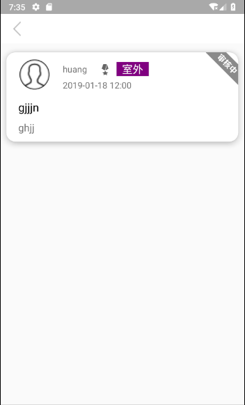
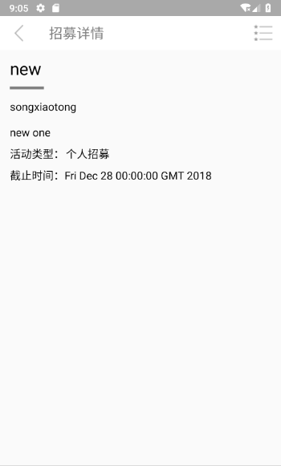
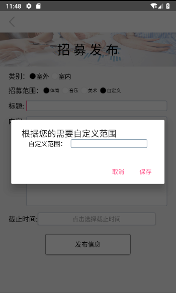
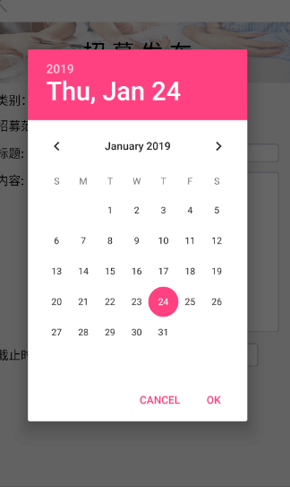

# 中山大学数据科学与计算机学院本科生实验报告
## （2018年秋季学期）
| 课程名称 | 手机平台应用开发 | 任课老师 | 郑贵锋 |
| :------------: | :-------------: | :------------: | :-------------: |
| 年级 | 2016 | 专业（方向） | 软件工程 |
| 学号 | 16340215 | 姓名 | 王建 |
| 电话 | 13246824607 | Email | jankingwon@foxmail.com |
| 开始日期 | 2018-12-26 | 完成日期 |2018-12-19|

---

## **一、个人贡献**

- ”**个人资料**“（他人）页面
  - 代码编写
- “**活动详情**”界面
  - 代码编写
- “**招募发布**”页面
  - 代码编写
- **项目展示**
  - 技术方面的展示
- **小组报告**
  - 文档编写

---

## 二、功能代码

### “个人资料”页面

#### 效果





上面三幅图片分别是

- PersonalCenter(Activity)
- Application(Activity)
- Recruit(Activity)


其中`Application`和`Recruit`是直接复用个人资料（侧边栏的）“**我的申请**”和“**我的招募**”页面

#### ToolBar

在初始化视图的时候设置好`ToolBar`，使其显示成我们想要的样子

即只有左边一个返回按钮

- 并给这个按钮设置`Image`为经典的`Material`设计的返回键
- 监听其事件为调用`finish()`方法

这样简单的实现点击返回将当前视图在栈中销毁而不是新建另外的跳转`Intent`

> 但是现在写报告的时候发现`ToolBar`上面还是加个标题栏比较好看，不过没事，这样也有简介的道理

```java
public void setToolbar() {
    setSupportActionBar(toolbar);
    ActionBar actionBar = getSupportActionBar();
    if(actionBar != null) {
        actionBar.setDisplayHomeAsUpEnabled(true);
        toolbar.setNavigationIcon(R.drawable.previous);
        toolbar.setNavigationOnClickListener(new View.OnClickListener() {
            @Override
            public void onClick(View v) {
                finish();
            }
        });
    }
}
```


但是其实还有一种办法，**官方推荐的导航栏**（据说）就是左上角可以有一个`id`为`R.id.home`的菜单，而且是系统默认的返回图标，只需要直接启用就行，甚至可以设置旁边的标题栏，然后只需要写监听事件就好了

```java
@Override
public boolean onOptionsItemSelected(MenuItem item) {
    switch (item.getItemId()) {
        case android.R.id.home:
            finish();
            break;
        default:break;
    }
    return true;
}
```

> 在测试的时候这两种方式我都试了，也都成功了，所以两个都放在了代码里面，当然，目测是没有产生冲突


#### 数据传递

此页面显示的是招募人的信息，所以传进来的时候（通过活动列表->点击具体活动->查看招募人）应该会把需要的的用户类通过Bundle或者Intent传递过来，不然没有可显示的内容，队友确实是这么做的

> 第一反应是上面那样的传递，当然我们还学了`EventBus`，确实好用，但是感觉如果需要有Intent的传递的时候不如干脆把数据一起放进去好了，比较协调

所以就是通过下面的代码得到用户的`id`

```java
Intent mintent=getIntent();
user_id = mintent.getIntExtra("u_id",1);
```

#### 数据查询和显示

通过我们这个项目最主要的JDBC数据库查询到用户的属性，不过是异步查询的，使用的方法可以有很多，便于理解，这里使用的是`Handler`和`Thread`的方式

- 新线程中连接数据库并通过id查询用户信息

```java
public void setHeader() {
    new Thread(new Runnable() {
        @Override
        public void run() {
            try {
                Connection con = db.getConnection();
                users = db.getUserById(user_id, con);
                handler.obtainMessage(100).sendToTarget();
                db.closeConnection(con);
            } catch (Exception e) {
                e.printStackTrace();
            }
        }
    }).start();
}

```

- 主线程中`Handler`监听返回的消息更新`UI`

  ```java
  final Handler handler = new Handler() {
      @Override
      public void handleMessage(Message msg) {
          super.handleMessage(msg);
          switch (msg.what) {
              case 100: //设置Toolbar左边的头像
                  if(users.getPhoto() != null) photo.setImageBitmap(users.getPhoto());
                  else photo.setImageResource(R.drawable.me);
                  name.setText(users.getName());
                  if(users.getSex() == 1) sex.setText("女");
                  else sex.setText("男");
                  mail.setText(users.getEmail());
                  break;
              default:
                  break;
          }
      }
  };
  ```

#### 操作列表

用户信息下面有两个操作“**TA的申请**“和“**TA的招募**”

其实最简单的用两个按钮就可以解决问题，但是总觉得用按钮差了点意思，难道像**设置**应用这样的一列表的操作都是通过一个个`Button`实现的吗，那岂不是太低级了？

所以学习了下基础开发知识，对于这样的列表级操作应该用`ListView`设置点击事件实现，有利于后续功能的添加和删除

于是新建一个用来处理操作的`ListView`的`Adapter`类

```java
public class MyListAdapter extends BaseAdapter {
    private Context mcontext;
    private List<Integer> image_list;//图片id数组
    private List<String> func_list; //功能名称数组
    private int resourceId;
    private class ViewHolder {
        public ImageView imageView;
        public TextView function;
    }
    public MyListAdapter(Context context, int ResourceId, List<Integer> Image_list, List<String> Func_list) {
        mcontext = context;
        resourceId = ResourceId;
        image_list = Image_list;
        func_list = Func_list;
    }

    @Override
    public int getCount() {
        if(func_list == null) {
            return 0;
        }
        return func_list.size();
    }
    @Override
    public Object getItem(int i) {
        if(func_list == null) {
            return null;
        }
        return func_list.get(i);
    }
    @Override
    public long getItemId(int i ) {
        return i;
    }
    @Override
    public View getView(int i, View view, ViewGroup viewGroup) {
        View convertView;
        ViewHolder holder;
        if(view == null) {
            convertView = LayoutInflater.from(mcontext).inflate(resourceId, viewGroup, false);
            holder = new ViewHolder();
            holder.imageView = (ImageView) convertView.findViewById(R.id.item_image);
            holder.function = (TextView) convertView.findViewById(R.id.item_function);
            convertView.setTag(holder);
        } else {
            convertView = view;
            holder = (ViewHolder) convertView.getTag();
        }
        holder.imageView.setImageResource(image_list.get(i));
        holder.function.setText(func_list.get(i));
        return convertView;
    }
}

```

**使用方法：**

初始化的时候传进去两个数组参数，一个是图片数组，一个是字符串数组，分别代表每个操作的**图标**和**名称**

通过重写`setOnItemClickListener`方式查找`id`处理相应的操作

这里使用的操作是跳转到当前用户的所有**申请的的活动**和**所有招募的活动**

```java
/**
 * 设置功能列表ListView
 */
public void setListView() {
    /* 设置图片列表 */
    image_list = new ArrayList<>();
    image_list.add(R.drawable.apply);
    image_list.add(R.drawable.recruit_me);
    /* 设置功能名称列表 */
    func_list = new ArrayList<>();
    func_list.add("TA的申请");
    func_list.add("TA的招募");
    /* 设置适配器 */
    myListAdapter = new MyListAdapter(this, R.layout.me_listitem, image_list, func_list);
    listView.setAdapter(myListAdapter);

    /* 菜单项点击监听事件 */
    listView.setOnItemClickListener(new AdapterView.OnItemClickListener() {
        @Override
        public void onItemClick(AdapterView<?> adapterView, View view, int i, long l) {
            switch (i) {
                case 0:
                    Intent intent_apply = new Intent(PersonalCenter.this, Application.class);
                    intent_apply.putExtra("u_id", user_id);
                    startActivityForResult(intent_apply, 1);
                    Toast.makeText(PersonalCenter.this, "申请", Toast.LENGTH_LONG).show();
                    break;
                case 1:
                    Intent intent_recruit = new Intent(PersonalCenter.this, Recruit.class);
                    intent_recruit.putExtra("u_id", user_id);
                    startActivityForResult(intent_recruit, 1);
                    Toast.makeText(PersonalCenter.this, "招募", Toast.LENGTH_LONG).show();
                    break;
                default: break;

            }
        }
    });
}
```


### “活动详情”页面

这个页面做的就比较简洁，基本上文本即信息



#### 进度条

在没有加载出来用户信息的时候是显示进度条的，当信息加载出来后会设置其不见

且同样是通过`Handler`和`Thread`加载数据的


**获取**数据库中的活动详情

```java
final Thread thread=new Thread(new Runnable() {
    @Override
    public void run() {
        con=mydb.getConnection();
        mArticle=mydb.getArticleById(a_id,con);
        u_name=mydb.getUnameById(mArticle.getU_id(),con);
        Log.d("id", String.valueOf(a_id));
        handler.obtainMessage(123).sendToTarget();
    }
});
thread.start();
```

对数据库查询返回结果的**处理**

```java
handler=new Handler() {
   @Override
   public void handleMessage(Message msg) {
       super.handleMessage(msg);
       switch (msg.what){
           case 123:
               if(mArticle!=null){
                   Log.d("test", "mArticle not null");
                   title.setText(mArticle.getTitle());
                   publisher.setText(u_name);
                   content.setText(mArticle.getBody());
                   if(mArticle.getType()==1) type.setText("室外");
                   else if(mArticle.getType()==2)type.setText("室内");
                   else type.setText("个人招募");
                   String rag="";
                   if(mArticle.getEmblems()[0]==1){
                       rag+="web前端";
                   }
                   if(mArticle.getEmblems()[1]==1){
                       rag+=" 安卓";
                   }
                   if(mArticle.getEmblems()[2]==1){
                       rag+=" IOS";
                   }
                   time.setText(mArticle.getDate().toString());
               }
               progressBar.setVisibility(View.INVISIBLE);
               scrollView.setVisibility(View.VISIBLE);
               break;
               ......
                  
```


#### 菜单栏

新建一个布局文件设置好菜单中包含的操作

```xml
<?xml version="1.0" encoding="utf-8"?>
<menu xmlns:android="http://schemas.android.com/apk/res/android"
    xmlns:app="http://schemas.android.com/apk/res-auto">
    <item android:id="@+id/toolbar_r_img"
        android:title="添加"
        android:icon="@drawable/more"
        app:showAsAction="ifRoom">
        <!-- item包含menu表示该menu是item下的子菜单 -->
        <menu>
            <group>
                <item android:id="@+id/toolbar_edit"
                    android:title="编辑文章"
                    app:showAsAction="ifRoom" />
                <item android:id="@+id/toolbar_add"
                    android:title="申请加入/取消申请"
                    app:showAsAction="ifRoom" />
                <item android:id="@+id/toolbar_publisher"
                    android:title="查看招募人"
                    app:showAsAction="ifRoom" />
                <item android:id="@+id/toolbar_applicant"
                    android:title="查看申请人"
                    app:showAsAction="ifRoom" />
            </group>
        </menu>
    </item>
</menu>
```

在`Activity`代码中使用它渲染菜单

```java
@Override
public boolean onCreateOptionsMenu(Menu menu) {
   getMenuInflater().inflate(R.menu.toolbar, menu); //解析menu布局文件到menu
   return true;
}
```


#### 对活动的修改

这里的修改主要涉及两个地方：**编辑文章**（活动），**申请加入或者取消申请**

不管进行哪种修改，都会使类内部的变量`isDirt`置为`true`

- **编辑文章**

  仍然是监听菜单项的`id`，如果视图编辑活动，需要先判断发起此活动的用户是不是当前正在操作的用户，如果是，就会跳转到更新活动的`Activity`中，并且设置`requestCode`为1

  否则就会弹出`Toast`提示错误

  ```java
  toolbar.setOnMenuItemClickListener(new Toolbar.OnMenuItemClickListener() {
      @Override
      public boolean onMenuItemClick(MenuItem item) {
          switch (item.getItemId()) {
              case R.id.toolbar_r_img:
                  Log.e("Test---->","点击了右边图标");
                  break;
              case R.id.toolbar_edit:
                  Log.e("Test---->","点击了编辑");
                  if(u_id==mArticle.getU_id()){
                      Intent newintent=new Intent(ArticleActivity.this,updatemessage.class);
                      newintent.putExtra("a_id",a_id);
                      startActivityForResult(newintent,1);
                      isDirt = true;
                  }
                  else Toast.makeText(ArticleActivity.this,"你没有权限编辑此文章", Toast.LENGTH_SHORT).show();
                  break;
                  ......
  ```

  而编辑文章的话也会有`resultCode`返回给当前`Activity`

  查看相应的代码知道`resultCode`为2时表示已经修改过，为3表示没有修改过

  ```java
  @Override
  protected void onActivityResult(int requestCode, int resultCode, Intent data){
      super.onActivityResult(requestCode,resultCode,data);
      if(requestCode == 1 && resultCode == 2){
          getarticle();
      }
      else if(requestCode == 1 && resultCode == 3){
          setResult(2);
          finish();
      }
  }
  ```

- **申请加入/取消申请**

  首先判断当前用户是不是活动的发起人，如果是会弹出`Toast`提示，操作结束；

  如果不是就会启动新线程去查询，当前用户是否已经申请了这个活动（遍历该活动所有的申请人）

  如果还没申请就把`code`置为`124`，执行申请，并发送消息给`Handler`

  如果已经申请了就把`code`置为`125`，执行取消申请，并发消息给`Handler`

  ```java
  case R.id.toolbar_add:
      Log.e("Test---->","点击了申请");
      if(u_id==mArticle.getU_id()){
          Toast.makeText(ArticleActivity.this,"你是文章发布人，无需申请", Toast.LENGTH_SHORT).show();
      }
      else{
          new Thread(new Runnable() {
              @Override
              public void run() {
                  DB db=new DB();
                  Connection con=db.getConnection();
                  alluer_id=mydb.getAllapplyById(a_id,con);
                  boolean flag=true;
                  int code=124;
                  for(int i=0;i<alluer_id.size();i++){
                      if(u_id==alluer_id.get(i)){
                          flag=false;
                          break;
                      }
                  }
                  Log.d("test", String.valueOf(flag));
                  Log.d("test1", String.valueOf(a_id));
                  Log.d("test2", String.valueOf(u_id));
                  if(flag){
                      db.apply(a_id,u_id,con);
                      code=124;
                  }
                  else {
                      db.cancleapply(a_id,u_id,con);
                      code=125;
                  }
                  handler.obtainMessage(code).sendToTarget();
                  db.closeConnection(con);
              }
          }).start();
      }
      break;
  ```

  `Handler`处理的操作

  ```java
  case 124:
  
      Toast.makeText(ArticleActivity.this,"你已成功申请该项目", Toast.LENGTH_SHORT).show();
      break;
  case 125:
  
      Toast.makeText(ArticleActivity.this,"你已成功取消申请该项目", Toast.LENGTH_SHORT).show();
      break;
  ```

- **查看招募人**

  因为这个不涉及数据的修改，所以只需要开启一个不返回结果的`Intent`就好了

  ```java
  case R.id.toolbar_publisher:
      Log.e("Test---->","点击了查看发布人");
      Intent n_intent=new Intent(ArticleActivity.this,PersonalCenter.class);
      n_intent.putExtra("u_id",mArticle.getU_id());
      startActivity(n_intent);
      overridePendingTransition(R.anim.anim_in,R.anim.anim_out);
      break;
  ```

- **查看申请人**

  这个也是不涉及修改数据，可以直接`StartActivity`

  ```java
  case R.id.toolbar_applicant:
      Boolean is_publisher=false;
      if(u_id==mArticle.getU_id()){
          is_publisher=true;
      }
      Intent intent=new Intent(ArticleActivity.this,Applicant_list_Activity.class);
      intent.putExtra("article_id",a_id);
      Log.d("test3", String.valueOf(a_id));
      intent.putExtra("is_publisher",is_publisher);
      intent.putExtra("u_id",u_id);
      startActivity(intent);
      overridePendingTransition(R.anim.anim_in,R.anim.anim_out);
      Log.e("Test---->","点击了查看申请列表");
      break;
  ```

当发现数据发生修改之后（即`isDirt`为`true`），会设置`ToolBar`左上角的返回值（返回上一层))

这样子，上一层的`ACTIVITY`就可以知道数据是否修改过再进行相应的操作

```java
toolbar.setNavigationOnClickListener(new View.OnClickListener() {
    @Override
    public void onClick(View v) {
        mydb.closeConnection(con);
        if(isDirt) {
            setResult(2);
        }
        else {
            setResult(3);
        }
        Log.d("setresult", "2");
        finish();
    }
});
```


### “招募发布”页面

这个页面出现在主页面点击右上角工具栏的新建活动按钮（没有显示名称，只有图标）跳出来的


#### 获取当前用户的的ID

这理理并没有使用`Intent`，而是使用本地存储的`SharedPreferences`

当用户登录成功之后会使用`SharedPreferences`在本地留下一个名为`SHAREDNAME2`的键值对指示当前的ID

```java
public void loadsuccessed(int u_id){
    Log.i("test","loadsuccessed");
    final SharedPreferences sharedPreferences =getSharedPreferences(SHAREDNAME2,MODE_PRIVATE);
    SharedPreferences.Editor editor = sharedPreferences.edit();
    editor.putInt("now u_id",u_id);
    editor.commit();
    Intent intent = new Intent(LoginActivity.this,com.example.jason.finalproj.MainInterface.MainActivity.class);
    startActivity(intent);
}
```

因此新建活动时需要能够表示出来是那个用户发起的，需要从本地去除这个当前用户`id`

```java
final SharedPreferences sharedPreferences = getSharedPreferences(LoginActivity.SHAREDNAME2,MODE_PRIVATE);
inputu_id = sharedPreferences.getInt(LoginActivity.SHAREDNAME2,-1);
```


#### RadioGroup的使用

`putout.xml`

```xml
<RadioGroup
    android:id="@+id/typebutton"
    android:layout_width="250dp"
    android:layout_height="25dp"
    android:layout_marginLeft="0.0dip"
    android:layout_marginRight="15.0dip"
    android:gravity="center_vertical"
    android:orientation="horizontal">

    <RadioButton
        android:id="@+id/match"
        android:layout_width="wrap_content"
        android:layout_height="wrap_content"
        android:button="@drawable/radio_button_style"
        android:checked="true"
        android:text="室外"
        android:textColor="@android:color/black"
        android:textSize="15.0sp" />

    <RadioButton
        android:id="@+id/proposal"
        android:layout_width="wrap_content"
        android:layout_height="wrap_content"
        android:layout_marginLeft="5dip"
        android:button="@drawable/radio_button_style"
        android:checked="false"
        android:text="室内"
        android:textColor="@android:color/black"
        android:textSize="15.0sp" />

</RadioGroup>
```

`putout.java`

我选择的办法是通过判断选中的单选按钮的文字而确定活动的类型，最后传递一个`int`型的”活动类型“给数据库就好

```java
RadioButton rb = (RadioButton)findViewById(type.getCheckedRadioButtonId());
if(rb.getText().toString().equals("室外"))
    inputtype = 1;
else if(rb.getText().toString().equals("室内"))
    inputtype = 2;
```

#### 自定义

`RadioGroup`和`CheckBox`的局限性就在于它只能选择有限个类型的数据，为了让活动更多样，需要添加自定义类型的活动



将自定义按钮的监听事件改为弹出一个对话框，提示输入自定义的类型

而且如果弹出的对话框中内容为空就点击保存还时能检测到错误的


```java
user_defined.setOnCheckedChangeListener(new CompoundButton.OnCheckedChangeListener() {
    @Override
    public void onCheckedChanged(CompoundButton buttonView, boolean isChecked) {
        if(isChecked){
            LayoutInflater factor = LayoutInflater.from(putout.this);
            View view_in = factor.inflate(R.layout.userdefine, null);
            final AlertDialog.Builder alertDialog1 = new AlertDialog.Builder(putout.this);

            define = (EditText) view_in.findViewById(R.id.define);

            alertDialog1.setView(view_in);
            alertDialog1.setTitle("根据您的需要自定义范围");
            alertDialog1.setPositiveButton("保存", new DialogInterface.OnClickListener() {
                @Override
                public void onClick(DialogInterface dialog, int which) {
                    if(define.getText().toString().length()!=0){
                        user_defined.setText(define.getText().toString());
                    }
                    else {
                        user_defined.setError("请输入内容");
                    }
                }
            });
            alertDialog1.setNegativeButton("取消", new DialogInterface.OnClickListener() {
                @Override
                public void onClick(DialogInterface dialog, int which) {

                }
            });
            alertDialog1.show();
        }
    }
}
```


#### 日期选择控件



其实源布局这个控件的位置只是一个`Button`，监听点击了此`Button`之后就会通过`java`代码生成一个`DATE_DIALOG`

`showDialog`这是一个系统的方法，用于动态生成控件

```java
endtime.setOnClickListener(new View.OnClickListener() {

    @Override
    public void onClick(View v) {
        showDialog(DATE_DIALOG);
    }
});
```

重载其构造方法，默认为当前时间

```java
final Calendar ca = Calendar.getInstance();
        mYear = ca.get(Calendar.YEAR);
        mMonth = ca.get(Calendar.MONTH);
        mDay = ca.get(Calendar.DAY_OF_MONTH);
@Override
protected Dialog onCreateDialog(int id) {
    switch (id) {
        case DATE_DIALOG:
            return new DatePickerDialog(this, mdateListener, mYear, mMonth, mDay);
    }
    return null;
}
```

设置监听器，将选择后的日期赋值给本地变量

```java
private DatePickerDialog.OnDateSetListener mdateListener = new DatePickerDialog.OnDateSetListener() {

    @Override
    public void onDateSet(DatePicker view, int year, int monthOfYear,
                          int dayOfMonth) {
        mYear = year;
        mMonth = monthOfYear;
        mDay = dayOfMonth;
        display();
    }
};
```

这里的`display()`方法是要将控件的时间显示为字符串

```java
public void display() {
    endtime.setText(new StringBuffer().append(mYear).append("-").append(mMonth + 1).append("-").append(mDay).append(" "));
}
```

#### 错误提示

点击提交之后会检查是否有必填项为空，有的话就不会提交成功，并提示修改

```java
putoutbutton.setOnClickListener(new View.OnClickListener() {
    @Override
    public void onClick(View v) {
        if(title.getText().toString().length()!=0&&content.getText().toString().length()!=0){
            setThread1();
        }else {
            if(title.getText().toString().length()==0)
            {
                title.setError("请输入内容");
            }
            if(content.getText().toString().length()==0)
            {
                content.setError("请输入内容");
            }
            if(endtime.getText().toString().length()==0)
            {
                endtime.setError("请输入时间");
            }
        }
    }
});
```

#### 更新数据库

当然如果没有什么问题的时候就日常开启一个新线程去更新数据库

跟之前的多线程处理差不过

```java
public void setThread1(){
    final Thread thread = new Thread(new Runnable() {
        @Override
        public void run() {
            Connection con = db.getConnection();
            inputtitle = title.getText().toString();
            inputbody = content.getText().toString();
            RadioButton rb = (RadioButton)findViewById(type.getCheckedRadioButtonId());
            if(rb.getText().toString().equals("室外"))
                inputtype = 1;
            else if(rb.getText().toString().equals("室内"))
                inputtype = 2;
            else if(rb.getText().toString().equals("个人招募"))
                inputtype = 3;
            inputstate = 1;
            SimpleDateFormat sdf=new SimpleDateFormat("yyyy-MM-dd");
            String time = endtime.getText().toString();
            try {
                inputdate = sdf.parse(time);
            }catch (ParseException e){
                Log.i("ss","bbb");
            }
            int isweb=(web.isChecked()==true)?1:0;
            int isandroid = (andro.isChecked()==true)?1:0;
            int isios = (ios.isChecked()==true)?1:0;
            Integer[] inputemblems = {isweb,isandroid,isios};
            db.addArticle(inputtitle,inputbody,inputtype,inputstate,inputdate,inputemblems,inputu_id,con);
            handler.obtainMessage(123).sendToTarget();
            db.closeConnection(con);
            setResult(2);
            finish();
        }
    }
    );
    thread.start();
}
Handler handler = new Handler(){
    @Override
    public void handleMessage(Message msg){
        super.handleMessage(msg);
        switch (msg.what){
            case 123:
                titlename.setText("成功");
                break;
        }
    }
};
```


### ”活动列表“适配器

这里只编写了`Adapter`，我并没有去处理其具体显示问题。

而且更加简洁的是，这个`Adapter`没有在内部调用具体的单项布局 ，而是保留了一个**带有参数**的构造函数，需要调用这个`Adapter`的时候需要传递这个参数

至于剩下的问题就是活动名称，发起人姓名，发起人头像等等信息的绑定，比较简单

```java
public class ArticleAdapter extends RecyclerView.Adapter<ArticleAdapter.ViewHolder> {
    protected Context mContext;
    protected int mLayoutid;
    protected List<Map<String, Object>> mData;
    protected List<Map<String, Bitmap>> mImage;
    private OnItemClickListener mOnItemClickListener = null;

    public ArticleAdapter (Context context, int layoutid, List<Map<String, Object>> datas , List<Map<String, Bitmap>> images) {
        mContext = context;
        mLayoutid = layoutid;
        mData = datas;
        mImage = images;
    }

    static class ViewHolder extends RecyclerView.ViewHolder {
        public TextView mtype;      //类型（比赛、项目、个人）
        public CircleImageView mphoto;    //头像
        public TextView mname;      //名字
        public ImageView mbadge;    //徽章
        public TextView mdate;      //日期
        public TextView mtitle;     //标题
        public TextView mbody;      //正文
        public ImageView mstate;    //状态（招募中、已结束）
        public ImageView mcollection;//收藏
        public ImageView mpraise;   //点赞
        View mView;     //布局视图

        public ViewHolder(View itemView) {
            super(itemView);
            mView = itemView;
            mtype = (TextView) itemView.findViewById(R.id.article_item_type);
            mphoto = (CircleImageView) itemView.findViewById(R.id.article_item_photo);
            mname = (TextView) itemView.findViewById(R.id.article_item_name);
            mbadge = (ImageView) itemView.findViewById(R.id.article_item_badge);
            mdate = (TextView) itemView.findViewById(R.id.article_item_date);
            mtitle = (TextView) itemView.findViewById(R.id.article_item_title);
            mbody = (TextView) itemView.findViewById(R.id.article_item_body);
            mcollection = (ImageView) itemView.findViewById(R.id.article_item_collection);
            mstate = (ImageView) itemView.findViewById(R.id.article_item_state);
        }
        public static ViewHolder get(Context context, ViewGroup parent, int layoutId) {
            View itemView = LayoutInflater.from(context).inflate(layoutId, parent, false);
            ViewHolder holder = new ViewHolder(itemView);
            return holder;
        }
    }

    public interface OnItemClickListener {
        void OnClick(View view, int position);
        void LongClick(View view, int position);
        void AttentionOnClick(View view, int position);
    }
    public void setonItemClickListener (OnItemClickListener onItemClickListener) {
        mOnItemClickListener = onItemClickListener;
    }


    @Override
    public ViewHolder onCreateViewHolder(final ViewGroup parent, int ViewType) {
        ViewHolder viewHolder = ViewHolder.get(mContext, parent, mLayoutid);
        return viewHolder;
    }

    @Override
    public void onBindViewHolder(final ViewHolder holder, int position) {
        //类型
        TextView type = holder.mtype;
        type.setText(mData.get(position).get("type").toString());
        //头像
        ImageView photo = holder.mphoto;
        photo.setImageBitmap(mImage.get(position).get("photo"));
        //名字
        TextView name = holder.mname;
        name.setText(mData.get(position).get("name").toString());
        //徽章
        ImageView badge = holder.mbadge;
        badge.setImageBitmap(mImage.get(position).get("badge"));
        //日期
        TextView date = holder.mdate;
        date.setText(mData.get(position).get("date").toString());
        //标题
        TextView title = holder.mtitle;
        title.setText(mData.get(position).get("title").toString());
        //正文
        TextView body = holder.mbody;
        body.setText(mData.get(position).get("body").toString());
        //状态
        ImageView state = holder.mstate;
        state.setImageBitmap(mImage.get(position).get("state"));
        //收藏
        ImageView collection = holder.mcollection;
        collection.setImageBitmap(mImage.get(position).get("collection"));

        if(mOnItemClickListener != null) {
            holder.itemView.setOnClickListener(new View.OnClickListener() {
                @Override
                public void onClick(View view) {
                    mOnItemClickListener.OnClick(holder.itemView, holder.getLayoutPosition());
                }
            });
            holder.itemView.setOnLongClickListener(new View.OnLongClickListener() {
                @Override
                public boolean onLongClick (View view) {
                    mOnItemClickListener.LongClick(holder.itemView, holder.getLayoutPosition());
                    return true;
                }
            });
            holder.mcollection.setOnClickListener(new View.OnClickListener() {
                @Override
                public void onClick(View view) {
                    mOnItemClickListener.AttentionOnClick(holder.itemView, holder.getLayoutPosition());
                }
            });
        }
    }

    @Override
    public int getItemCount() {
        return mData.size();
    }

}
```


---

## 三、遇到的问题与解决方案

### ActionBar

最开始使用`getActionBar`是出错的，提示并没有

其实并不是，而且是`ActionBar`在不同的`api`中不一样的

**解决办法：**

- 如果直接继承自`Activity`，**那么在主题文件中就不能用AppCompatTheme，**也就是`Theme.AppCompat.*`的主题，使用`android:Theme.Light`等是可以的。这样`activity.getActionBar()`能正确返回ActionBar对象。

```
getActivity().getActionBar().setDisplayHomeAsUpEnabled(true);
```

- 如果继承自`AppCompatActivity`，那么主题文件中需要使用`AppCompatTheme`，同时获取ActionBar的方法需要用`getSupportActionBar()`，如下：

```
((AppCompatActivity)getActivity()).getSupportActionBar().setDisplayHomeAsUpEnabled(true
```


### 报错`Configuration on demand is not supported by the current version of the Android Gradle plugin`

一般安卓开发都会话一般的时间在AS的日常抽筋上，而且远程协作开发，不同电脑上的环境可能有的配置不一样，有一次就出了这个情况

**解决办法：**

 `File` > `Settings` > `Build, Execution, Deployment` > `Compiler`

取消勾选  `configure on demand`


---

## 四、个人总结与个人贡献评分

**个人总结：**

学期末的安卓开发作业了

即使已经放了寒假还是在家疯狂写报告

总的来说这一学期，真的相当努力（`emmm`，这么说不会被打吧

感觉`Andorid`开发相当有趣，或许是因为之前学的大多数都是理论知识，没怎么看到自己做的成果吧

这样子没一个星期就能看到自己做出一个像模像样的东西。

但是我也知道东西不能太急功近利，基础知识还是需要扎实，所以我每次遇到不会的知识还是认真静下心来去读了一些架构上的认识，一般学一遍做感觉是效率最高的了

而且基本上每周都会根据布置的任务写一篇博客，写的也许不是很好，但也是自己慢慢成功进步的一个过程！


**个人贡献评分：**

满分制：98/100

均分制：25%

---

## 五、思想感悟

`Android`开发很容易上手，但是真的要想做出一些逻辑缜密，没有明显bug的应用却不是那么简单

所以网上也有很多劣质的app，一定要好好辨别，用专业的角度去分析

每次开发项目用的大部分都是一些常用的知识，如果需要用到新的知识不要着急直接使用，最好需要看一下框架上的理论知识，比起直接实践会对项目的架构清楚的多，以后debug也会更得心应手！

做app不是目的，其实也是在学习android操作系统比较高层的逻辑！

---


