# 封面

## 应用


## 成员


# 程序运行界面截图

## 启动页面


## 登录页面

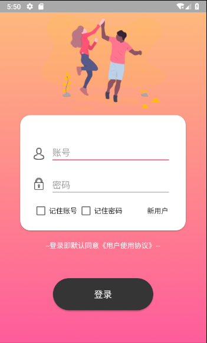

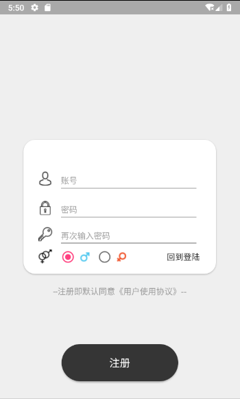

## 首页


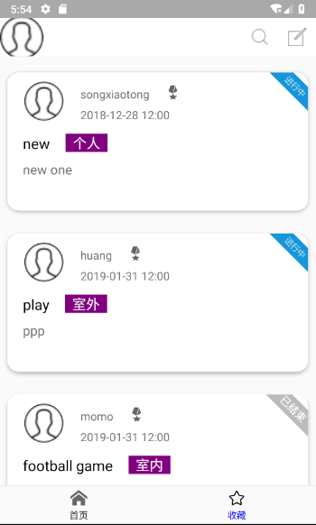

## 侧边栏

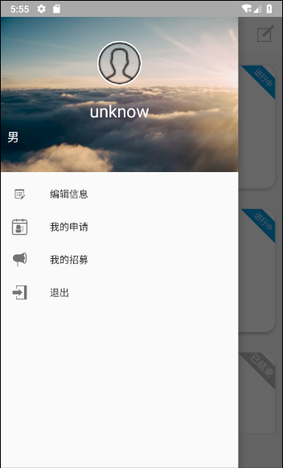

### 编辑信息

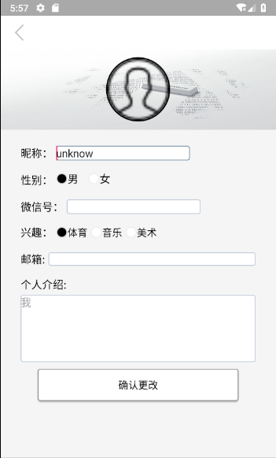

### 我的申请

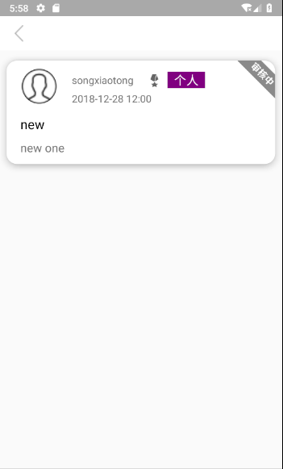

### 我的招募


## 活动详情


### 编辑文章

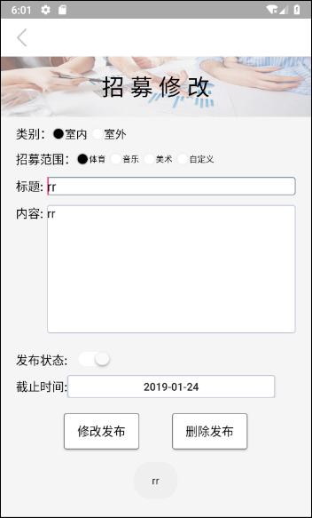


### 申请加入

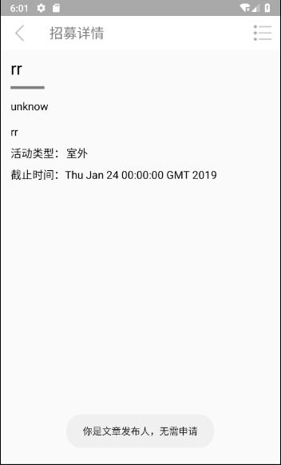


## 个人中心

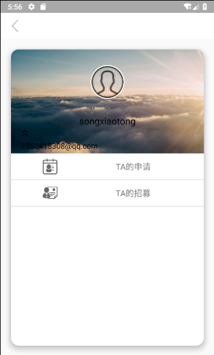

### TA的申请

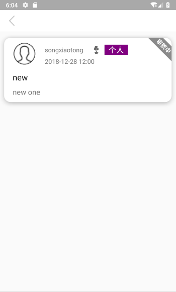

### TA的招募


## 搜索页面

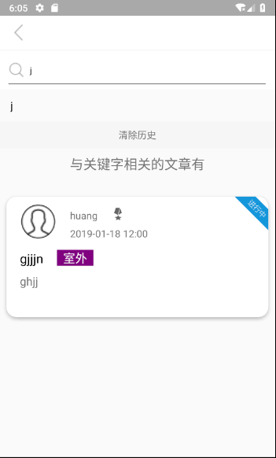

## 发布页面


# 项目总览

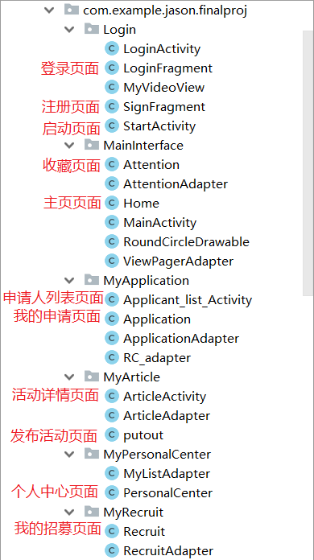

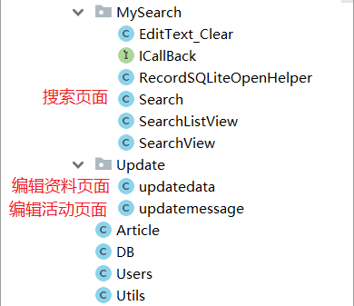


# 应用类图

## MySearch

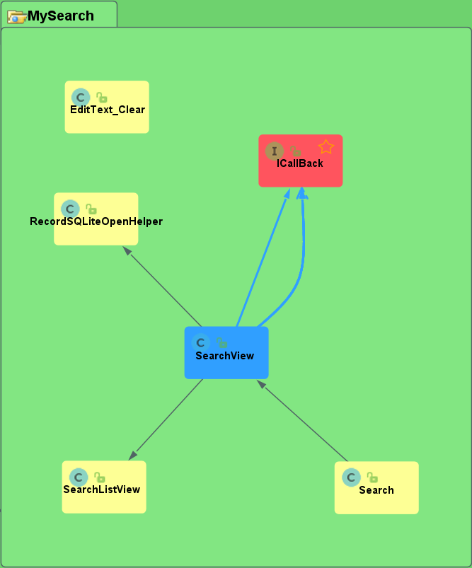

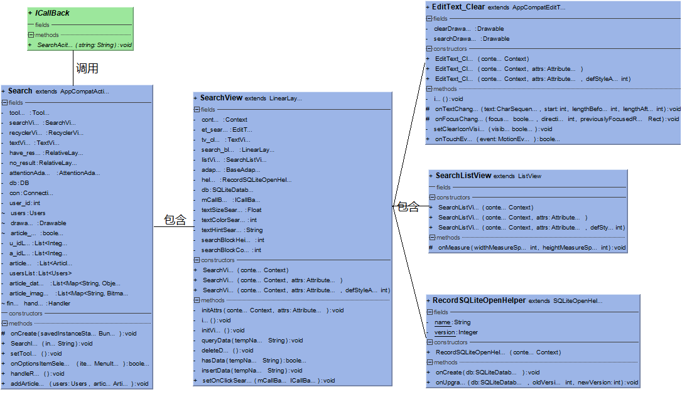

- `EditText_Clear`:自定义的一个控件，实现输入框右边的清除按钮
- `ICallBack`:回调方法的接口，用于执行搜索
- `RecordSQLiteOpenHelper`:用于存储搜索记录的SQLite数据库
- `SearchView`:搜索页面的主要视图
- `SearchListView`:稍微修改了下`ListView`用来展现搜索结果
- `Search`**:搜索页面**


## MainInterface

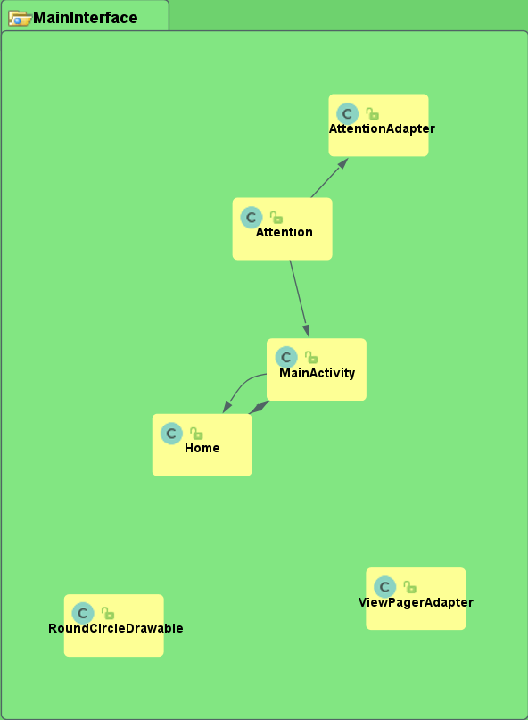


- `MainActivity`**:应用的主界面**
- `Home`:“**首页**”视图的`Fragment`
- `Attention`:“**收藏**”视图的`Fragment`
- `AttentionAdapter`:”**收藏**“视图列表的适配器
- `ViewPagerAdapter`:“**首页**”视图的广告页适配器
- `RoundCircleDrawable`:显示圆形头像


## MyApplication

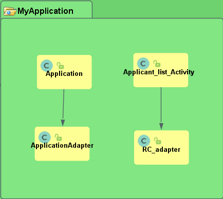


- `Application`:“**我的申请**”页面
- `ApplicationAdapter`:“**我的申请**”视图的活动列表适配器
- `Application_list_Activity`:“**申请人列表**”页面
- `RC_adapter`:"**申请人列表**"页面的用户列表适配器


## MyArticle

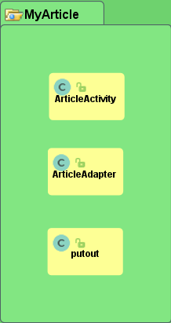

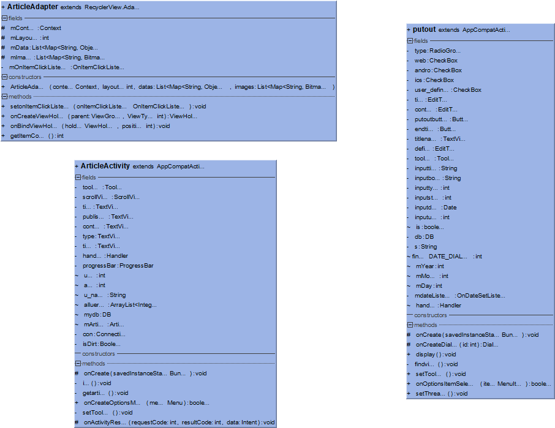

- `ArticleActivity`:“**活动详情**”界面
- `ArticleAdapter`:“**主页**”界面活动列表的适配器
- `putout`:“**招募发布**”


## Login

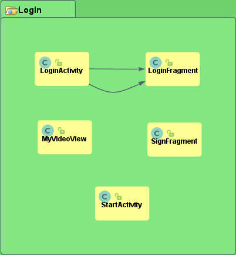

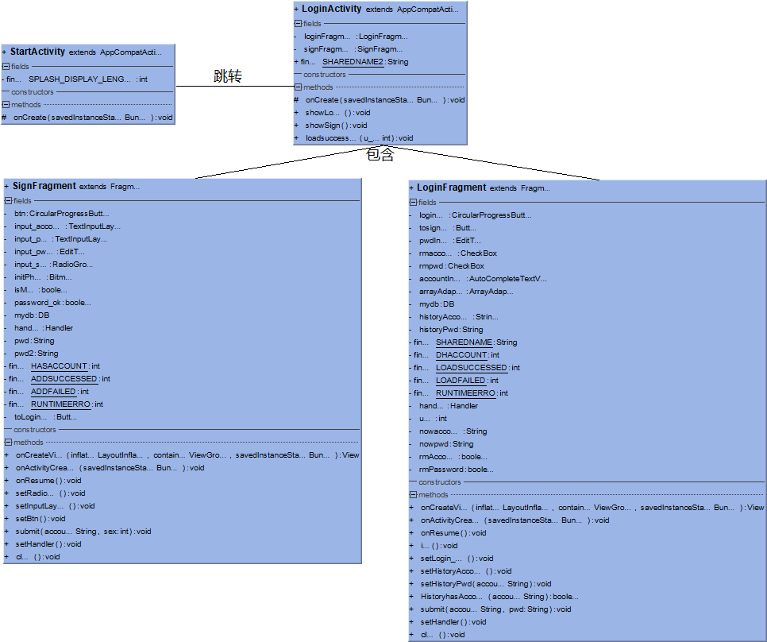

- `StartActivity`":**应用启动**页面
- `LoginActivity`:"**登录注册**"页面
- "`LoginFragment`":”**登录**“视图部分
- "`SignFragment`":"**注册**"视图部分
- “`MyVideoView`":"**登录**"页面上方的视频视图（已弃用）


## MyRecruit

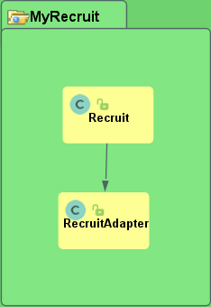

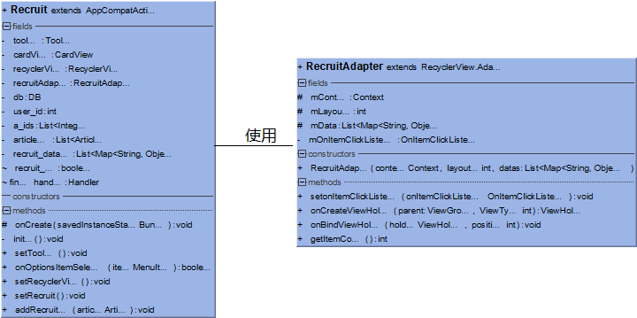

- `Recruit`:“**我的招募**”页面
- `RecruitAdapter`:**我的招募**页面活动列表适配器

## MyPersonalCenter


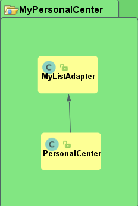

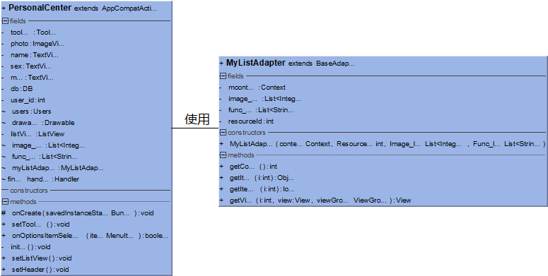

- `PersonalCenter`:“**个人中心**”侧边栏视图
- `MyListAdapter`:“**个人中心**”侧边栏的功能列表

## Update

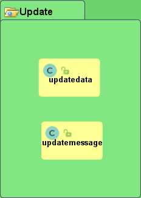

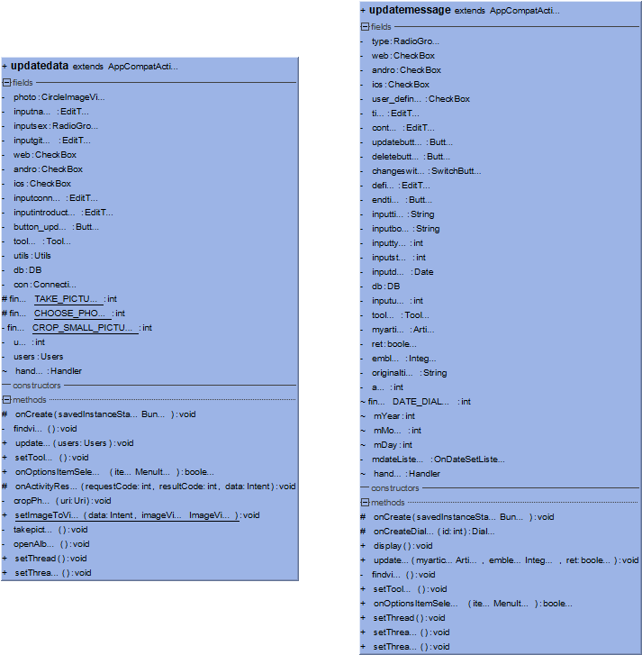

- `updatedata`：”**编辑资料**“页面
- `updatemessage`:“**编辑发布活动**”页面


## 其它


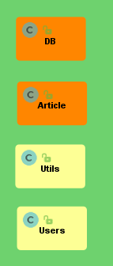


- `DB`:用于连接JDBC数据库的类
- `Article`:活动信息的实体类
- `Utils`:一些实用方法的类
- `Users`:用户信息的类


# 时序图


# 所采用的技术和采用该技术的原因

## JDBC数据库

什么是JDBC？

>  JDBC（Java Data Base Connectivity,java数据库连接）是一种用于执行SQL语句的Java API，可以为多种关系数据库提供统一访问，它由一组用Java语言编写的类和接口组成。JDBC提供了一种基准，据此可以构建更高级的工具和接口，使数据库开发人员能够编写数据库应用程序。
>
> JDBC提供的主要功能是：1)同一个数据库建立连接；2)向数据库发送SQL语句；3)处理数据库返回的结果。

应用程序通过`JDBC API(java.sql)`与数据库连接，而实际的动作则是由`JDBC`驱动程序管理器`(DriverManager)`通过`JDBC`驱动程序与数据库系统进行连接。也就是说，真正提供存取数据库功能的是`JDBC`驱动程序，用户如果想要存取某一种具体的数据库系统中存储的数据，就必须要拥有对应于该数据库系统的驱动程序。

`JDBC`优缺点：

1）优点：简单易学,上手快,非常灵活构建`SQL`，效率高。

2）缺点：代码繁琐，难以写出高质量的代码（例如：资源的释放，`SQL`注入安全性等）开发者既要写业务逻辑，又要写对象的创建和销毁，必须管底层具体数据库的语法（例如：分页）。

3）适合于超大批量数据的操作，速度快 。

`jdbc`的主要工作原理：

- 1、加载驱动程序  `Class.forName(driver)；`JDBC只定义接口，具体实现由各个数据库厂商负责。程序员使用时只需要调用接口，实际调用的是底层数据库厂商的实现部分
- 2、获取数据库连接，`getconnection()`调用`driver`的`connect（）`方法 返回一个实现了`Connection`接口的对象
- 3、创建语句对象，利用`connection`创建的`statement`执行`sql`语句。

​               

```
Statement   PreparedStatement  CallableStatement
```


- 4、提交执行语句对象获取返回的结果集

- 5、遍历访问结果集

- 6、关闭

---------------------


## 侧边导航栏

使用的是抽屉式导航，这种导航通过按钮来触发，拓展性非常好，导航的标签同样没有上限，可以容纳的导航个数很多，由于它是通过按钮触发的，基本不占空间。

## 功能齐全的搜索页面

- 远程数据库搜索
- 保留搜索记录
- 自定义搜索框

## 对图片的处理

- 可以调用相机
- 可以裁剪图片
- 转换为`bitmap`再转换为`byte`数组存进数据库

# 成员贡献表和Git提交记录

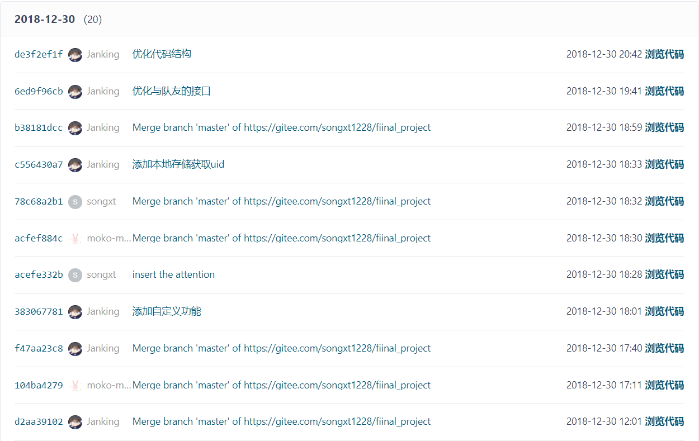

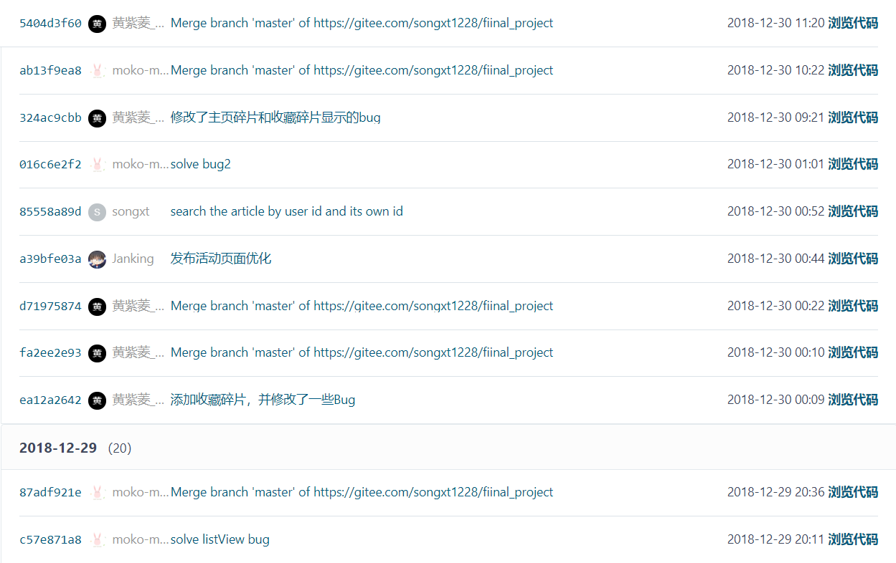

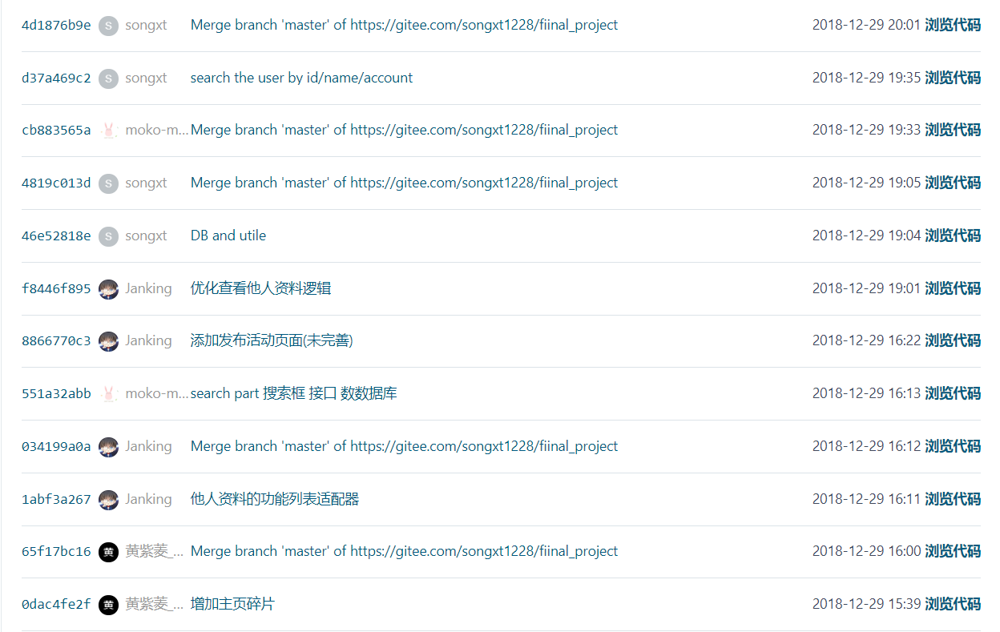

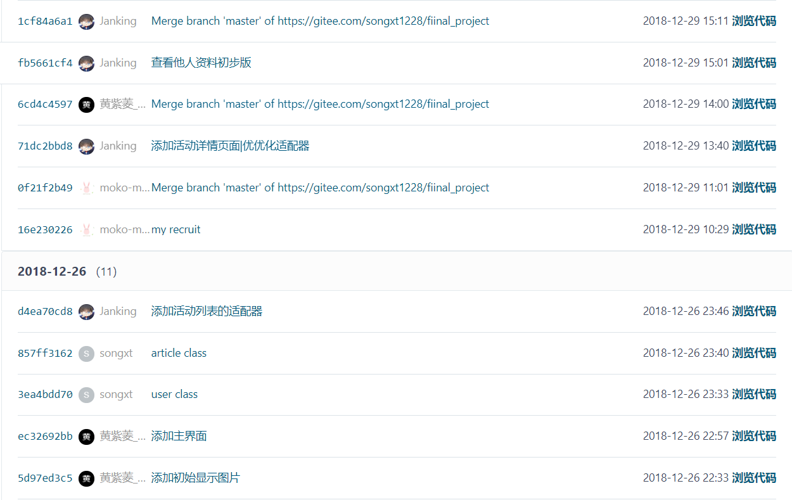

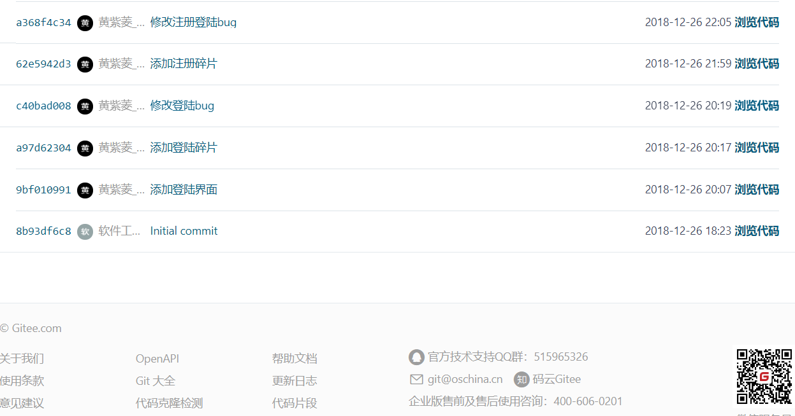

# 应用部署

## 生成KEY

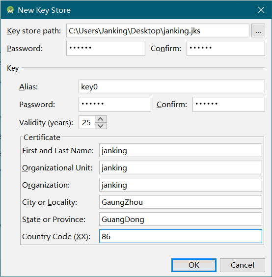

## 生成签名APK

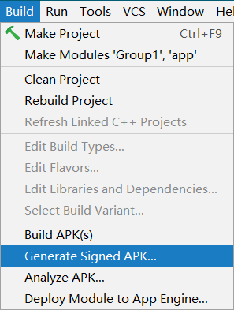

## 使用KEY

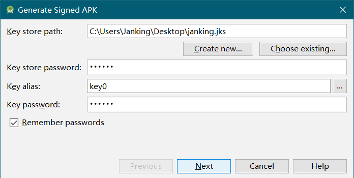

## 注意事项

- 错误：

  ```
  Android resource compilation failed
  D:\AndroidProject\TeamProject2\code\Group1\app\src\main\res\drawable\photo.png: error: failed to read PNG signature: file does not start with PNG signature.
  ```

  解决办法：

  把图片源文件改成`png`后缀

- 错误：

  ```
  Caused by: Error: java.util.concurrent.ExecutionException: com.android.builder.internal.aapt.v2.Aapt2Exception: AAPT error: check logs for details
  	at com.android.ide.common.res2.MergedResourceWriter.end(MergedResourceWriter.java:332)
  	at com.android.ide.common.res2.DataMerger.mergeData(DataMerger.java:301)
  	at com.android.ide.common.res2.ResourceMerger.mergeData(ResourceMerger.java:412)
  	at com.android.build.gradle.tasks.MergeResources.doFullTaskAction(MergeResources.java:285)
  	... 51 more
  	Suppressed: java.lang.RuntimeException: Some file processing failed, see logs for details
  		at com.android.builder.internal.aapt.QueuedResourceProcessor.waitForAll(QueuedResourceProcessor.java:121)
  		at com.android.builder.internal.aapt.QueuedResourceProcessor.end(QueuedResourceProcessor.java:141)
  		at com.android.builder.internal.aapt.v1.AaptV1.close(AaptV1.java:347)
  		at com.android.build.gradle.tasks.MergeResources.doFullTaskAction(MergeResources.java:293)
  		... 51 more
  Caused by: java.util.concurrent.ExecutionException: java.util.concurrent.ExecutionException: com.android.builder.internal.aapt.v2.Aapt2Exception: AAPT error: check logs for details
  	at com.google.common.util.concurrent.AbstractFuture.getDoneValue(AbstractFuture.java:503)
  	at com.google.common.util.concurrent.AbstractFuture.get(AbstractFuture.java:462)
  	at com.google.common.util.concurrent.AbstractFuture$TrustedFuture.get(AbstractFuture.java:79)
  	at com.android.ide.common.res2.MergedResourceWriter.end(MergedResourceWriter.java:327)
  	... 54 more
  Caused by: java.util.concurrent.ExecutionException: com.android.builder.internal.aapt.v2.Aapt2Exception: AAPT error: check logs for details
  	at com.google.common.util.concurrent.AbstractFuture.getDoneValue(AbstractFuture.java:503)
  	at com.google.common.util.concurrent.AbstractFuture.get(AbstractFuture.java:462)
  	at com.google.common.util.concurrent.AbstractFuture$TrustedFuture.get(AbstractFuture.java:79)
  	at com.android.builder.internal.aapt.v1.AaptV1.lambda$compile$0(AaptV1.java:404)
  	at java.util.concurrent.ThreadPoolExecutor.runWorker(ThreadPoolExecutor.java:1142)
  	at java.util.concurrent.ThreadPoolExecutor$Worker.run(ThreadPoolExecutor.java:617)
  	... 1 more
  ```

  **解决办法：**

  将`gradle`和`gradle tools`改为相适应的版本

  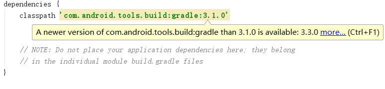

# 测试

## Monkey压力测试

### 什么是Monkey

顾名思义，Monkey就是猴子，  Monkey测试，就像一只猴子， 在电脑面前，乱敲键盘在测试。  猴子什么都不懂， 只知道乱敲

通过Monkey程序模拟用户触摸屏幕、滑动Trackball、 按键等操作来对设备上的程序进行压力测试，检测程序多久的时间会发生异常

 

### Monkey 用来做什么

Monkey 主要用于Android 的压力测试  自动的一个压力测试小工具， 主要目的就是为了测试app 是否会Crash.

 

### Monkey程序介绍

（1） Monkey程序由Android系统自带，使用Java诧言写成，在Android文件系统中的存放路径是： /system/framework/monkey.jar；   
（2） Monkey.jar程序是由一个名为“monkey”的Shell脚本来启动执行，shell脚本在Android文件系统中 的存放路径是：/system/bin/monkey；  
（3）Monkey 命令启动方式：    
a）可以通过PC机CMD窗口中执行: adb shell monkey ｛+命令参数｝来进行Monkey测试          

b）在PC上adb shell 进入Android系统，通过执行 monkey {+命令参数} 来进行Monkey 测试          

c )  在Android机或者模拟器上直接执行monkey 命令，可以在Android机上安装Android终端模拟器  

### 结果

采用了第三种命令行方式

**因为这个随机测试程序肯定是登陆不进去的，所以我是在已经登录的状态下进行测试**

> windows命令行复制下来没有换行符，所以还是直接截图

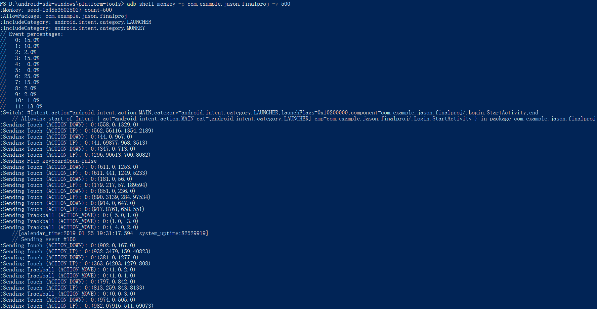

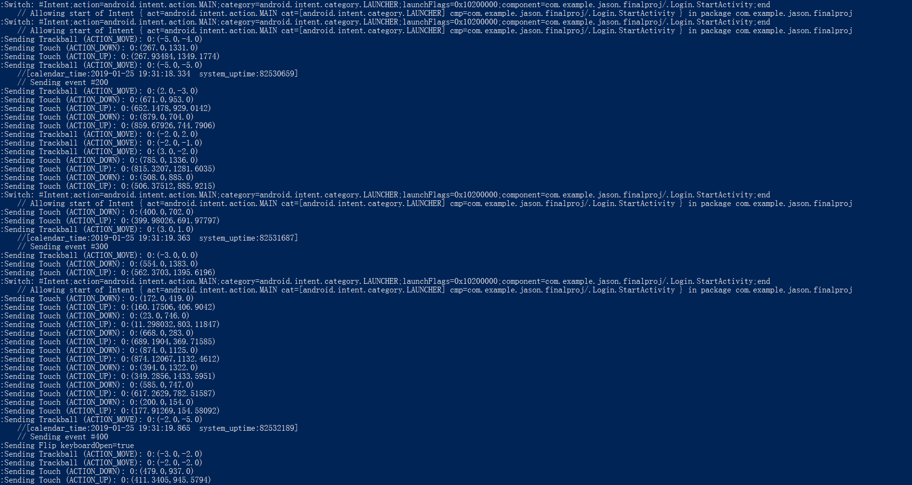

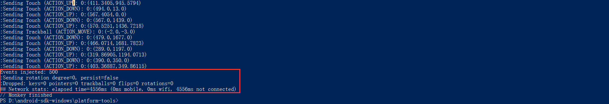

**可以看到发送了500条随机操作，没有出现丢失的情况，说明应用的鲁棒性还是不错的！**


## 代码覆盖率

Android 开发统计代码覆盖率，在之前的老版本中，需要借助第三方工具，在现在的新版本中，只要使用JaCoCo插件，就可以完成简单覆盖率测试。

**配置：**

 在 `build.gradle` 中将 `testCoverageEnabled`设置为 `true`

```
android {
   buildTypes {
      debug {
         testCoverageEnabled = true
      }
   }
}
```


 **使用：**
 为了能生成代码覆盖率报告，我们需要将`Android`设备或者模拟器连接到计算机，因为 在生成报告前，会执行 `connectedCheck`
 任务。 之后，我们可以执行如下的命令行

```
/gradlew clean assemble
```

此命令会清空所有的编译产生class，防止之前的测试对后续造成影响。

```
/gradlew createDebugCoverageReport
```

该任务会分析 `/src/main/java/`路径下的代码和 `/src/androidTest/java/`目录下测试用例。
 在执行这个任务之后，我们可以在模块的如下路径中找到代码覆盖率报告 `/build/outputs/reports/coverage/debug/`

在浏览器中打开 `index.html` 文件，可以看见可视化的报告。 

同时，在同一级目录下，也可以找到可以供持续集成覆盖率分析使用的 `report.xml` 文件

**结果：**

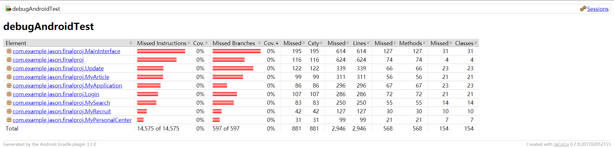

