# 用户说明文档

## 软件功能说明

1.**简介**：为各种活动搭建一个交流的平台，每位用户通过发起招募、申请活动等来进行互动，从而使活动顺利举办；

2.**登录/注册**：进行新用户注册、用户登录，可选择记住用户、记住密码；

3.**首页**：列表查看全部招募信息，可收藏活动、查看活动详情，编辑活动、申请活动、取消申请活动、查看招募人和申请人；

4.**收藏**：列表显示收藏的全部活动；

5.**搜索活动**：根据关键字搜索已经发起的活动；

6.**发起活动**：发起一个新活动；

7.**编辑信息**：更新个人信息；

8.**我的申请**：列表查看当前用户的申请；

9.**我的招募**：列表查看当前用户发起的招募；

10.**退出**：退出app。

## 软件流程图

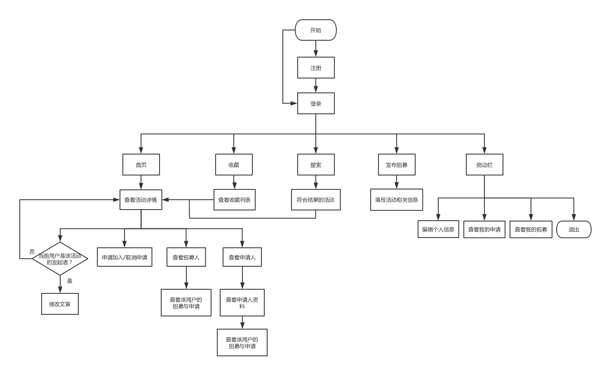

## 软件使用交互

**登录界面**

0.默认显示登录界面；

1.填写：输入账号、密码进行登录；

2.记住：记住账号、记住密码选项；

3.注册：新用户进行注册；

4.登录按钮：点击登录；

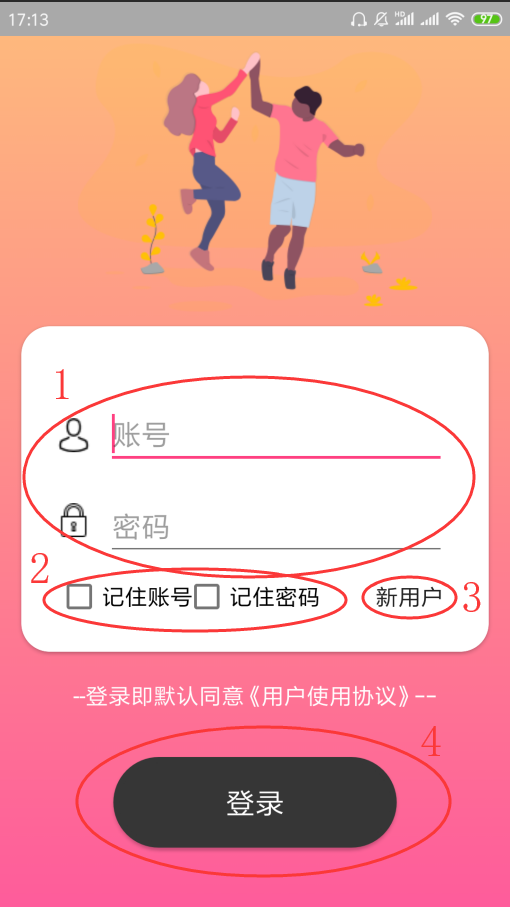

**注册界面**

1.用户名：输入注册用户名：若用户名已存在，点击注册时会提示用户名重复；

2.密码：输入设置的密码、再次输入密码确认，两次密码需相同；

3.性别选择；

4.回到登录：点击返回登录界面；

5.注册：填写完成后，点击进行注册；

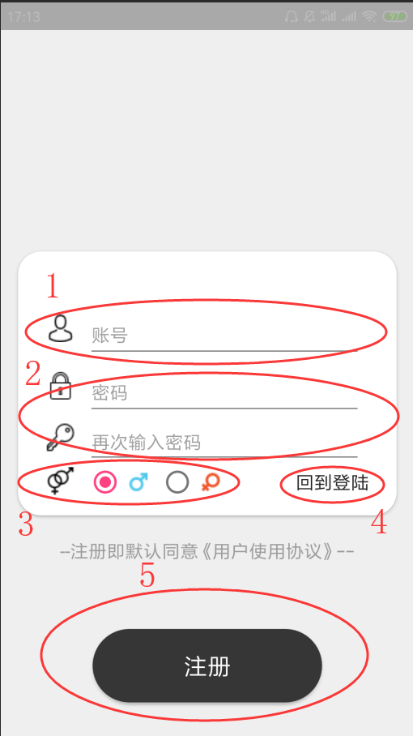

**首页**

0.默认显示当前的招募列表；

1.侧边栏：点击后显示侧边栏，包括一些功能；

2.搜索：点击后可根据关键词进行搜索；

3.发起招募：点击后可发起新的招募；

4.广告位：可轮换播放广告图片；

5.活动列表：包括发起者、发起时间、活动状态、活动标题、活动类型、活动内容；

6.详情：点击可查看详情；

7.收藏：点击可将该活动收藏；

8.收藏界面：点击切换到收藏界面；

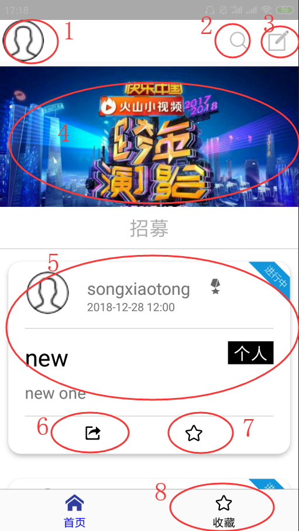

**活动详情界面**

1.活动详情：包括该活动的详细信息；

2.操作按钮：点击显示更多操作；

3.编辑文章：如果当前用户为活动发起者，可进行文章编辑；若不是，则会提示权限不够；

4.申请/取消申请按钮：点击进行申请，若已经申请过，则点击后取消申请；

5.查看招募人：点击可查看招募人信息，并可以查看其发起的招募和进行的申请；

6.查看申请人：点击可查看申请人信息。

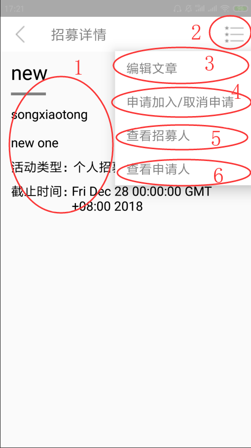

**编辑文章界面**

1.类别：更改招募类别；

2.范围：更改活动的类型范围；

3.标题及内容：更改活动的标题内容；

4.发布状态：更改活动的发布状态；

5.截止时间：更改活动的截止时间；

6.修改发布：点击后可保存该招募的修改；

7.删除发布：可对该发布进行删除；

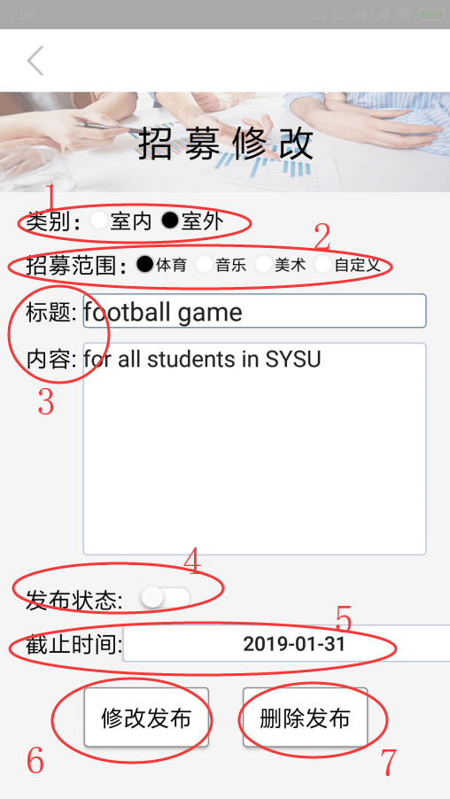

**查看申请人及查看招募人**

1.显示用户头像与名称；

2.显示用户联系方式；

3.用户申请：点击查看该用户的申请；

4.用户招募：点击查看该用户的招募；

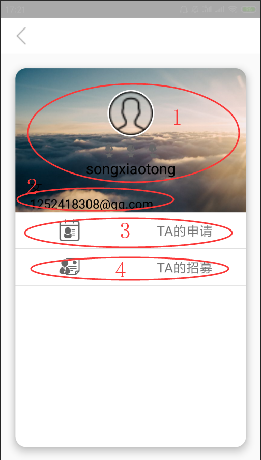

**搜索界面**

0.默认显示图1；

1.输入框：输入查询关键字；

2.搜索记录：显示之前的搜索记录；

3.清除历史：点击清除之前的搜索记录；

4.搜索结果：输入关键字后，显示与关键字相关的搜索结果，点击该活动可以进入招募详情界面；

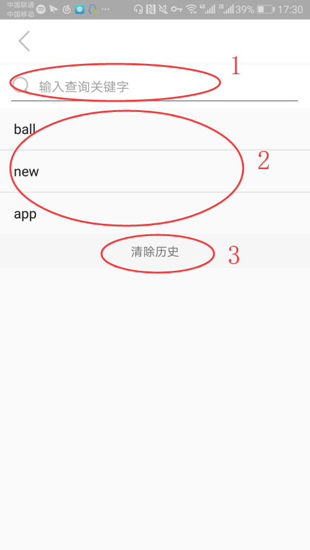

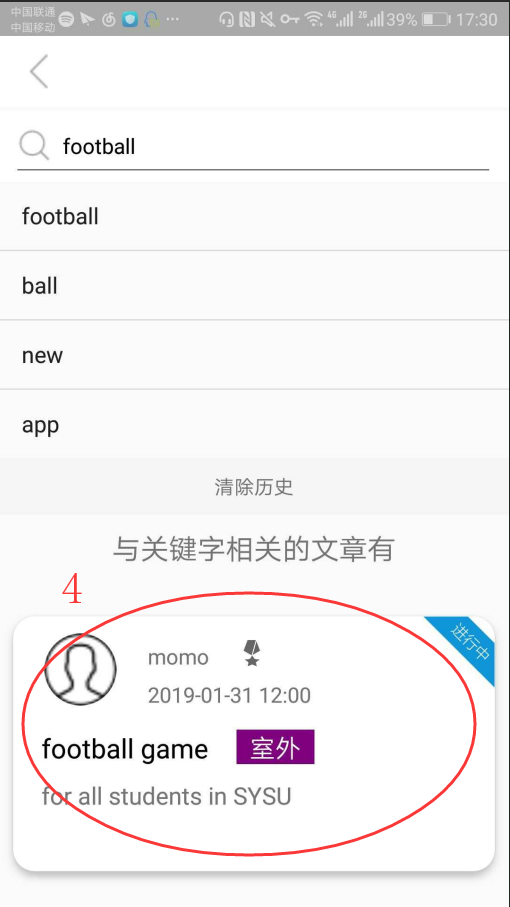

**发起招募界面**

1.类别：选择招募类别；

2.范围：选择活动的类型范围；

3.标题及内容：选择活动的标题内容；

4.截止时间：选择活动的截止时间；

5.发布信息：点击后可保存并发布该活动；

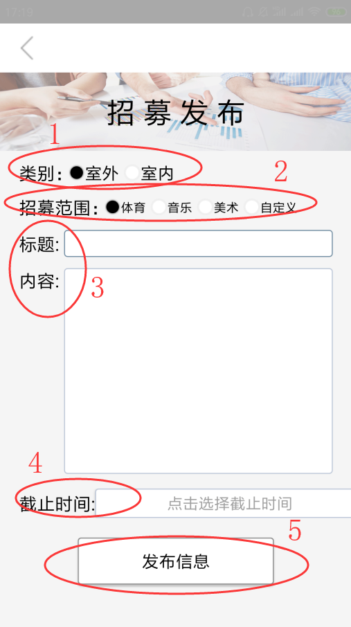

**收藏界面**

0.点击收藏按钮切换到收藏界面，点击头像、搜索按钮与发布按钮等功能与首页相同；

1.收藏列表：显示已收藏的活动，点击后可进入详情界面；

2.首页：点击后可切换回首页；

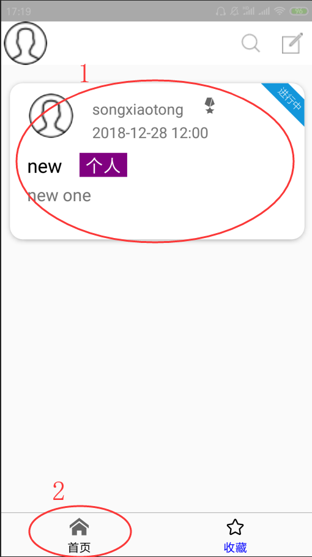

**侧边栏**

1.若不修改个人资料，默认显示如图头像与unknow用户名；

2.编辑信息：修改当前用户的个人信息；

3.我的申请：点击查看当前用户的所有申请；

4.我的招募：点击查看当前用户发起的所有招募；

5.退出：点击退出；

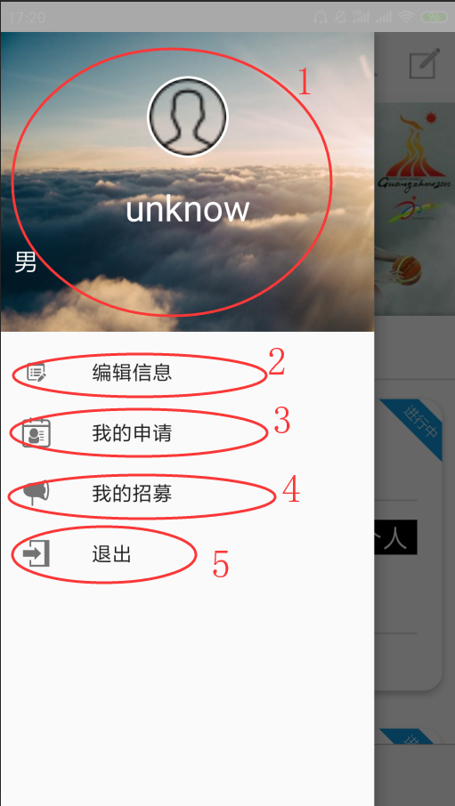

**编辑信息**

1.头像：点击更换头像；

2.昵称：更换个人昵称，昵称与账号可以不同；

3.性别：选择性别；

4.微信号：更改微信号，便于后续联系；

5.兴趣：选择兴趣；

6.邮箱：填写邮箱；

7.个人介绍：填写个人介绍；

8.确认更改：点击保存更改并提交。

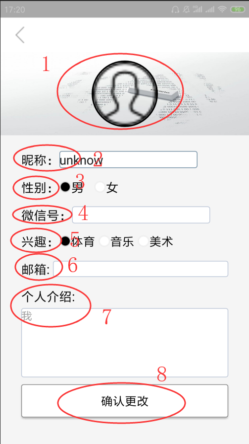