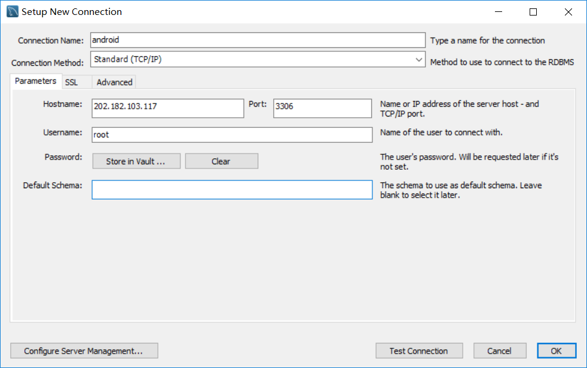
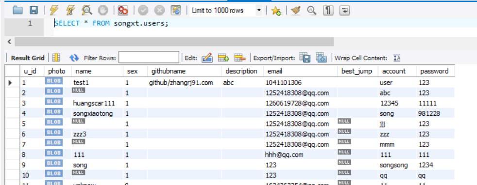
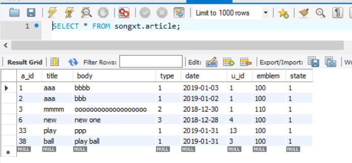
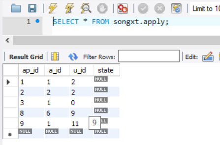

# 部署文档

## 数据库部署方案

（部署文档完成时已经完成，所以下述内容均只贴出代码，而没有存放大量截图）

### **【在远端服务器安装Mysql】**

1. 服务器主机使用的是ubuntu的命令行镜像，使用命令行在主机中安装mysql工具，注意密码设置

   ​	sudo apt-get install mysql-server 

   ​	apt-get isntall mysql-client 

   ​	sudo apt-get install libmysqlclient-dev 

2.  检查Mysql是否安装成功

   ​	sudo netstat -tap | grep mysql

3. 登录mysql

   ​	mysql -u root -p

   ​	输入命令后会提示输入密码，输入设置的密码即可进入

4. 建库，库的名称使用的是songxt

   ​	create database songxt; 

5. 注意：服务器是外网服务器，运行程序需要打开vpn

### **【Mysql workbench操作】**

1. 连接远程库：输入服务器地址和端口，端口为建库时默认使用的3306，并为连接命名（psw：981228）

   

2. 进入workbench，图形化建表及操作

   - 用户表：序号、用户名、昵称、邮箱、个人介绍、微信、密码
   - 活动表：序号、类型、标题、介绍、截止日期、发起者序号、招募范围、招募状态
   - 申请表：序号、活动序号、申请者序号、审批状态
   - 收藏表：序号、收藏者序号、活动序号

   

   

   

   